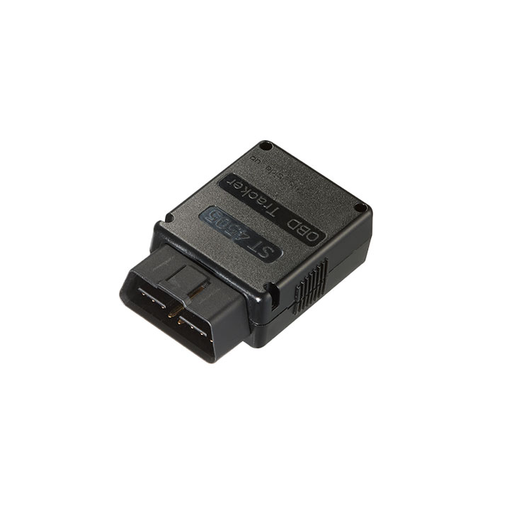

# Suntech - ST4505

El Suntech ST4505 es un rastreador OBD-II de tipo enchufar y listo diseñado para la telemetría vehicular moderna y la gestión de flotas. Ofrece posicionamiento continuo basado en GNSS, diagnóstico vehicular a través del conector J1962 OBD-II y telemetría pensada para soportar el seguimiento en tiempo real, el análisis del comportamiento del conductor y la respuesta rápida ante incidentes. Fabricado para uso dentro del vehículo, la familia ST4505 incluye variantes con soporte para sensores Bluetooth y detección opcional de interferencias para ampliar sus capacidades.

Como dispositivo compatible con Plaspy desde el primer encendido, el ST4505 se integra en despliegues de Plaspy con una configuración mínima. Su combinación de posicionamiento, transmisión de datos de diagnóstico y funciones de reporte de respaldo lo convierten en una opción práctica para operadores que desean alimentar a Plaspy con telemetría fiable para monitoreo, alertas e informes en toda la flota.

## Aspectos destacados

- Factor de forma OBD-II enchufar y listo para despliegues rápidos en vehículos y tiempo mínimo de instalación.
- Conectividad celular multinetwork para cobertura amplia y transporte de datos eficiente.
- Posicionamiento GNSS con GPS y GLONASS más augmentación SBAS para una mayor precisión en la ubicación.
- Diagnóstico vehicular mediante la interfaz J1962 OBD-II para acceder a datos del motor y otros parámetros expuestos por el vehículo.
- Sensores de movimiento integrados para detección de eventos, reconstrucción de incidentes y análisis del comportamiento del conductor.
- Batería de respaldo recargable para mantener el reporte durante pérdida de alimentación principal y soportar flujos de trabajo antirobo.
- Opciones de variantes con soporte para sensores Bluetooth y detección de interferencias para ampliar la telemetría y las funciones de seguridad.

## Cómo funciona con Plaspy

El ST4505 transmite posicionamientos GNSS, datos de diagnóstico del vehículo y eventos de sensor a través de redes celulares hacia Plaspy, donde esas señales se procesan para seguimiento en vivo, generación de alertas y análisis histórico. Plaspy procesa la telemetría entrante para que los administradores de flota puedan configurar frecuencias de actualización, notificaciones e informes que se ajusten a sus necesidades operativas sin desperdiciar datos.

- Actualizaciones de ubicación en tiempo real y trazado de recorrido para visibilidad de rutas y monitoreo en vivo de la flota.
- Alertas por choques, maniobras bruscas y otros incidentes basados en movimiento usando los sensores integrados.
- Reporte de diagnóstico del vehículo y códigos DTC reenviados a Plaspy para flujos de trabajo de mantenimiento preventivo y reducción de tiempos de inactividad.
- Reporte basado en la batería de respaldo que mantiene la conectividad durante cortes de energía y soporta notificaciones antirobo.
- Datos opcionales de sensores Bluetooth desde la variante ST4505T que alimentan flujos para temperatura, puertas o monitoreo de carga cuando se configuran en Plaspy.

## Casos de uso habituales

- Seguimiento de flotas comerciales para optimizar rutas, supervisar la utilización y mantener la supervisión operativa.
- Protección de vehículos de alquiler y activos usando reportes de respaldo y detección opcional de interferencias.
- Programas de capacitación y seguridad para conductores impulsados por la detección de eventos de movimiento y scoring de comportamiento.
- Programas de mantenimiento preventivo que dependen de datos de diagnóstico vehicular para activar alertas de servicio.
- Monitoreo de cadena de frío o carga cuando se añaden sensores Bluetooth en las variantes compatibles.

## Por qué elegir este rastreador con Plaspy

El ST4505 es una opción práctica para organizaciones que necesitan un rastreador OBD-II sencillo que entregue posición, telemetría del vehículo y eventos de sensores a una plataforma de gestión de flotas. Su diseño enchufar y listo y la detección de movimiento integrada lo hacen ideal para flotas, operadores de alquiler y programas de seguros o seguridad que dependen de datos oportunos de ubicación y eventos.

Para saber más sobre cómo Plaspy puede usar la telemetría del ST4505 en sus flujos de trabajo, visite https://www.plaspy.com. Las especificaciones del producto, la disponibilidad y los detalles del fabricante pueden cambiar con el tiempo, por lo que le recomendamos verificar las especificaciones actuales y las características de las variantes con el fabricante en http://www.suntechint.com/ antes de tomar decisiones de compra o despliegue.
