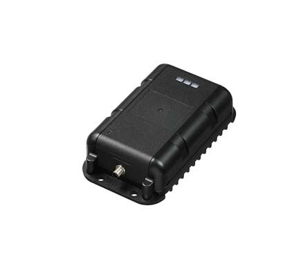

# Suntech - ST4932

El ST4932 de Suntech es un rastreador GPS compatible con Plaspy diseñado para el monitoreo de activos a largo plazo y despliegues profesionales de flota. Emplea conectividad LTE Cat M1 y NB2 con conmutación de respaldo a 2G y recepción GNSS concurrente para ofrecer posicionamiento fiable y telemetría persistente en condiciones de red mixtas. Diseñado para entornos exigentes, el equipo combina protección IP67, amplia autonomía de batería y un gateway BLE integrado para soportar sensores de corto alcance y funcionalidades de proximidad.

Al integrarse con Plaspy, el ST4932 suministra datos continuos de ubicación, eventos y telemetría para que usted pueda rastrear activos en tiempo real, recibir alertas y generar informes operativos. Su diseño robusto, posicionamiento por múltiples constelaciones y opciones de ahorro de energía lo convierten en una opción práctica para gestores de flota y equipos de operaciones que requieren supervisión confiable dentro de la plataforma Plaspy.

## Puntos clave

- Rastreador compatible con Plaspy con conectividad LTE Cat M1 y NB2 más fallback EGPRS 2G para amplia cobertura.
- Recepción GNSS multiconstelación, incluyendo GPS y GLONASS, para mayor fiabilidad en el posicionamiento.
- Gateway BLE integrado para ampliar la telemetría con detección de proximidad y soporte para sensores Bluetooth.
- Carcasa robusta IP67 y rango de operación industrial para uso en flotas y activos en exteriores.
- Batería de respaldo de larga duración y modos de bajo consumo adecuados para reportes multianuales en escenarios de baja frecuencia.
- Detección de movimiento y manipulación mediante sensores a bordo y entradas/salidas configurables para reporte de eventos.

## Cómo funciona con Plaspy

Cuando está conectado a Plaspy, el ST4932 entrega fijaciones de ubicación y señales de evento a la plataforma para que su equipo pueda visualizar activos, configurar alertas y analizar comportamientos históricos. Plaspy consolida datos GNSS, eventos de proximidad BLE y entradas del dispositivo en paneles y notificaciones que facilitan la supervisión de la flota y los flujos operativos.

- Actualizaciones de ubicación en tiempo real para mapeo, historial y reconstrucción de rutas en Plaspy.
- Información sobre movimiento y colisiones gracias al sensor de movimiento integrado, útil para notificaciones de incidentes y análisis de flotas.
- Alertas por manipulación y sensor de luz que apoyan flujos de trabajo anti robo y acciones de recuperación.
- Eventos configurables de I/O como estado de encendido e información de puertas para activar reglas e informes.
- Eventos de proximidad y sensores BLE integrados para enriquecer la telemetría con datos ambientales de corto alcance o asociación de activos.

## Casos de uso habituales

- Gestión de flotas para vehículos que requieren seguimiento continuo, historial de rutas y registro de eventos.
- Monitoreo de contenedores y remolques donde se necesita una carcasa resistente y larga duración de batería.
- Recuperación de activos y aplicaciones anti robo mediante alertas por manipulación y detección de movimiento.
- Telemetría de equipos remotos que combina entradas de sensores BLE con reportes del dispositivo para supervisión.
- Seguimiento a largo plazo con reportes esporádicos para activos estacionales o infraestructuras con registros poco frecuentes.

## Por qué elegir este rastreador con Plaspy

El ST4932 combina hardware resistente y conectividad multinetwork con las funciones operativas que su equipo espera de Plaspy. Su recepción GNSS multiconstelación y el gateway BLE amplían el alcance de la telemetría disponible, mientras que las capacidades de ahorro energético reducen el mantenimiento en despliegues que requieren larga autonomía. Para organizaciones que gestionan flotas mixtas o activos dispersos, el ST4932 ofrece un equilibrio entre durabilidad y extensibilidad que se integra con los flujos de trabajo de Plaspy para alertas, informes y recuperación.

Si desea obtener más información sobre la gestión de dispositivos compatibles y funciones de flota, visite el sitio web de Plaspy en https://www.plaspy.com. Las especificaciones del producto y su disponibilidad pueden cambiar con el tiempo, por lo que le recomendamos verificar los detalles técnicos y certificaciones actuales en el sitio del fabricante http://www.suntechint.com/.
