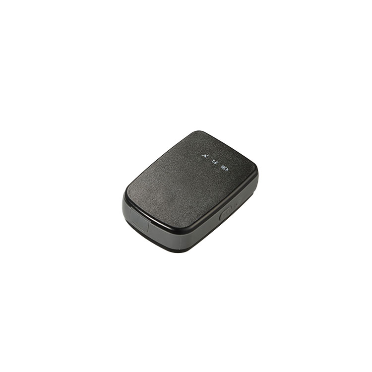

# Suntech - ST4945(S)

El ST4945\(S\) es un rastreador GPS compatible con Plaspy, diseñado para el seguimiento de activos portátiles y vehículos, donde la larga duración de la batería y la cobertura de red flexible son cruciales. Disponible en dos configuraciones compactas \(ST4945 con batería de 3,000mAh y ST4945S con batería de 1,500mAh\), este dispositivo combina conectividad celular multimodo, posicionamiento GNSS sólido y modos de bajo consumo para ofrecer un seguimiento en tiempo real confiable para la gestión de flotas, la recuperación y el monitoreo general de activos.

El rastreador admite LTE Cat M1 y NB‑IoT con respaldo 2G y ofrece actualizaciones de firmware OTA y soporte opcional de servidor de mantenimiento para un despliegue y una gestión del ciclo de vida más eficientes. Con características como detección de movimiento por acelerómetro incorporado, detección de interferencia, entradas de encendido y de puerta y salidas para bloqueo remoto del inmovilizador o sirena, el ST4945\(S\) está diseñado para integrarse directamente en Plaspy para telemetría, alertas y flujos de trabajo de control remoto.

## Puntos destacados

- Rastreador GPS compatible con Plaspy con conectividad LTE Cat M1 y NB‑IoT y respaldo EGPRS \(2G\) para amplia cobertura de red y seguimiento en tiempo real confiable.
- Opciones de batería de larga duración \(3,000mAh estándar, opcional 1,500mAh\) y modos de ultrabajo consumo \(modo sueño profundo \<10µA\) para ampliar la autonomía operativa de activos portátiles.
- GNSS de alta precisión: GPS + GLONASS con soporte SBAS \(WAAS, EGNOS, MASA\); precisión típica ≈ ±3 m CEP; arranque en frío \<35 s, arranque en caliente \<30 s, arranque en caliente \<1 s
- Movimiento integrado y acelerómetro de 3 ejes para detección de movimiento, capacidad de pánico/SOS y detección de interferencia para la prevención de robos.
- E/S de vehículos y activos: entradas configurables para sensores de encendido, pánico y puerta, y salidas para bloqueo remoto del vehículo o funciones de sirena.
- Resistente y robusto: IP66 con soporte, IP65 sin soporte; formato compacto adecuado para despliegues en vehículos y activos.
- Bluetooth 4.2 opcional para sensores Bluetooth externos y una base magnética opcional para montaje sencillo; admite actualizaciones OTA de firmware y soporte opcional de servidor de mantenimiento.

## Cómo funciona con Plaspy

Cuando se empareja con Plaspy, el ST4945\(S\) transmite la ubicación y la telemetría del dispositivo a través de canales de red seguros para que pueda monitorear activos en tiempo real, recibir alertas y emitir comandos remotos. Plaspy ingiere los mensajes TCP/SMS del rastreador \(UDP opcional\) y expone datos de ubicación, estado y eventos a través de paneles, alertas y endpoints API utilizados en los flujos de trabajo de gestión de flotas.

- Actualizaciones de ubicación y telemetría en tiempo real enviadas a Plaspy para vistas de mapa, reproducción histórica e informes de geocercas.
- Estado de encendido, puerta y pánico/SOS enviado a Plaspy para activar alertas y automatizar flujos de trabajo ante incidentes.
- Alertas de batería baja y notificaciones de alimentación/fallo enviadas a Plaspy para gestionar proactivamente el mantenimiento y los ciclos de carga.
- Inmovilizador remoto o bloqueo de vehículo soportado a través de las salidas; Plaspy puede enviar comandos o alertas para coordinar la recuperación y las acciones anti‑robo.
- Los sensores Bluetooth \(opcionales\) transmiten datos a Plaspy cuando están emparejados, habilitando telemetría como monitoreo ambiental o de movimiento junto con la ubicación.

## Resumen técnico

| Conectividad | LTE Cat M1, NB‑IoT con fallback a 2G \(EGPRS\); TCP y SMS \(UDP opcional\) |
| --- | --- |
| Bandas | Soporte multibanda para LTE Cat M1 y NB‑IoT y bandas EGPRS 2G \(el dispositivo se entrega con un amplio soporte de bandas regionales\) |
| Alimentación y batería | Batería recargable de Li‑ion 3.7V; 3,000mAh estándar \(ST4945\) o 1,500mAh opcional \(ST4945S\); carga USB; modos de consumo muy bajo \(modo sueño profundo &lt;10µA\) |
| Interfaces | Botón de encendido, botón de SOS, opciones de E/S incluyendo entrada de encendido, entrada de pánico, entradas de sensor de puerta, salidas para bloqueo del vehículo o funciones de sirena |
| GNSS | GPS + GLONASS con SBAS \(WAAS, EGNOS, MASA\); precisión típica ≈ ±3 m CEP; arranque en frío \<35 s, arranque en caliente \<30 s, arranque en caliente \<1 s |
| Bluetooth | Bluetooth 4.2 opcional para sensores externos y balizas |
| Gestión remota | Actualizaciones de firmware OTA y soporte opcional de servidor de mantenimiento para aprovisionamiento y actualizaciones de la flota |
| Factor de forma | ST4945: 50.5 × 75 × 32.5 mm, 113 g \(3,000mAh\); ST4945S: 50.5 × 75 × 22.5 mm, 81 g \(1,500mAh\); resistente IP66 con soporte / IP65 sin soporte; operación −20°C a +60°C |
| Consumo de energía | Activo: 40–60 mA; Sleep: &lt;3.5 mA; Deep sleep: &lt;10 µA |

## Casos de uso

- Gestión de flotas: seguimiento en tiempo real de furgonetas y vehículos utilitarios, monitorización del encendido para análisis del comportamiento del conductor y adherencia a la ruta.
- Antirrobo y recuperación: SOS, detección de interferencia y salidas de inmovilizador remoto ayudan a asegurar vehículos robados o no autorizados y a facilitar la recuperación.
- Seguimiento de activos portátiles: larga duración de la batería y carcasa robusta hacen que el ST4945\(S\) sea adecuado para equipos de alquiler, remolques y activos portátiles de alto valor.
- Telemetría con sensores: cuando se equipa con sensores Bluetooth, monitoriza temperatura, impacto o proximidad junto con la ubicación para activos sensibles a las condiciones.

## Por qué elegir este rastreador con Plaspy

Elegir el ST4945\(S\) como rastreador GPS compatible con Plaspy ofrece un equilibrio práctico entre autonomía de la batería, conectividad en gran área y una precisión de posicionamiento robusta. Su soporte para LTE Cat M1 y NB‑IoT con fallback a 2G garantiza conectividad en distintos escenarios de cobertura, mientras que el bajo consumo de energía prolonga la vida útil en despliegues portátiles. La integración con Plaspy proporciona seguimiento en tiempo real inmediato, telemetría y alertas —incluidos eventos de encendido, puerta y SOS— y permite acciones remotas como el control del inmovilizador. Las actualizaciones OTA de firmware y el soporte opcional de servidor de mantenimiento simplifican la gestión del ciclo de vida del dispositivo a gran escala.

Para empresas que requieren seguimiento GPS fiable, telemetría y capacidades anti‑robo integradas en un flujo de trabajo impulsado por Plaspy, el ST4945\(S\) ofrece una plataforma compacta, resistente y flexible que admite la gestión de flotas, recuperación y monitoreo basado en sensores sin sacrificar la vida útil de la batería ni la manejabilidad.

