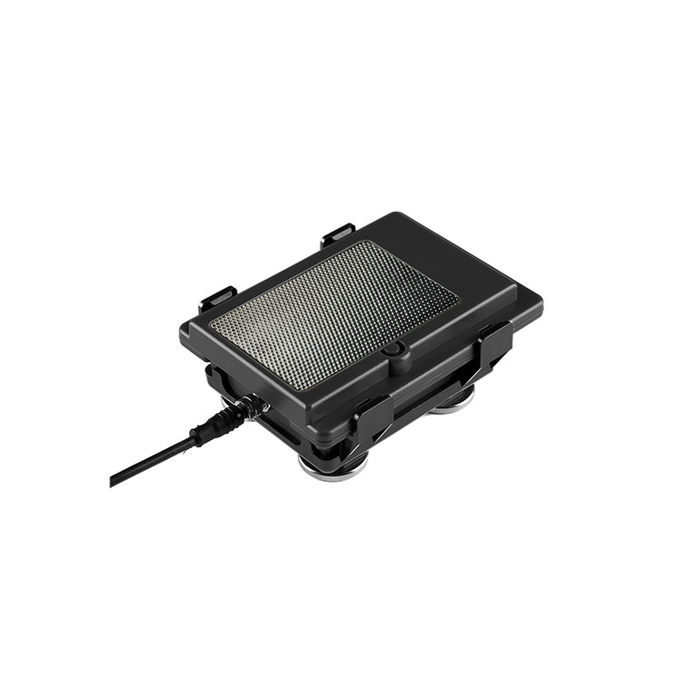

# Suntech - ST4955

El ST4955 es un rastreador GPS robusto, alimentado por energía solar, diseñado para el monitoreo prolongado en exteriores de vehículos, equipos sin fuente de alimentación propia y activos de alto valor. Pensado para despliegues de campo extensos, el dispositivo combina un receptor GNSS de alta sensibilidad con sistemas de aprovechamiento de energía y opciones de baterías de gran capacidad para soportar meses de funcionamiento autónomo en entornos exigentes.

Como dispositivo compatible con Plaspy, el ST4955 aporta posiciones, eventos del acelerómetro y flujos de sensores ambientales a Plaspy para una supervisión consolidada de flotas y activos. Su diseño de bajo consumo y las funciones de gestión remota lo hacen una opción práctica cuando se requiere seguimiento persistente, monitoreo de condiciones y visibilidad remota en activos distribuidos o de difícil acceso.

## Puntos clave

- Diseño con alimentación solar y varias opciones de batería interna para prolongar la autonomía en campo en despliegues de larga duración.
- Conectividad celular multinetwork con conmutación de respaldo para mantener la telemetría desde sitios remotos y activos en movimiento.
- Receptor GNSS de alta sensibilidad de 56 canales para posicionamiento preciso y obtención fiable de fijaciones en condiciones difíciles.
- Modos de operación de ultra bajo consumo que permiten intervalos de reporte de varios meses y reducen las visitas de mantenimiento.
- Acelerómetro integrado y soporte para entradas ambientales para capturar eventos de movimiento y telemetría de condición además de la ubicación.
- Caja resistente y amplio rango de temperatura de operación para aplicaciones industriales y al aire libre.
- Actualizaciones de firmware remotas e informes de salud del dispositivo para simplificar el mantenimiento de la flota y la gestión del ciclo de vida.

## Cómo funciona con Plaspy

Cuando lo despliega con Plaspy, el ST4955 transmite la ubicación y la telemetría a la plataforma, donde Plaspy decodifica y presenta los datos para uso operativo. Plaspy consolida las fijaciones GNSS, los eventos de movimiento y los flujos de sensores en mapas, alertas e informes históricos para que los equipos puedan supervisar activos, reaccionar ante incidentes y analizar el rendimiento a lo largo del tiempo.

- Actualizaciones de ubicación y telemetría en tiempo real entregadas a Plaspy para mapeo, seguimiento en vivo y alertas de geovallas.
- Detección de movimiento e impactos mediante el acelerómetro integrado para apoyar flujos de trabajo anti robo y acciones de recuperación.
- Flujos de sensores ambientales y datos de sondas disponibles dentro de Plaspy para el monitoreo de condiciones en activos sensibles a la temperatura o expuestos al clima.
- Datos opcionales de sensores Bluetooth agregados en Plaspy para ampliar la cobertura de telemetría local cuando sea necesario.
- Gestión remota de firmware y métricas de estado del dispositivo visibles en Plaspy para apoyar el mantenimiento escalable de la flota y las actualizaciones.

## Casos de uso típicos

- Seguimiento a largo plazo de activos sin alimentación propia donde la carga solar y el bajo consumo en espera reducen las necesidades de mantenimiento.
- Monitoreo de flotas de remolques, equipos de renta y maquinaria fuera de carretera que requieren telemetría celular persistente.
- Operaciones anti robo y recuperación usando detección de movimiento y reporte continuo de ubicación.
- Monitoreo de sitios remotos en construcción, minería y otros despliegues exteriores que necesitan hardware resistente y amplia tolerancia térmica.
- Monitoreo de condiciones ambientales de activos sensibles mediante entradas de sensores integrados y opcionales.

## Por qué elegir este rastreador con Plaspy

El ST4955 es una opción práctica para organizaciones que necesitan hardware de rastreo duradero y de bajo mantenimiento combinado con una plataforma de gestión que consolida datos de ubicación y condición. Su capacidad de carga solar, opciones de baterías extendidas y diseño eficiente reducen el servicio en sitio, mientras que Plaspy proporciona los paneles operativos, alertas e informes necesarios para actuar sobre esos datos.

La integración con Plaspy permite a los equipos correlacionar ubicación, eventos del acelerómetro y telemetría ambiental en una sola interfaz para apoyar la prevención de robos, la utilización de activos y el monitoreo basado en condiciones. Para más información sobre compatibilidad, escenarios de despliegue y cómo el ST4955 puede integrarse en sus flujos de trabajo, consulte Plaspy en el sitio principal https://www.plaspy.com. Las especificaciones del producto y su disponibilidad pueden cambiar con el tiempo, por lo que le recomendamos verificar los detalles técnicos actuales en el sitio del fabricante http://www.suntechint.com/.
