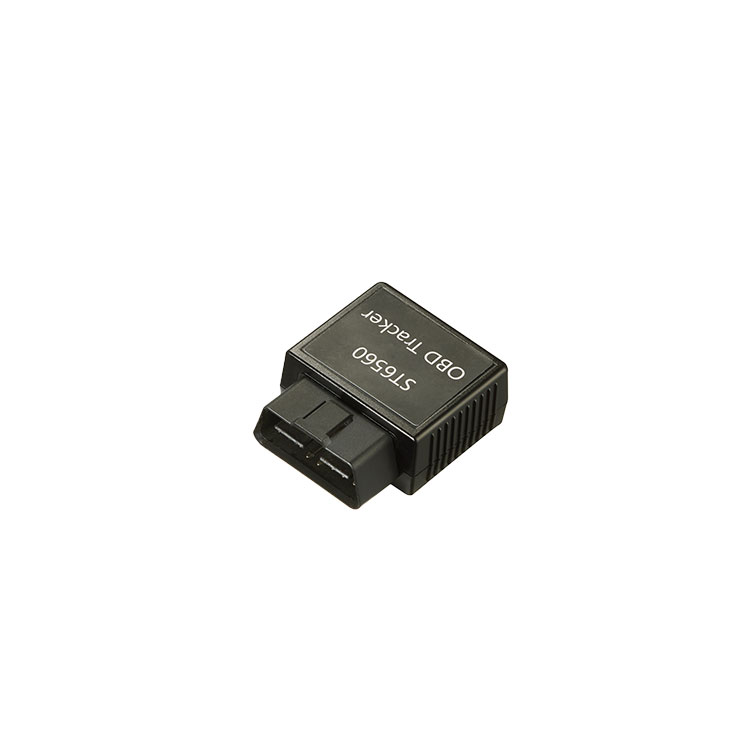

# Suntech - ST6560

El ST6560 es un rastreador OBD II compacto diseñado para ofrecer diagnóstico vehicular y reporte continuo de ubicación. Se instala fácilmente en el conector J1962 de 16 pines del vehículo, lo que lo hace ideal para gestión de flotas, recuperación ante robo y proyectos telemáticos que requieren una solución integrada de diagnóstico y localización. Este modelo destaca por su resiliencia multi red y su receptor GNSS multiconstelación con Dead Reckoning para mantener la continuidad de la posición en entornos difíciles.

Como dispositivo compatible con Plaspy, el ST6560 entrega telemetría y datos del motor en formatos estandarizados que se integran en los paneles y reportes de Plaspy. Su capacidad para exponer datos OBD II, señales J1939 y FMS, además de entradas locales de sensores BLE, lo hace relevante para flotas y operadores que necesitan visibilidad diagnóstica, alertas por geocercas y seguimiento continuo dentro de la plataforma Plaspy.

## Características principales

- Factor de forma OBD II plug and play que combina diagnóstico del vehículo con reporte de posición.
- Diseño celular multi red para mayor cobertura y conectividad resiliente entre regiones.
- GNSS multiconstelación y Dead Reckoning para mejorar la continuidad de la ubicación en túneles y cañones urbanos.
- Acceso profundo a diagnósticos del motor e información DTC para mantenimiento y detección de fallas.
- Soporte para mensajes J1939 ELD y FMS para satisfacer las necesidades telemáticas de vehículos pesados.
- Compatibilidad BLE integrada para emparejar sensores locales y ampliar la telemetría, por ejemplo temperatura o estado de puertas.

## Cómo funciona con Plaspy

Al conectarse y activarse, el ST6560 envía datos de ubicación, diagnóstico y telemetría a Plaspy, permitiendo que los administradores de flota supervisen los vehículos en tiempo real e investiguen la actividad histórica. El dispositivo normaliza las señales vehiculares y la telemática en un formato que Plaspy utiliza para visualización, alertas y reportes.

- Actualizaciones de ubicación en tiempo real y reproducción histórica disponibles en los paneles de Plaspy.
- Diagnósticos del motor e informes DTC que se muestran como alertas y disparadores de mantenimiento.
- Eventos de geocerca, tanto circulares como poligonales, para notificaciones de entrada y salida.
- Telemetría J1939 y FMS visible para vehículos pesados cuando esas señales están disponibles.
- Datos de sensores BLE sincronizados a través del dispositivo para que la telemetría ambiental y de carga aparezca en Plaspy.
- Soporte de seguimiento continuo mediante GNSS y Dead Reckoning para reducir huecos en el reporte de posición.

## Casos de uso habituales

- Monitoreo centralizado de flotas con ubicaciones en vivo y historial de rutas en Plaspy.
- Flujos de trabajo de mantenimiento preventivo impulsados por diagnósticos OBD II y alertas DTC.
- Telemática para vehículos pesados en transporte de larga distancia usando flujos de J1939 y FMS.
- Prevención de robo y recuperación con instalación discreta en OBD II y alertas basadas en geocercas.
- Monitoreo de carga y activos mediante emparejamiento de sensores BLE para telemetría de temperatura o estado de puertas.

## Por qué elegir este rastreador con Plaspy

El ST6560 combina la conveniencia del OBD II con telemetría vehicular integral, lo que lo convierte en una opción práctica para organizaciones que requieren diagnóstico y seguimiento confiable a través de Plaspy. Su enfoque multi red y GNSS con Dead Reckoning ayudan a mantener visibilidad en distintos entornos operativos, mientras que el soporte BLE y los protocolos para vehículos pesados amplían los tipos de datos de flota que se pueden recopilar y analizar.

Para equipos que evalúan hardware compatible con Plaspy, el ST6560 es una opción equilibrada cuando la instalación compacta, el diagnóstico del motor y las opciones de telemetría extendida son prioridades. Obtenga más información sobre Plaspy en nuestro sitio principal en https://www.plaspy.com y verifique las especificaciones y disponibilidad actuales con el fabricante en http://www.suntechint.com/ ya que los detalles y ofertas de producto pueden cambiar con el tiempo.
