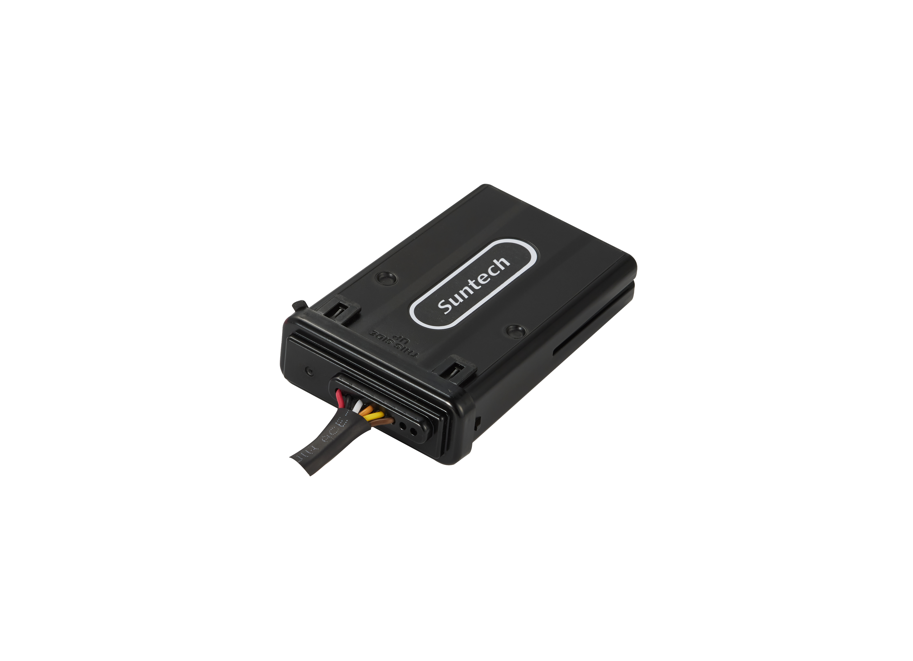

# Suntech - ST8310U

El Suntech ST8310U es un rastreador GPS vehicular compacto pensado para ofrecer monitoreo confiable de ubicación en múltiples escenarios de transporte y flotas. Ofrece conectividad económica LTE Cat.1 y 2G, una carcasa robusta e impermeable para entornos exigentes, varios puertos I/O de 5 pines para integraciones y detección integrada de interferencias. Características opcionales como análisis de patrones de conducción y reconstrucción de choques amplían su utilidad para supervisión operativa y revisión de incidentes.

Como dispositivo compatible con Plaspy, el ST8310U puede enviar datos de ubicación, eventos y estado a la plataforma Plaspy para seguimiento centralizado, alertas e informes. Su capacidad de configuración y actualización de firmware OTA facilita la gestión remota cuando se combina con un sistema de rastreo en la nube como Plaspy, mientras que las funciones de geocercas y seguridad respaldan flujos de trabajo comunes en la gestión de flotas.

## Aspectos destacados

- Conectividad LTE Cat.1 y 2G para comunicación eficiente entre dispositivo y plataforma
- Carcasa resistente e impermeable, apta para uso en vehículos expuestos al exterior
- Detección integrada de interferencias para proteger la integridad de la localización
- Geocercas circulares y poligonales para alertas por zonas
- Múltiples puertos I/O de 5 pines para soportar integraciones externas
- Opcionales de Análisis de Patrones de Conducción y Reconstrucción de Choques para visión sobre comportamiento e incidentes
- Configuración OTA y posibilidad de actualización de firmware para simplificar el mantenimiento remoto

## Cómo funciona con Plaspy

Al integrarlo con Plaspy, el ST8310U suministra datos de posición y eventos a la plataforma Plaspy, donde usted puede visualizarlos, analizarlos y actuar en consecuencia. Plaspy procesa la información del dispositivo y la transforma en vistas operativas, alertas e informes para que los equipos gestionen vehículos y respondan a incidentes desde una única interfaz.

- Visualización de ubicación en tiempo real y reproducción histórica de rutas para supervisión de flotas
- Notificaciones de entrada y salida de geocercas que se canalizan a alertas y reglas en Plaspy
- Eventos de detección de interferencias visibles en Plaspy para monitoreo de seguridad
- Eventos relacionados con comportamiento del conductor y choques disponibles para revisión cuando las funciones opcionales están habilitadas
- Ajustes remotos del dispositivo y actualizaciones de firmware coordinadas por OTA a través de los flujos de trabajo de la plataforma
- Informes agregados y paneles de control para medir utilización y métricas operativas

## Casos de uso típicos

- Seguimiento de flotas y monitoreo de rutas para vehículos de entrega y servicio
- Protección de activos y control perimetral mediante geocercas poligonales o circulares
- Revisión de comportamiento del conductor y reconstrucción de incidentes con funciones DPA y CR opcionales
- Implementación en vehículos que operan al aire libre o en condiciones climáticas adversas gracias a su diseño impermeable y resistente
- Monitoreo de un solo vehículo para propiedad, alquiler o control de unidades arrendadas

## Por qué elegir este rastreador con Plaspy

El ST8310U combina un hardware resistente con funcionalidades prácticas que responden bien a las necesidades de monitoreo vehicular y de flotas. Sus opciones de conectividad y la gestión OTA lo hacen apto para despliegues donde el mantenimiento remoto y el flujo de datos confiable son críticos. Las analíticas opcionales sobre patrones de conducción y la reconstrucción de choques aportan valor operativo a organizaciones enfocadas en seguridad y análisis de incidentes.

En conjunto con Plaspy, el ST8310U forma parte de una solución de rastreo gestionada donde los eventos del dispositivo, las alertas de geocerca y los informes agregados se presentan en una plataforma diseñada para visibilidad de flotas y control operativo. Si usted necesita un rastreador compacto y duradero que se integre en un entorno de rastreo en la nube, el ST8310U es una opción relevante a considerar.

To learn more about how Plaspy can work with compatible trackers like the ST8310U visit https://www.plaspy.com. Product specifications, availability, and manufacturer details can change over time, so please verify current specifications on the Suntech official website http://www.suntechint.com/ before making purchasing or deployment decisions.
