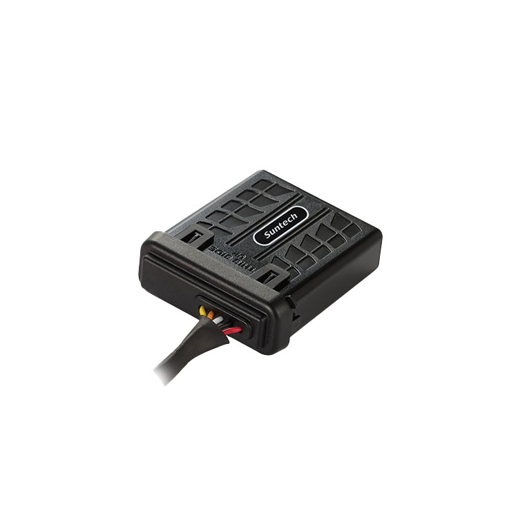

# Suntech - ST8310UM

El ST8310UM es un rastreador GPS LTE Cat 1 ultracompacto diseñado para el seguimiento de vehículos y activos en entornos expuestos y exigentes. Combina conectividad celular con posicionamiento GNSS robusto y una carcasa con certificación IP67, pensado para instalaciones donde el espacio es limitado y se requiere protección ambiental. La unidad está orientada a integraciones y optimizada para reportes de ubicación continuos, alertas por eventos y comportamiento de bajo consumo, ideal para gestión de flotas y prevención de robos.

Este dispositivo es compatible con Plaspy desde el primer momento, por lo que la telemetría y los datos de ubicación del ST8310UM pueden ser ingeridos por Plaspy para su monitoreo y administración centralizada. Los usuarios de Plaspy pueden aprovechar el rastreador para obtener visibilidad en tiempo real, geocercas configurables y reglas de alerta, lo que convierte al ST8310UM en una opción práctica para operaciones con flotas mixtas y procesos de recuperación de activos.

## Aspectos principales

- Rastreador GPS compatible con Plaspy para seguimiento en tiempo real y gestión centralizada de flotas.
- LTE Cat 1 con retroceso a 2G para mantener cobertura celular en distintas regiones.
- Factor de forma compacto con clasificación IP67 para instalaciones expuestas y entornos adversos.
- Acelerómetro tridimensional integrado y detección de ignición virtual para alerta de eventos y conducción brusca.
- Batería de respaldo recargable y amplio rango de entrada DC para soportar variaciones de alimentación del vehículo y monitoreo en estacionamiento.
- Geocercas configurables y detección de manipulación o, opcionalmente, de jamming para apoyar flujos de trabajo antirobo.
- Modos de bajo consumo y deep sleep para preservar la batería del vehículo durante estacionamientos prolongados.

## Cómo funciona con Plaspy

Al integrarse con Plaspy, el ST8310UM transmite posiciones GNSS y el estado del dispositivo a la plataforma para habilitar seguimiento en vivo, alertas e informes históricos. Plaspy convierte los eventos entrantes en visualizaciones en el mapa, notificaciones y paneles operativos que apoyan despacho, recuperación y supervisión rutinaria de la flota.

- Actualizaciones de ubicación en tiempo real visibles en los mapas y paneles de Plaspy.
- Informe de ignición virtual usando detección de voltaje y movimiento para generar resúmenes de viajes y alertas basadas en ignición.
- Alertas por manipulación y jamming enviadas a Plaspy para notificación inmediata y procesos de recuperación.
- Reportes de eventos de conducción brusca basados en el acelerómetro integrados en registros de desempeño del conductor e incidentes.
- Eventos de entrada y salida de geocercas para alertas automáticas, verificación de cumplimiento de rutas y seguridad perimetral.
- Estado de pérdida de alimentación y batería de respaldo disponible en Plaspy para monitorear la salud eléctrica del vehículo.

## Casos de uso típicos

- Gestión de flotas con seguimiento continuo en tiempo real y reportes de viajes para mejorar la utilización.
- Operaciones antirobo y recuperación mediante alertas de manipulación y seguimiento GNSS persistente.
- Monitoreo de activos y equipos donde se requiere hardware compacto con protección IP67 para instalaciones expuestas.
- Seguridad del conductor y revisión de incidentes mediante reportes de eventos bruscos basados en acelerómetro.
- Monitoreo de vehículos estacionados con modos de bajo consumo y soporte de batería de respaldo para supervisión prolongada.

## Por qué elegir este rastreador con Plaspy

El ST8310UM ofrece un equilibrio entre robustez, tamaño compacto y telemetría esencial que encaja en muchas implementaciones de Plaspy. Su conectividad celular con retroceso, posicionamiento GNSS confiable y capacidades de eventos entregan a los operadores los datos fundamentales para gestionar vehículos y activos sin complejidad excesiva. El bajo consumo y el soporte de batería de respaldo ayudan a reducir mantenimiento y mejorar la disponibilidad para flotas dispersas.

Al combinarse con Plaspy, el ST8310UM envía información de ubicación, eventos y estado de alimentación a una plataforma unificada para alertas, reportes y flujos operativos. Esto facilita añadir reglas basadas en geocercas, procedimientos antirobo y monitoreo de eventos de conductor a una implementación Plaspy existente, manteniendo la gestión de dispositivos y la telemetría centralizada.

Learn more about Plaspy and how compatible devices are supported on the main website https://www.plaspy.com. Product specifications, availability and manufacturer documentation can change over time, so verify current details on the official Suntech site http://www.suntechint.com/ before making deployment decisions.
