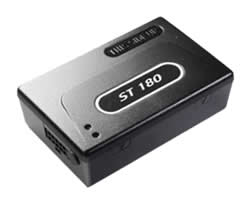

# Suntech - ST 180 Wi-FI

El Suntech ST 180 Wi‑FI es un rastreador GPS para vehículos pensado para aplicaciones de flota y telemática. Combina funciones básicas de localización con almacenamiento a bordo, conservando hasta 2000 posiciones GPS que pueden descargarse mediante conexión Wi‑Fi. El equipo está diseñado para reducir la dependencia de una conectividad celular continua, permitiendo transferencias por lotes cuando hay Wi‑Fi disponible y ayudando a controlar los costos operativos de las flotas.

Además del registro de ubicación, el ST 180 puede recopilar información del sistema del vehículo a través de interfaces estándar, ofreciendo datos como tendencias de consumo de combustible y métricas de rendimiento del motor. Su conjunto de opciones de comunicación, disparadores por eventos, entradas digitales, modo de ahorro de energía y batería de respaldo lo convierten en una unidad versátil para flotas que requieren historial de posiciones confiable y datos del vehículo sin asumir disponibilidad de red constante. Al ser un dispositivo compatible con Plaspy, puede integrarse en el flujo de trabajo de gestión de flotas para monitoreo y generación de reportes centralizados.

## Aspectos destacados

- Memoria interna para almacenar hasta 2000 posiciones GPS y descargarlas posteriormente vía Wi‑Fi.
- Descarga por Wi‑Fi que reduce la dependencia de subida continua por celular y puede disminuir costos operativos.
- Soporte para interfaces de datos vehiculares como J1939 FMS y estándares OBDII para capturar señales del sistema del vehículo.
- Múltiples opciones de comunicación, incluyendo TCP, UDP y Wi‑Fi, para transferencias flexibles de datos.
- Disparadores basados en eventos y múltiples entradas digitales para escenarios de monitoreo configurables.
- Modo de ahorro de energía y batería de respaldo para mantener la operación básica y la retención de datos.

## Cómo funciona con Plaspy

Al integrarse con Plaspy, el ST 180 Wi‑FI envía posiciones registradas y datos del vehículo a la plataforma Plaspy para visualización, alertas e informes. Plaspy procesa la información del dispositivo para que los administradores de flota puedan ver el historial de ubicaciones, monitorear tendencias del sistema vehicular y ejecutar análisis operativos desde una única interfaz.

- Vista centralizada en el mapa de posiciones en vivo e históricas para análisis de rutas y supervisión.
- Alertas y notificaciones basadas en eventos capturados por el rastreador y transmitidos a Plaspy.
- Herramientas de informes en Plaspy que usan los datos almacenados para generar resúmenes de viajes e informes de uso.
- Uso de descargas por Wi‑Fi para subir datos almacenados cuando los vehículos regresan a base o alcanzan cobertura Wi‑Fi, preservando el historial offline.
- Información del sistema vehicular desde CAN y otras interfaces visible en los paneles de Plaspy para apoyar la planificación de mantenimiento y eficiencia.

## Casos de uso típicos

- Operadores de flota que requieren un historial robusto de posiciones y desean minimizar los costos de datos celulares mediante transferencias por Wi‑Fi.
- Empresas que necesitan datos del vehículo para monitoreo de combustible y supervisión básica del rendimiento del motor.
- Recuperación de vehículos y rastreo de activos donde las posiciones almacenadas ayudan a reconstruir rutas cuando no hay conectividad continua.
- Operaciones con cobertura mixta que se benefician de la carga por lotes de telemetría y registros de posición en depósitos o ubicaciones con Wi‑Fi conocido.
- Despliegues de telemática donde entradas configurables y disparadores por evento se usan para vigilar comportamientos específicos del vehículo.

## Por qué elegir este rastreador con Plaspy

El ST 180 Wi‑FI es una opción práctica para organizaciones que necesitan registro duradero de posiciones y acceso a información del sistema vehicular, manteniendo control sobre los costos operativos. Su capacidad de almacenar un historial amplio de posiciones y subirlo vía Wi‑Fi lo hace adecuado para flotas que operan en zonas con cobertura celular intermitente o que prefieren transferencias programadas de datos.

Combinar el ST 180 con Plaspy ofrece a los operadores una plataforma única para rastreo, generación de reportes y alertas. Plaspy puede tomar los datos del dispositivo y presentarlos en mapas, líneas de tiempo e informes que ayudan a los equipos a tomar decisiones informadas sobre rutas, mantenimiento y gestión de combustible, mientras conserva un registro de la actividad vehicular recogida incluso cuando el ancho de banda en vivo es limitado.

Para obtener más información sobre Plaspy y cómo dispositivos compatibles como el Suntech ST 180 Wi‑FI pueden utilizarse con la plataforma visite https://www.plaspy.com. Las especificaciones de producto, disponibilidad y detalles del fabricante pueden cambiar con el tiempo, por lo que le recomendamos verificar la información técnica actual en el sitio oficial de Suntech http://www.suntechint.com/.
