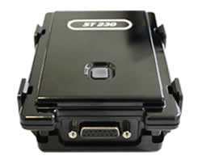

# Suntech - ST 230

El Suntech ST 230 es un rastreador GPS autónomo diseñado para el seguimiento y la supervisión de activos móviles de alto valor, como remolques, contenedores, trenes y yates. Combina una carcasa plástica resistente con clasificación IP67 y una batería interna de 5200 mAh para ofrecer funcionamiento prolongado en entornos exteriores exigentes. El equipo incluye además cuatro entradas digitales para monitoreo de eventos o estados y soporta métodos comunes de transmisión de datos para enviar información de posición y actividad.

Como dispositivo compatible con Plaspy, el ST 230 puede integrarse en los flujos de trabajo de gestión de flotas y activos de Plaspy para proporcionar visibilidad continua y control operativo. Su carcasa duradera y su batería de larga duración lo hacen apropiado para activos no atendidos o de difícil acceso, mientras que las entradas digitales permiten a los usuarios de Plaspy recibir señales basadas en eventos junto con las actualizaciones de ubicación para mejorar la conciencia situacional.

## Aspectos clave

- Carcasa resistente con clasificación IP67 ideal para entornos exteriores y marinos
- Batería interna de gran capacidad pensada para intervalos de rastreo prolongados
- Cuatro entradas digitales para monitoreo de eventos externos como alarmas o señales de estado
- Diseño autónomo, perfecto para activos móviles o sin alimentación propia como remolques y contenedores
- Soporta métodos de transporte de datos comunes para reenviar la información de rastreo a plataformas
- Adecuado para despliegues de larga duración donde el acceso para mantenimiento es limitado

## Cómo funciona con Plaspy

Al integrarse con Plaspy, el Suntech ST 230 envía información de ubicación y eventos a la plataforma para que los equipos puedan monitorear activos, revisar el historial y actuar ante alertas. Plaspy procesa los datos del dispositivo y los presenta junto con la información de la flota para apoyar la toma de decisiones operativas.

- Visibilidad en tiempo real e histórica de la posición de los activos en los paneles de Plaspy
- Alertas basadas en eventos utilizando las entradas digitales del ST 230 para notificaciones de pánico o disparadores externos
- Menor carga de mantenimiento gracias a la larga autonomía de la batería y la operación confiable del dispositivo
- Mayor protección de activos como remolques contenedores trenes y yates mediante monitoreo continuo
- Integración con los informes y flujos operativos de Plaspy para supervisión y auditoría

## Casos de uso típicos

- Rastrear el movimiento de remolques y contenedores durante transporte intermodal
- Monitorear material rodante y vagones para conocer ubicación y estado
- Brindar conciencia de ubicación y apoyo en recuperación ante robos para yates y activos marinos
- Gestionar equipos dispersos o no atendidos a largo plazo donde la vida útil de la batería es crítica
- Apoyar programas de recuperación de vehículos y protección de activos de alto valor

## Por qué elegir este rastreador con Plaspy

El ST 230 es una opción práctica cuando necesita un rastreador autónomo y resistente capaz de permanecer en campo por períodos prolongados. Su construcción impermeable y su batería interna de gran capacidad reducen la necesidad de mantenimientos frecuentes, mientras que las entradas digitales ofrecen flexibilidad para el monitoreo basado en eventos. Para organizaciones que usan Plaspy, el ST 230 permite ampliar la visibilidad a remolques contenedores vagones y activos marinos sin depender del cableado del vehículo.

Plaspy aporta la capa de plataforma necesaria para recolectar, visualizar y actuar sobre los datos del ST 230 junto con otros dispositivos de su flota. Para equipos enfocados en despliegues de larga duración y protección de activos, esta combinación entrega capacidades de rastreo prácticas y claridad operativa. Para saber más sobre Plaspy visite https://www.plaspy.com y para las especificaciones y detalles del fabricante verifique información en http://www.suntechint.com/ ya que las especificaciones y la disponibilidad de productos pueden cambiar con el tiempo.
