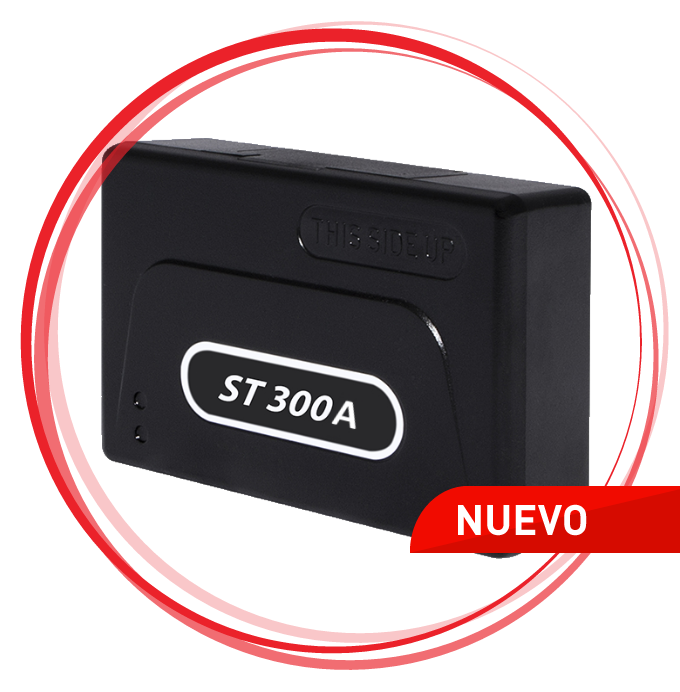

# Suntech - ST 300A

El Suntech ST 300A es un rastreador GPS avanzado diseñado para el monitoreo de vehículos y activos, con soporte para múltiples entradas de sensor y funciones de seguridad integradas. Cuenta con antenas internas, conectividad 1‑Wire compatible con sensores de temperatura y dispositivos iButton, interfaz RS232 y varias entradas analógicas. Además, soporta señales por arnés para detección de puertas, botón de pánico, inmovilización y monitoreo de placas, y ofrece alarmas por interferencia (jamming) y detección de arrastre de grúa, junto con otras funciones antirobo y de gestión de pasajeros.

Como dispositivo compatible con Plaspy, el ST 300A puede enviar información de ubicación y eventos a Plaspy para visibilidad y análisis centralizados. Plaspy presenta el historial de posiciones, lecturas de sensores y eventos de alarma del rastreador en paneles y reportes, lo que permite a los operadores integrar el ST 300A en flujos de trabajo de monitoreo y operación sin depender de plataformas propietarias.

## Aspectos destacados

- Antenas internas para una instalación discreta y recepción GPS confiable
- Soporte 1‑Wire para hasta tres sensores de temperatura y uso de iButton para identificación
- Interfaz RS232 y múltiples entradas analógicas para integración con sistemas del vehículo
- Entradas por arnés para detección de apertura de puertas, botón de pánico, inmovilización y monitoreo de placas
- Detección de interferencias y funciones antirobo integradas para mayor seguridad
- Características especializadas como detección de arrastre de grúa y análisis para gestión de pasajeros en casos específicos

## Cómo funciona con Plaspy

Cuando el ST 300A está conectado a Plaspy, el rastreador envía actualizaciones de ubicación y notificaciones de eventos que Plaspy integra en sus paneles y herramientas de reporte. Los valores de los sensores y los eventos de entradas digitales se convierten en elementos accionables que los equipos pueden monitorear, sobre los que pueden configurar alertas e incluir en reportes operativos.

- Datos de ubicación GPS en tiempo real e históricos mostrados en los mapas de Plaspy para seguimiento de vehículos
- Lecturas de sensores de temperatura y eventos de iButton integrados en la supervisión del estado de activos
- Eventos de entradas digitales como apertura de puertas, botón de pánico e inmovilización mapeados a alertas y notificaciones
- Alarmas de seguridad, como detección de jamming y eventos antirobo, visibles como alertas dentro de la plataforma
- Valores de entradas analógicas disponibles para monitoreo operativo e inclusión en reportes personalizados

## Casos de uso típicos

- Seguimiento de vehículos de flota con monitoreo de seguridad y eventos integrados
- Monitoreo de carga sensible a la temperatura cuando se requieren múltiples sensores térmicos
- Transporte de pasajeros o gestión de usuarios donde importan los eventos de identidad y la supervisión de puertas
- Monitoreo de equipos pesados y grúas para detectar movimientos anómalos como arrastre de grúa
- Implementaciones de protección de activos y antirobo que utilizan detección de interferencias e alertas de inmovilización

## Por qué elegir este rastreador con Plaspy

El ST 300A es un rastreador versátil que combina seguimiento de posición con un amplio conjunto de entradas y capacidades de alarma. Para organizaciones que necesitan supervisar la ubicación del vehículo junto con temperatura, estado de puertas y eventos de seguridad, el ST 300A ofrece una opción de hardware consolidada que Plaspy puede incorporar en flujos de monitoreo de flotas y activos.

Usar el ST 300A con Plaspy reduce la necesidad de soluciones puntuales separadas al reunir datos posicionales, lecturas de sensores y eventos de alarma en una sola plataforma para visibilidad y generación de reportes. Esto lo convierte en una opción práctica para operadores de flotas, gerentes de transporte y equipos de seguridad que requieren una vista integrada del estado de vehículos y carga.

Para obtener más información sobre la gestión de rastreadores compatibles y sus funciones con Plaspy visite https://www.plaspy.com. Las especificaciones del producto, la disponibilidad y los datos del fabricante pueden cambiar con el tiempo; verifique las especificaciones actuales y los detalles de instalación en el sitio oficial de Suntech http://www.suntechint.com/.
