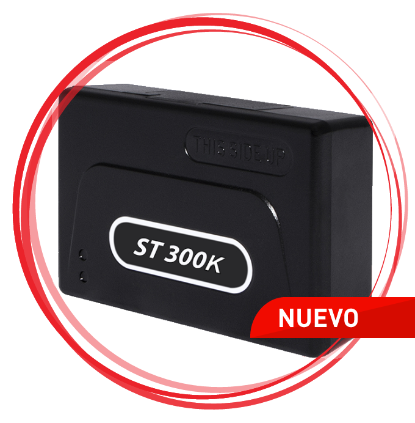

# Suntech - ST 300K

El Suntech ST 300K es un rastreador GPS de alta gama concebido para la gestión de flotas y el monitoreo operativo. Incluye múltiples interfaces vehiculares como RS232 y CANbus, además de una interfaz 1-Wire que admite hasta tres sensores de temperatura o un i-Button para la identificación del conductor. El dispositivo ofrece entradas y salidas analógicas y digitales configurables y detección de eventos integrada que puede generar alertas por colisiones, golpes y arrastre de grúa, junto con funciones como inmovilización del motor y detección de botón de pánico.

Como dispositivo compatible con Plaspy, el ST 300K puede enviar ubicaciones de vehículos, señales de evento y datos de reporte a la plataforma Plaspy para mejorar la visibilidad y la toma de decisiones en la gestión de flotas. Plaspy aprovecha las capacidades de reporte e I/O del rastreador para generar perfiles de conducción, informes de mantenimiento y resúmenes de turnos, ayudando a los equipos a monitorear actividad, responder a alertas y gestionar el mantenimiento preventivo dentro de un único entorno de gestión.

## Aspectos clave

- Soporte de múltiples interfaces, incluyendo RS232 y CANbus para integrarse con los sistemas del vehículo
- Interfaz 1-Wire compatible con hasta tres sensores de temperatura o con identificación de conductor mediante i-Button
- Funciones avanzadas de reporte para perfiles de conducción, horarios de trabajo e informes de mantenimiento
- Entradas y salidas analógicas y digitales configurables para eventos como inmovilización y señales de pánico
- Detección integrada de eventos para colisiones, golpes y arrastre de grúa con generación de alertas
- Diseñado para soportar monitoreo a nivel de flota e informes operativos

## Cómo funciona con Plaspy

Al integrarse con Plaspy, el ST 300K suministra un flujo constante de información de ubicación y eventos que Plaspy presenta mediante paneles, alertas e informes. Plaspy traduce las salidas del dispositivo en información operativa y registros históricos útiles para gerentes de flota y equipos de despacho.

- Ubicación en tiempo real y visibilidad del estado básico del vehículo dentro de los paneles de Plaspy
- Alertas y notificaciones por colisiones, golpes, arrastre de grúa y activaciones del botón de pánico
- Lecturas de sensores de temperatura y eventos de identificación de conductor disponibles para monitoreo y cumplimiento
- Informes agregados de perfiles de conducción y mantenimiento para análisis de tendencias y planificación preventiva
- Uso de eventos de entradas digitales y analógicas para activar flujos de trabajo y alertas operativas dentro de Plaspy

## Casos de uso habituales

- Monitoreo de rutas y reportes de actividad para flotas medianas y grandes
- Supervisión de carga sensible a temperatura mediante las entradas 1-Wire para sensores de temperatura
- Identificación de conductores y control de turnos con soporte para i-Button, mejorando la responsabilidad operativa
- Monitoreo de equipos pesados y grúas donde las alertas por colisiones y arrastre son críticas
- Planificación de mantenimiento programado utilizando los informes avanzados de mantenimiento y perfiles de conducción

## Por qué elegir este rastreador con Plaspy

El ST 300K combina múltiples interfaces de integración y reporte de eventos con entradas y salidas flexibles, lo que lo hace una opción práctica para flotas que requieren más que un simple rastreo de posición. Sus capacidades de reporte se alinean con el enfoque de Plaspy en supervisión operativa, ofreciendo un camino claro desde los eventos crudos del dispositivo hasta informes y alertas accionables.

Para organizaciones que necesitan monitorización de temperatura, identificación de conductores y manejo configurable de eventos junto con rastreo de ubicación, el ST 300K emparejado con Plaspy puede brindar una vista consolidada de la salud del vehículo, la actividad del conductor y los eventos excepcionales. Si usted tiene necesidades específicas de integración o reporte, evalúe las características del dispositivo en el contexto de su configuración de Plaspy para asegurar que cumplan sus objetivos operativos.

Para obtener más información sobre cómo funciona el Suntech ST 300K con Plaspy, visite el sitio de Plaspy en https://www.plaspy.com. Las especificaciones del producto, la disponibilidad y los detalles del fabricante pueden cambiar con el tiempo, por lo que le recomendamos verificar los datos técnicos actuales en el sitio del fabricante http://www.suntechint.com/ antes de tomar decisiones de compra.
