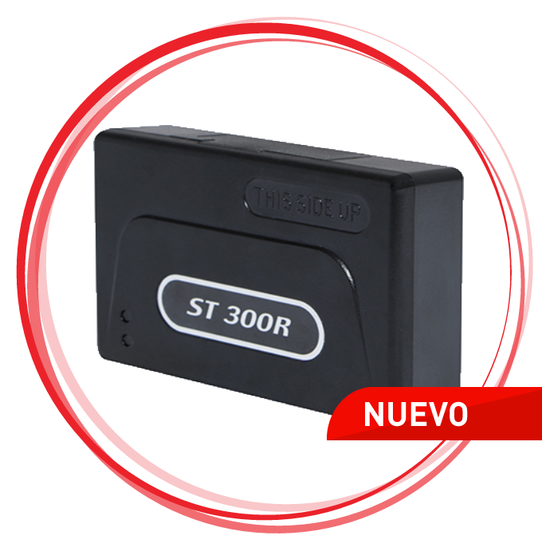

# Suntech - ST 300R

El Suntech ST 300R es un rastreador GPS para vehículos diseñado para apoyar la gestión de flotas y las necesidades de seguridad. Ofrece informes en tiempo real sobre estados clave del vehículo, como velocidad, estado de encendido y tiempos de inactividad, e incluye una interfaz de comunicación serial RS232 para conexión con sensores externos. Cuando se conecta a sensores, el ST 300R puede aportar datos adicionales como niveles de combustible, eventos de frenado brusco y presencia de pasajeros, ayudando a los operadores a comprender mejor el uso de cada vehículo.

Como dispositivo compatible con Plaspy, el ST 300R puede integrarse en el entorno de monitoreo de flotas de Plaspy para consolidar información de ubicación y estados del vehículo junto con otros activos. Esta compatibilidad convierte al ST 300R en una opción práctica para organizaciones que desean combinar conocimientos derivados de sensores con los informes, la supervisión y las herramientas operativas de Plaspy.

## Aspectos destacados

- Informes en tiempo real de velocidad, estado de encendido y tiempos de inactividad para visibilidad continua
- Interfaz serial RS232 para conectar sensores y fuentes de datos externas
- Capacidad para detectar lecturas relacionadas con combustible y eventos de conducción cuando está conectado a sensores
- Mejora la visibilidad de la flota para apoyar la optimización de rutas y el control operativo
- Contribuye a mejorar la seguridad y el monitoreo de vehículos y actividades a bordo
- Útil para empresas que buscan reducir costos mediante una supervisión vehicular más eficiente

## Cómo funciona con Plaspy

El ST 300R puede enviar datos de posición y estados del vehículo a Plaspy, permitiendo la visualización conjunta de la ubicación y la telemetría basada en sensores dentro de la misma plataforma. Plaspy puede utilizar esa información para soportar monitoreo, alertas e informes en una flota mixta.

- Consolide ubicación en tiempo real y estado del vehículo en el tablero de Plaspy para la supervisión operativa
- Utilice datos históricos en Plaspy para análisis de rutas, informes de tiempo de inactividad y evaluaciones de eficiencia
- Configure alertas en Plaspy para notificar a los equipos sobre eventos de encendido, inactividad excesiva o incidentes de conducción destacados
- Combine las entradas de sensores del ST 300R con los informes de Plaspy para identificar tendencias de combustible e indicadores de mantenimiento
- Incluya vehículos equipados con ST 300R en vistas agrupadas de la flota para planificación de despacho y logística

## Casos de uso típicos

- Flotas de reparto comercial que rastrean rutas y tiempos de parada para mejorar la eficiencia
- Operaciones logísticas que monitorean patrones de conducción e inactividad para reducir costos de combustible
- Servicios de transporte de pasajeros que usan datos de ocupación y eventos para mejorar la planificación del servicio
- Flotas con enfoque en seguridad que requieren visibilidad continua y reportes de eventos
- Operadores de servicios en campo que coordinan ubicaciones de vehículos y programación de tareas

## Por qué elegir este rastreador con Plaspy

El Suntech ST 300R es una opción sensata para flotas que necesitan un equilibrio entre seguimiento posicional y conectividad ampliable a sensores. Su capacidad de reportar estados del vehículo en tiempo real, junto con la posibilidad de conectar sensores externos, lo hace adaptable para organizaciones que requieren más que un simple seguimiento de ubicación. Al integrarlo con Plaspy, los datos del ST 300R pueden mostrarse junto con otros activos de la flota para ofrecer una visión unificada de las operaciones.

Los usuarios de Plaspy se benefician de combinar los datos a bordo del ST 300R con funciones de la plataforma como supervisión consolidada, alertas configurables e informes. Esto facilita convertir datos crudos del vehículo en mejoras operativas accionables mientras mantiene la supervisión de la flota centralizada.

Para saber más sobre Plaspy y cómo dispositivos compatibles como el Suntech ST 300R pueden encajar en su estrategia de flota visite https://www.plaspy.com. Las especificaciones y la disponibilidad del producto pueden cambiar con el tiempo; por favor verifique los detalles actuales con el fabricante en http://www.suntechint.com/ para asegurarse de que el ST 300R cumple sus requisitos exactos.
