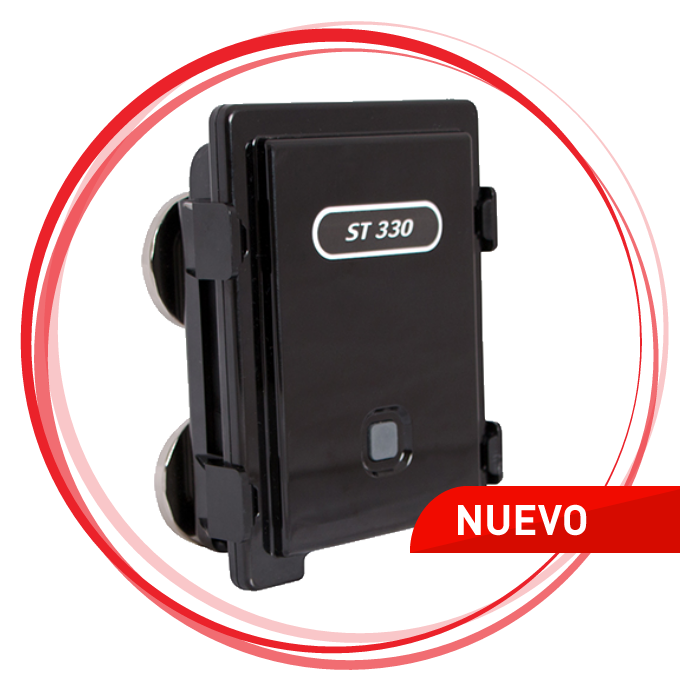

# Suntech - ST 330

El rastreador GPS Suntech ST330 es la solución perfecta para brindar autonomía a contenedores y cajas secas, ya sea en recorridos o estacionamientos prolongados. Este dispositivo cuenta con una batería de extra larga duración que puede reportar una posición cada 15 minutos durante hasta 5 semanas. Esto garantiza que siempre estés al tanto de la ubicación de tus activos, incluso en situaciones en las que no haya acceso a una fuente de alimentación.

Una de las características destacadas del ST330 es su potente imán, que permite que el rastreador sea colocado fácilmente en cualquier superficie metálica, como contenedores o cajas secas. Esto proporciona una instalación rápida y sencilla, sin necesidad de utilizar herramientas adicionales. Además, el dispositivo está diseñado para soportar elementos como agua y polvo, lo que lo hace ideal para entornos en los que estos factores son inevitables. De hecho, el ST330 cumple con la norma IP67, que garantiza su impermeabilidad.

En resumen, el rastreador GPS Suntech ST330 es una opción confiable y duradera para aquellos que necesitan monitorear la ubicación de contenedores y cajas secas durante períodos prolongados. Su batería de larga duración, su fácil instalación y su resistencia a elementos como agua y polvo lo convierten en una herramienta eficiente y versátil para la gestión de activos.

### Características destacadas:

- Batería de extra larga duración
- Reporte de posición cada 15 minutos durante hasta 5 semanas
- Potentes imanes para una fácil instalación en superficies metálicas
- Resistente al agua y al polvo \(cumple con la norma IP67\)

