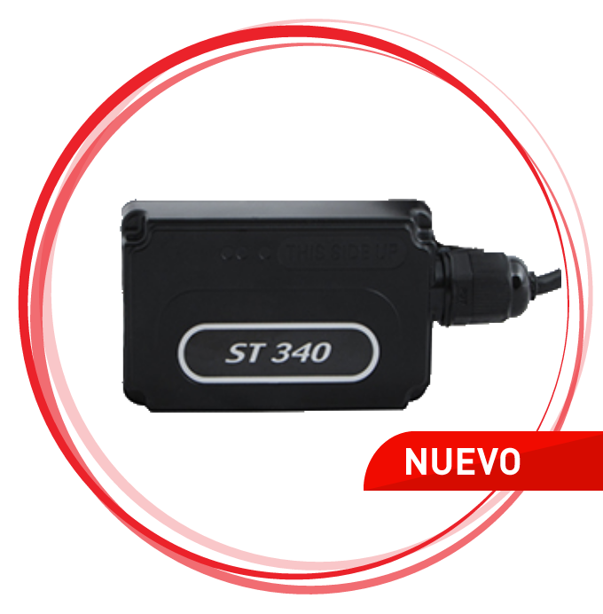

# Suntech - ST 340

El Suntech ST 340 es un rastreador GPS compacto diseñado para una amplia variedad de aplicaciones automotrices y marinas. Su tamaño reducido y bajo consumo energético lo convierten en una opción práctica para motociclismo, maquinaria pesada, embarcaciones, motos acuáticas y flotas mixtas. Diseñado para operar en entornos exigentes, el ST 340 cuenta con certificación IP67 para resistencia al polvo y al agua, lo que permite instalaciones externas con protección fiable frente a la exposición.

Como dispositivo compatible con Plaspy, el ST 340 puede integrarse en flujos de trabajo centralizados de monitoreo de flotas y activos para ofrecer visibilidad de ubicación en tiempo real, geocercas e inmovilización remota. Al combinarse con Plaspy, el rastreador ayuda a su organización a mantener conciencia operativa en distintos tipos de vehículos y entornos, mostrando los datos en la plataforma de Plaspy para monitoreo, alertas e informes.

## Aspectos destacados

- Diseño compacto ideal para instalaciones en espacios reducidos o dispositivos portátiles
- Bajo consumo energético para operación prolongada en activos remotos
- Certificación IP67 que proporciona resistencia al polvo y al agua para uso exterior y marino
- Seguimiento en tiempo real para mejorar la visibilidad operativa
- Capacidad de geocercas para recibir alertas de entrada y salida de zonas virtuales
- Opción de inmovilización remota para respuesta ante robos y mayor seguridad
- Muy adecuado para flotas mixtas que incluyen motocicletas, equipo pesado y embarcaciones

## Cómo funciona con Plaspy

El ST 340 se integra con Plaspy para enviar información de ubicación y eventos a un entorno único de gestión de flotas. Plaspy recoge y muestra las actualizaciones de posición, dispara alertas según reglas configuradas y ofrece herramientas de reporte que ayudan a los equipos a tomar decisiones basadas en los datos del rastreador.

- Visualización de ubicación en vivo y seguimiento sobre el mapa dentro de Plaspy para supervisión de la flota
- Creación de geocercas y notificaciones para alertar al equipo cuando los activos entran o salen de áreas definidas
- Control de inmovilización disponible a través de la plataforma para respaldar procesos de seguridad
- Historial de seguimiento y reproducción de recorridos para revisar rutas y analizar incidentes
- Notificaciones y ruteo de alertas para mantener informados a los equipos operativos sobre excepciones

## Casos de uso típicos

- Seguimiento de motocicletas usadas en entregas o mensajería
- Monitoreo de maquinaria pesada y equipos de construcción en obra
- Gestión de embarcaciones y motos acuáticas en flotas de alquiler y operaciones marinas
- Supervisión de flotillas mixtas que combinan activos terrestres y marinos
- Mejora de la respuesta ante robos y recuperación mediante inmovilización y alertas

## Por qué elegir este rastreador con Plaspy

El ST 340 es una opción práctica para organizaciones que requieren un rastreador pequeño y resistente a la intemperie para distintos tipos de vehículos. Su combinación de tamaño compacto, protección ambiental y eficiencia energética lo hace adecuado para activos que operan al aire libre o en espacios reducidos donde se prefiere un dispositivo de perfil bajo. Al integrarlo con Plaspy, las funciones principales del dispositivo se incorporan a procesos centralizados de monitoreo y operación.

Plaspy aporta valor al agregar los datos del ST 340 en paneles, sistemas de alerta e informes que ayudan a los equipos a reducir tiempos de inactividad, mejorar la supervisión de rutas y responder ante incidentes de seguridad. Si sus operaciones incluyen motocicletas, embarcaciones o activos de flota mixta que deben soportar la exposición a los elementos, el ST 340 junto con Plaspy puede ser un componente útil dentro de una estrategia integral de gestión de flotas.

Para obtener más información sobre la integración del ST 340 con Plaspy visite https://www.plaspy.com. Las especificaciones del producto y su disponibilidad pueden cambiar con el tiempo, por lo que le recomendamos verificar las especificaciones actuales y los detalles del fabricante en el sitio oficial de Suntech http://www.suntechint.com/.
