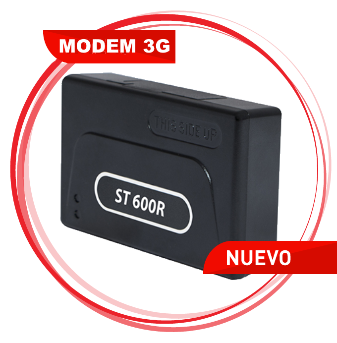

# Suntech - ST 600R

El Suntech ST 600R es un rastreador GPS de alto rendimiento diseñado para transmitir datos de forma fiable a través de redes celulares. Soporta velocidades 3G y cuenta con un módem celular avanzado compatible con HSDPA, UMTS, EDGE y GSM GPRS, lo que le permite seguir enviando y recibiendo información de ubicación y estado incluso donde la cobertura 3G no está disponible. Sus múltiples entradas y salidas permiten conectar periféricos para ampliar las capacidades de monitoreo.

Como dispositivo compatible con Plaspy, el ST 600R puede enviar datos de ubicación y de periféricos a la plataforma Plaspy para obtener visibilidad y reportes consolidados. Su conmutación celular y las opciones flexibles de entradas y salidas lo convierten en una opción práctica para organizaciones que requieren seguimiento continuo y la posibilidad de integrar sensores o accesorios adicionales en sus flujos de trabajo con Plaspy.

## Puntos destacados

- Rastreo GPS de alto rendimiento con velocidad de datos 3G y retroceso a 2G cuando sea necesario
- Módem celular avanzado compatible con HSDPA, UMTS, EDGE y GSM GPRS
- Múltiples entradas y salidas para conectar periféricos externos y ampliar el monitoreo
- Diseñado para transmisión de datos continua y fiable en áreas con cobertura variable
- Adecuado para rastrear vehículos, activos y personas en entornos de conectividad mixta
- Opción práctica para flotas y operaciones que requieren funcionalidades extendidas del dispositivo

## Cómo funciona con Plaspy

Cuando usted lo conecte a Plaspy, el ST 600R transmite fijaciones de ubicación y señales de periféricos a un entorno centralizado de gestión de flotas, de modo que los equipos puedan supervisar movimientos y estados de dispositivos en tiempo casi real. Plaspy procesa los datos del rastreador y los presenta mediante mapas, alertas e informes para apoyar la toma de decisiones operativas.

- Visualización de ubicación en tiempo real en los mapas de Plaspy para rastreadores individuales y flotas agrupadas
- Las entradas y salidas de periféricos pueden mostrarse como eventos o indicadores de estado dentro de Plaspy
- Alertas personalizadas configurables en Plaspy para notificar sobre violaciones de geocercas o cambios en entradas
- Informes históricos y reproducción de rutas en Plaspy para análisis de trayectos y revisiones operativas
- Agrupación de dispositivos y vistas de panel que ofrecen supervisión operacional de vehículos y activos

## Casos de uso típicos

- Rastreo de vehículos de flota para monitoreo de rutas y coordinación operativa
- Seguimiento de activos móviles o de alto valor que requieren reportes constantes
- Supervisión de personal móvil donde los datos de ubicación y periféricos mejoran la asignación de tareas
- Integración de sensores externos o cámaras para ampliar las capacidades telemáticas de la flota
- Entornos de cobertura mixta donde el retroceso celular garantiza el seguimiento continuo

## Por qué elegir este rastreador con Plaspy

El ST 600R combina conectividad celular práctica con opciones flexibles de entradas y salidas (E/S), lo que lo hace apropiado para organizaciones que necesitan reportes de ubicación continuos y la posibilidad de ampliar las funciones del dispositivo. Su diseño soporta operación primaria en 3G y retroceso a 2G, lo que ayuda a mantener el flujo de datos en áreas con cobertura variable. En conjunto con Plaspy, el rastreador permite centralizar datos de ubicación, eventos de periféricos y reportes en una única vista operativa.

Elegir el Suntech ST 600R para usar con Plaspy puede simplificar el monitoreo de flotas y activos cuando la fiabilidad celular y la integración de periféricos son importantes. Para más detalles sobre Plaspy y cómo gestionar este rastreador en la plataforma visite https://www.plaspy.com. Las especificaciones del producto y la disponibilidad pueden cambiar con el tiempo, por lo que le recomendamos verificar los detalles técnicos actuales y la documentación oficial en el sitio del fabricante http://www.suntechint.com/.
