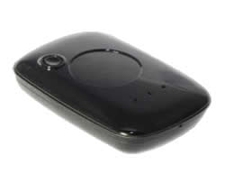

# Suntech - ST 910

El Suntech ST 910 es un rastreador GPS independiente diseñado para ofrecer seguimiento de ubicación confiable en activos móviles. Incluye una batería recargable Li-Polymer y almacenamiento interno de eventos, junto con una carcasa plástica compacta y resistente y un puerto mini USB para conectividad adicional. El equipo está orientado a aplicaciones de seguimiento y recuperación de vehículos donde se requiere visibilidad continua de la ubicación y alertas básicas.

Como dispositivo compatible con Plaspy, el ST 910 puede enviar posiciones de activos, eventos almacenados y alertas activadas por el usuario al entorno de gestión de flotas de Plaspy. Su soporte de conectividad GSM global, almacenamiento de eventos fuera de línea y un botón de pánico dedicado lo hacen adecuado para integrarlo con Plaspy para monitoreo, notificaciones e informes históricos sobre activos distribuidos.

## Puntos clave

- Rastreador GPS independiente diseñado para monitoreo persistente de ubicación en activos móviles
- Batería recargable Li-Polymer para operación prolongada en campo
- Memoria interna capaz de almacenar hasta 1000 eventos para continuidad offline
- Función de botón de pánico para enviar alertas de ubicación inmediatas vía SMS o servicios web
- Conectividad GSM cuatribanda con soporte para métodos comunes de transmisión de datos
- Modo de reposo para conservar batería cuando los activos están inactivos y mini USB para acceso auxiliar

## Cómo funciona con Plaspy

Al conectarse a Plaspy, el ST 910 suministra actualizaciones de posición y registros de eventos que Plaspy utiliza para mostrar vistas en vivo e históricas de la actividad de los activos. Plaspy ingesta las transmisiones del rastreador y las pone a disposición para monitoreo de flotas, alertas e informes, ayudando a los equipos operativos a mantener supervisión incluso cuando los activos se desplazan entre regiones.

- Plaspy registra y visualiza las actualizaciones de posición del ST 910 en mapas y en vistas temporales
- El historial de eventos almacenado en el dispositivo puede sincronizarse con Plaspy para informes sin lagunas
- Las alertas del botón de pánico pueden activar notificaciones y flujos de escalamiento en Plaspy
- El comportamiento en modo de reposo se refleja en Plaspy, de modo que los responsables pueden considerar la menor frecuencia de reporte mientras se conserva batería
- Plaspy puede generar informes operativos y resúmenes basados en la telemetría y los eventos almacenados del ST 910

## Casos de uso típicos

- Seguimiento y localización de equipos portátiles y activos sin alimentación propia
- Recuperación de vehículos y operaciones de recuperación de activos
- Monitoreo de flotas de alquiler donde se requiere rastreo compacto y autónomo
- Supervisión remota de equipos con conectividad intermitente y necesidad de almacenamiento de eventos
- Escenarios de seguridad que se benefician de una alerta de pánico activada por el usuario

## Por qué elegir este rastreador con Plaspy

El ST 910 es una opción práctica para organizaciones que necesitan un rastreador sencillo e independiente con almacenamiento offline confiable y capacidad de alertas por parte del usuario. Su batería recargable y el modo de reposo ayudan a prolongar la vida operativa entre cargas, y la memoria interna de eventos aporta resiliencia cuando la conectividad es intermitente. En combinación con Plaspy, el dispositivo ofrece visibilidad centralizada y registros consistentes a lo largo de activos distribuidos.

Dado que el ST 910 ofrece un conjunto de funciones enfocado en lugar de una amplia variedad de sensores, es especialmente adecuado para despliegues donde los requisitos principales son el reporte de posición fiable, la persistencia de eventos y la notificación en caso de emergencia. Usar el ST 910 con Plaspy proporciona un camino directo hacia el monitoreo a nivel de flota y la respuesta a incidentes sin complejidad innecesaria.

Para saber más sobre el uso de Plaspy con este rastreador visite https://www.plaspy.com. Las especificaciones del producto, disponibilidad y detalles del fabricante pueden cambiar con el tiempo, por lo que verifique la información técnica actual en el sitio oficial de Suntech en http://www.suntechint.com/ antes de la compra o el despliegue.
