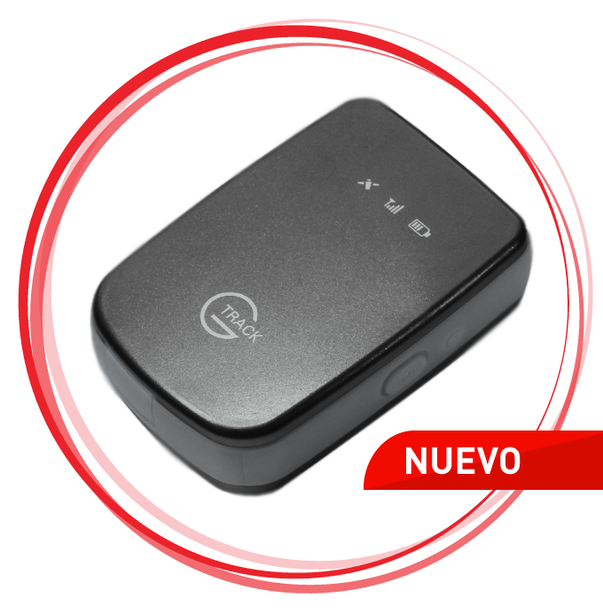

# Suntech - ST 940

El Suntech ST 940 es un rastreador GPS compacto y portátil diseñado para tareas de localización sencillas. Su formato pequeño y discreto, junto con un arnés magnético, facilita su fijación a equipos, paquetes, vehículos o pertenencias personales. El ST 940 se destaca por su larga autonomía en campo y su durabilidad, ofreciendo largos periodos operativos con una sola carga y una carcasa impermeable robusta para su uso en entornos expuestos.

Como dispositivo compatible con Plaspy, el ST 940 puede integrarse en flujos de trabajo de monitoreo de flotas y activos para proporcionar visibilidad continua de ubicaciones. Usted puede utilizar el ST 940 para aumentar la visibilidad de activos y personal sin necesidad de cambios complejos en el hardware. Su portabilidad y larga duración de batería lo convierten en una opción práctica para escenarios de seguimiento a largo plazo o con reportes intermitentes dentro de la plataforma Plaspy.

## Puntos clave

- Factor de forma compacto y portátil, ideal para colocaciones discretas e instalaciones temporales
- Autonomía muy prolongada cuando se configura para transmisiones infrecuentes, reduciendo la necesidad de mantenimiento
- Carcasa impermeable diseñada para condiciones exteriores, aumentando la fiabilidad en entornos adversos
- Arnés magnético para una fijación rápida y segura en una amplia variedad de superficies
- Versátil para múltiples roles de seguimiento, incluyendo activos, paquetes y monitoreo de personal

## Cómo funciona con Plaspy

Al utilizarse con Plaspy, el ST 940 entrega actualizaciones de ubicación que pueden integrarse en tableros, mapas e informes operativos. La integración permite la supervisión centralizada y el control continuo de los elementos rastreados, ayudando a los equipos a tomar decisiones informadas basadas en movimiento y presencia.

- Ver y rastrear las ubicaciones del ST 940 en los mapas de Plaspy para obtener visibilidad en tiempo real o periódica
- Definir geocercas y recibir alertas en Plaspy cuando un rastreador entra o sale de áreas definidas
- Agregar datos históricos de ubicación para informes y análisis operativos dentro de Plaspy
- Monitorear el estado del dispositivo y las tendencias de batería mediante Plaspy para planificar mantenimiento y recargas
- Usar las herramientas de notificación de Plaspy para escalar eventos relacionados con activos o personal rastreado

## Casos de uso típicos

- Seguimiento de activos de alto valor o de uso frecuente durante tránsito o almacenamiento
- Monitoreo de personal o trabajadores solitarios cuando se prefiere un rastreo compacto y portátil
- Seguimiento temporal de paquetes, envíos o consignaciones que requieren visibilidad intermitente
- Fijación a remolques, equipos u otros elementos móviles de la flota para comprobaciones de ubicación ocasionales

## Por qué elegir este rastreador con Plaspy

El ST 940 es una opción clara para organizaciones que necesitan un rastreador fiable y de bajo mantenimiento que se integre bien con las capacidades de monitoreo e informes de Plaspy. Su combinación de larga autonomía, resistencia a la intemperie y opción de montaje magnético lo hace adecuado para implementaciones donde las actualizaciones periódicas de ubicación y la robustez física importan más que la telemetría de alta frecuencia continua.

Si desea explorar cómo el ST 940 puede encajar en su implementación de Plaspy, conozca más sobre Plaspy y sus opciones de integración de dispositivos en https://www.plaspy.com. Las especificaciones del producto, disponibilidad y detalles del fabricante pueden cambiar con el tiempo, por lo que le recomendamos verificar las especificaciones actuales y la guía oficial del fabricante en http://www.suntechint.com/ antes de tomar decisiones de compra.
