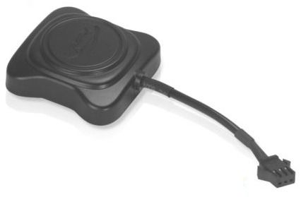

# Supermate - D10-W

El Supermate D10-W es un rastreador GPS pequeño y ligero pensado para necesidades variadas de localización en contextos personales, comerciales e industriales. Ofrece actualizaciones de ubicación en tiempo real e integra funciones útiles para la supervisión continua, como geo-cercas y un botón de emergencia SOS. Su formato compacto facilita su colocación en distintos activos sin llamar la atención.

Como dispositivo compatible con Plaspy, el D10-W puede enviar información de ubicación y eventos a la plataforma Plaspy para apoyar la supervisión centralizada y la gestión de flotas. Usted puede integrar el rastreador en sus flujos de trabajo de seguimiento para obtener visibilidad, recibir alertas de límites y reaccionar ante eventos SOS junto con otros activos gestionados en Plaspy.

## Características principales

- Actualizaciones de ubicación en tiempo real para visibilidad continua de los activos
- Capacidad de geo-cercas para recibir alertas cuando un activo entra o sale de zonas definidas
- Botón de emergencia SOS para señalizar situaciones urgentes
- Diseño compacto y ligero, ideal para colocación discreta en distintos tipos de activos
- Adecuado para seguimiento personal, comercial e industrial
- Instalación sencilla que facilita el despliegue rápido en operaciones diarias

## Cómo funciona con Plaspy

Al conectarse con Plaspy, el Supermate D10-W transmite ubicación y eventos en vivo a la plataforma, lo que permite a los operadores supervisar los activos desde un único tablero. Plaspy consolida los datos del D10-W junto con otros dispositivos para facilitar la supervisión operativa y la generación de informes.

- Seguimiento centralizado en vivo y visibilidad en el mapa dentro de Plaspy
- Configuración de geo-cercas y notificaciones gestionadas mediante reglas de Plaspy
- Notificación de eventos SOS dirigida a los paneles y canales de alerta de Plaspy
- Reproducción de posiciones históricas e informes básicos para revisión de rutas y auditorías
- Listados unificados de activos y agrupación para flotas mixtas que incluyan dispositivos D10-W

## Casos de uso típicos

- Monitoreo de vehículos de flotas para supervisión de rutas y ubicación
- Seguimiento de equipos portátiles y activos de alto valor en operaciones comerciales
- Monitorización de seguridad personal para trabajadores solitarios o personas vulnerables usando alertas SOS
- Control de equipos en alquiler y verificación de devoluciones
- Visibilidad en entregas y logística para mejorar la coordinación operativa

## Por qué escoger este rastreador con Plaspy

El Supermate D10-W es una opción práctica cuando necesita un rastreador pequeño y discreto que entregue actualizaciones de ubicación en vivo y funciones estándar como geo-cercas y alerta SOS. Su versatilidad para activos personales y comerciales lo convierte en una alternativa flexible para organizaciones que desean estandarizar la supervisión de distintos tipos de bienes.

Integrar el D10-W con Plaspy incorpora los datos del dispositivo en un entorno de gestión coherente, ayudando a los equipos a consolidar alertas, revisar movimientos históricos y mantener conciencia situacional en una flota mixta. Para quienes buscan funcionalidad de seguimiento simple y sin complejidad innecesaria, el D10-W junto con Plaspy es una combinación clara y funcional.

Para obtener más información sobre Plaspy y las capacidades de la plataforma visite https://www.plaspy.com. Las especificaciones del producto y la disponibilidad pueden cambiar con el tiempo, por lo que conviene verificar los detalles técnicos actuales y los recursos del fabricante en el sitio oficial de Supermate http://www.gps-summit.com/.
