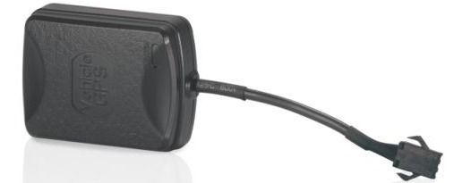

# Supermate - D11

El Supermate D11 es un rastreador GPS compacto pensado para la gestión flexible de activos y la seguridad personal. Diseñado para una colocación discreta, el D11 es adecuado para vehículos, equipos portátiles y objetos personales. El dispositivo prioriza la portabilidad y la resistencia, ofreciendo ubicación en tiempo real, geocercas y una función de alerta SOS para apoyar la supervisión continua y la respuesta rápida cuando sea necesario.

Como dispositivo compatible con Plaspy, el D11 se integra con los flujos de trabajo de gestión de flotas y activos de Plaspy para aportar visibilidad continua y alertas accionables. Su instalación sencilla y su diseño operativo versátil lo convierten en una opción práctica para organizaciones y particulares que deseen incorporar reportes de posición confiables y notificaciones de límites a su sistema de monitoreo utilizando la plataforma Plaspy.

## Principales características

- Factor de forma compacto y liviano que facilita la colocación discreta en una amplia variedad de activos
- Seguimiento de ubicación en tiempo real para mantener visibilidad continua de objetos y personal en movimiento
- Capacidades de geocercado para definir zonas y recibir alertas de entrada y salida
- Función SOS integrada para notificar a las partes interesadas en situaciones de emergencia
- Diseñado para uso global con amplia compatibilidad operativa y buena tolerancia ambiental
- Alta sensibilidad GPS para mejorar el rendimiento de localización en entornos urbanos complejos

## Cómo funciona con Plaspy

Al conectarse a Plaspy, el Supermate D11 envía la información de ubicación y eventos que Plaspy usa para mostrar la posición de los activos, activar alertas y alimentar las herramientas de reporte. Plaspy recibe las actualizaciones del D11 y las presenta en paneles, mapas y canales de notificación para que los equipos puedan monitorear y gestionar activos desde una única plataforma.

- Actualizaciones de ubicación en vivo mostradas en los mapas de Plaspy para seguimiento en tiempo real y supervisión operativa
- Alertas de geocerca enviadas a través de las notificaciones de Plaspy cuando los activos cruzan límites definidos
- Eventos SOS encaminados a los flujos de trabajo de Plaspy para escalar incidentes y registrar respuestas
- Datos históricos de posición disponibles para revisión e informes dentro de Plaspy para auditorías y análisis
- Visibilidad centralizada para flotas y tipos de activos mixtos cuando el D11 se despliega junto a otros rastreadores compatibles

## Casos de uso típicos

- Visibilidad de flotas pequeñas donde se requieren rastreadores discretos
- Protección de activos para equipos portátiles, herramientas y artículos de alto valor en tránsito
- Monitoreo de seguridad personal para trabajadores en solitario o familiares con necesidad de alertas de emergencia
- Supervisión logística para seguir movimientos y garantizar cumplimiento de rutas
- Despliegues temporales en proyectos de corta duración que requieren rastreo ligero y fácil de colocar

## Por qué elegir este rastreador con Plaspy

El Supermate D11 combina funciones de rastreo prácticas con un factor de forma que se adapta a muchos escenarios reales de monitoreo. Para organizaciones que usan Plaspy, el D11 ofrece una forma directa de ampliar el reporte de posición, las alertas por límites y la señalización de emergencias dentro de flujos de trabajo ya existentes, sin requerir configuraciones complejas.

Al priorizar la portabilidad, la fiabilidad y la facilidad de uso, el D11 es una buena opción para entornos con activos mixtos donde la colocación discreta y la visibilidad constante son importantes. Integrar el D11 con Plaspy ayuda a consolidar los datos de rastreo para que los equipos operativos puedan actuar más rápido, mantener mejores registros y mejorar la conciencia situacional.

Para más información sobre Plaspy y cómo dispositivos compatibles como el Supermate D11 pueden usarse con la plataforma visite https://www.plaspy.com. Las especificaciones del producto, la disponibilidad y los datos del fabricante pueden cambiar con el tiempo, así que verifique la información actual en el sitio oficial del fabricante Supermate http://www.gps-summit.com/.
