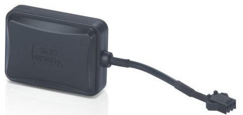

# Supermate - D11-G

El Supermate D11-G es un rastreador GPS compacto y versátil pensado para la gestión de activos y aplicaciones de seguridad. Diseñado para una colocación discreta y fácil transporte, el D11-G es adecuado para rastrear vehículos, objetos personales, equipos o personas. Sus funciones principales incluyen reporte de ubicación en tiempo real, geocercas para definir límites virtuales y un botón de emergencia SOS para alertas en situaciones críticas.

Como dispositivo compatible con Plaspy, el D11-G puede integrarse en los flujos de monitoreo de flotas y activos de Plaspy para ofrecer visibilidad continua y supervisión operativa. La compatibilidad facilita incorporar el D11-G en un entorno de seguimiento centralizado donde el historial de ubicaciones, las alertas y los informes se gestionan junto con otros dispositivos en la plataforma Plaspy.

## Características principales

- Seguimiento en tiempo real para visibilidad y monitoreo continuo de posiciones
- Soporte de geocercas para recibir alertas cuando los activos entran o salen de zonas definidas
- Botón de emergencia SOS para notificaciones inmediatas en situaciones urgentes
- Diseño liviano y compacto para colocación discreta y portátil
- Preparado para uso global con soporte de bandas de red amplias y tolerancia a rangos de temperatura
- Construcción resistente para uso diario y cumplimiento con estándares internacionales comunes

## Cómo funciona con Plaspy

Al usarlo con Plaspy, el Supermate D11-G envía actualizaciones de ubicación en vivo y alertas de eventos que se integran en los paneles y herramientas de reporte de Plaspy. Esta integración ayuda a los operadores a supervisar activos a gran escala, configurar notificaciones automáticas y analizar patrones de movimiento sin depender de software adicional del fabricante.

- Visibilidad centralizada de las ubicaciones de los dispositivos D11-G desde la plataforma Plaspy
- Recepción de alertas de geocerca y notificaciones SOS canalizadas a través del sistema de alertas de Plaspy
- Uso de los informes de Plaspy para revisar datos históricos de ubicación y tendencias de movimiento
- Agrupación y gestión de múltiples unidades D11-G para supervisión a nivel de flota y coordinación operativa
- Configuración de preferencias de notificación en Plaspy para ajustarlas a los flujos de trabajo y a los responsables

## Casos de uso típicos

- Monitoreo y supervisión de vehículos de flota
- Rastreo de activos portátiles de alto valor durante transporte o almacenamiento
- Monitoreo de seguridad personal para personas vulnerables con soporte SOS
- Gestión y localización de equipos de alquiler
- Visibilidad general del inventario de activos en varios sitios o regiones

## Por qué elegir este rastreador con Plaspy

El Supermate D11-G combina funciones prácticas de rastreo con un factor de forma compacto, lo que lo hace adecuado para organizaciones que requieren colocación flexible y visibilidad de ubicación confiable. Integrado con Plaspy, el D11-G aporta a una solución de seguimiento unificada que facilita alertas, informes y supervisión operativa sin añadir complejidad innecesaria.

Si desea evaluar dispositivos para integración con Plaspy, el D11-G es una opción sensata cuando la portabilidad, las geocercas y las alertas de emergencia son prioritarias. Conozca más sobre Plaspy y cómo dispositivos compatibles como el Supermate D11-G pueden gestionarse en el sitio web de Plaspy https://www.plaspy.com. Tenga en cuenta que las especificaciones del producto, la disponibilidad y los datos del fabricante pueden cambiar con el tiempo; verifique las especificaciones y la documentación actual con el fabricante en http://www.gps-summit.com/ antes de tomar decisiones de compra.
