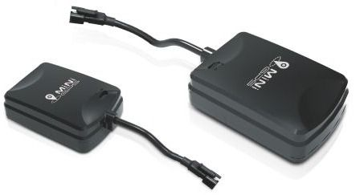

# Supermate - D12

El Supermate D12 es un rastreador GPS compacto pensado para la gestión versátil de activos y la seguridad personal. Ofrece seguimiento de ubicación en tiempo real, soporte para geocercas y un botón de alerta SOS en un formato pequeño y liviano, ideal para colocación discreta en una amplia variedad de objetos. Está diseñado como un rastreador multipropósito, útil tanto para uso individual como para supervisión de flotas empresariales, con énfasis en una instalación sencilla y fiabilidad en el uso diario.

Como dispositivo compatible con Plaspy, el D12 puede enviar información de ubicación y alertas en vivo a la plataforma de seguimiento de Plaspy para proporcionar visibilidad centralizada de sus activos y vehículos. Plaspy puede integrar los eventos de rastreo y alerta del D12 para apoyar la monitorización, la generación de informes y los flujos operativos, ayudando a los equipos a habilitar los datos del dispositivo rápidamente sin necesidad de integraciones personalizadas complejas.

## Características principales

- Seguimiento de ubicación en tiempo real para monitoreo continuo de activos
- Soporte para geocercas con alertas configurables por áreas
- Botón SOS integrado para notificaciones de emergencia rápidas
- Diseño compacto y liviano para colocación discreta
- Construcción resistente pensada para uso diario en condiciones variadas
- Instalación simple y configuración amigable para distintos tipos de usuarios

## Cómo funciona con Plaspy

Al integrarse con Plaspy, el Supermate D12 envía actualizaciones de posición y eventos de alerta que se muestran en la interfaz de monitoreo de Plaspy, lo que permite una supervisión centralizada de los elementos rastreados. Plaspy utiliza estos datos para mostrar ubicaciones en mapas, activar notificaciones y generar informes que apoyan la toma de decisiones operativas.

- Ver posiciones en vivo e historial reciente de dispositivos D12 en los mapas de Plaspy
- Recibir alertas de entrada y salida de geocercas a través de los canales de notificación de Plaspy
- Capturar alertas SOS del dispositivo y mostrarlas a los operadores para una respuesta rápida
- Agregar la actividad de los dispositivos en informes para analizar el desempeño de la flota y la utilización de activos
- Agrupar y filtrar dispositivos D12 dentro de Plaspy para monitoreo por roles y flujos operativos

## Casos de uso típicos

- Seguimiento y supervisión de vehículos de flota para operaciones pequeñas y medianas
- Monitoreo de equipos y activos portátiles valiosos en tránsito o almacenamiento
- Seguimiento de seguridad personal para trabajadores aislados o miembros de la familia con función SOS
- Control de activos en alquiler o compartidos para gestionar ubicación y uso
- Prevención de pérdidas y seguridad general de artículos de alto valor

## Por qué elegir este rastreador con Plaspy

El Supermate D12 es una opción práctica cuando necesita un rastreador directo que cubra las funciones básicas de ubicación y alertas sin complejidad innecesaria. Sus actualizaciones en tiempo real, soporte de geocercas y capacidad SOS encajan bien con las fortalezas de Plaspy en monitoreo centralizado, gestión de alertas e informes, lo que lo convierte en una alternativa sensata para organizaciones que desean combinar hardware confiable con una plataforma de seguimiento consolidada.

Plaspy ofrece una vista consolidada de los dispositivos D12 para que los equipos puedan gestionar activos, responder a incidentes y analizar movimientos históricos desde un único lugar. Si está evaluando hardware para usar con Plaspy, el D12 presenta un conjunto de funciones equilibrado para escenarios comunes de seguimiento de flotas y activos, manteniéndose fácil de desplegar y operar.

Para obtener más información sobre cómo Plaspy funciona con dispositivos como el Supermate D12, visite el sitio web de Plaspy en https://www.plaspy.com. Las especificaciones del producto y la disponibilidad pueden cambiar con el tiempo, por lo que le recomendamos verificar los detalles actuales en el sitio oficial del fabricante http://www.gps-summit.com/.
