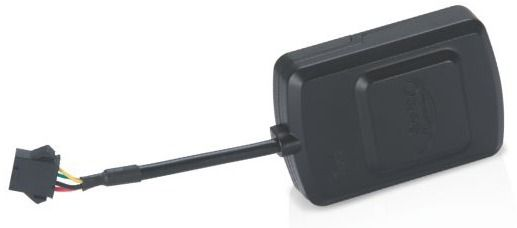

# Supermate - D12-G

El Supermate D12-G es un rastreador GPS compacto diseñado para la gestión de activos y la seguridad personal. Está pensado para colocarse de forma discreta en vehículos, equipos o artículos de valor, y ofrece visibilidad continua de la ubicación. El equipo prioriza la facilidad de uso con una instalación rápida y un formato ligero, lo que lo hace adecuado para distintos entornos operativos y para despliegues sencillos en el día a día.

Como dispositivo compatible con Plaspy, el D12-G puede enviar actualizaciones de ubicación y señales de evento a la plataforma Plaspy para su monitoreo y generación de informes centralizados. Esa compatibilidad lo convierte en una opción práctica para organizaciones que desean combinar el hardware D12-G con las funciones de software de Plaspy, como vistas de mapas en tiempo real, alertas y supervisión operativa, sin requerir configuraciones complejas por parte de los usuarios finales.

## Características principales

- Diseño compacto y liviano para colocación discreta en activos y vehículos
- Actualizaciones de ubicación en tiempo real para garantizar seguimiento continuo y visibilidad
- Soporte de geocercas para activar alertas cuando un activo entra o sale de áreas definidas
- Botón SOS integrado para notificar a respondedores o supervisores en situaciones de emergencia
- Alta sensibilidad GPS y construcción resistente para posicionamiento confiable en entornos variados
- Entrada de alimentación adaptable y amplio rango operativo para uso en distintas regiones
- Instalación sencilla apta para usuarios con distintos niveles técnicos

## Cómo funciona con Plaspy

El Supermate D12-G transmite información de ubicación y eventos que Plaspy presenta mediante sus paneles y herramientas de monitoreo. Una vez que el dispositivo se añade a una cuenta de Plaspy, los equipos pueden aprovechar las funciones de la plataforma para convertir las señales del dispositivo en información operativa para la gestión de flotas y activos.

- Vea la ubicación en vivo en los mapas de Plaspy para monitorear activos casi en tiempo real
- Configure geocercas en Plaspy y reciba alertas automáticas cuando se crucen los límites definidos
- Use las alertas SOS del D12-G para activar flujos de trabajo de incidentes y notificar a contactos designados
- Agrupe y supervise activos en Plaspy para obtener visibilidad a nivel de flota y seguir asignaciones
- Acceda a datos históricos de posiciones y genere informes para auditorías y revisiones operativas

## Casos de uso típicos

- Seguimiento y supervisión de vehículos de flota para control de rutas y utilización
- Localización de equipos portátiles de alto valor utilizados en distintos sitios de trabajo
- Protección de objetos personales y equipaje para usuarios individuales
- Monitoreo de seguridad para familiares o en contextos de cuidado
- Seguimiento de activos en renta para controlar ubicación y uso durante periodos de arriendo

## Por qué elegir este rastreador con Plaspy

El Supermate D12-G ofrece un equilibrio entre diseño compacto y funciones esenciales de rastreo que cubren muchas necesidades operativas. Al combinarlo con Plaspy, sus actualizaciones en tiempo real, geocercas y capacidad SOS se traducen en alertas accionables, informes y paneles que apoyan las tareas cotidianas de gestión de flota y activos.

Las organizaciones que requieren hardware de rastreo sencillo y confiable junto con una plataforma de gestión flexible pueden encontrar en la combinación D12-G y Plaspy una solución práctica. La facilidad de instalación del dispositivo y su sensibilidad de posicionamiento ayudan a minimizar la carga de despliegue, mientras que Plaspy proporciona la visibilidad centralizada y los informes en los que los equipos confían.

Para saber más sobre cómo Plaspy puede integrarse con el Supermate D12-G y otros dispositivos compatibles, visite https://www.plaspy.com. Las especificaciones del producto, la disponibilidad y los detalles del fabricante pueden cambiar con el tiempo, por lo que le recomendamos verificar la información técnica y de compatibilidad actual en el sitio oficial de Supermate http://www.gps-summit.com/.
