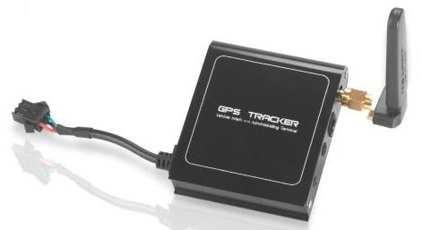

# Supermate - D26-H

El Supermate D26-H es un rastreador GPS compacto y ligero pensado para una amplia variedad de tareas de seguimiento. Según la descripción del modelo, resulta apropiado para usos personales, comerciales e industriales donde la colocación discreta y el monitoreo fiable de la ubicación son importantes. El D26-H prioriza la portabilidad, una construcción robusta y una instalación sencilla, al mismo tiempo que ofrece funciones esenciales como actualizaciones de ubicación en tiempo real, geovallas y una función de emergencia SOS.

Como dispositivo compatible con Plaspy, el D26-H puede integrarse en la plataforma de gestión de flotas y activos de Plaspy para proporcionar visibilidad continua en diferentes despliegues. Su versatilidad lo convierte en una opción práctica para organizaciones y particulares que necesitan un hardware directo que entregue datos de ubicación y alertas a Plaspy para monitoreo, generación de informes y supervisión operativa sin requerir conocimientos técnicos extensos.

## Aspectos destacados

- Diseño compacto y liviano para una colocación discreta en vehículos y activos
- Seguimiento en tiempo real para visibilidad continua de la ubicación
- Soporte de geovallas para definir zonas y generar alertas al entrar o salir
- Función SOS para alertas inmediatas en situaciones de emergencia
- Construcción resistente pensada para uso diario en entornos variados
- Instalación sencilla para reducir la complejidad de puesta en marcha

## Cómo funciona con Plaspy

El Supermate D26-H envía información de ubicación y eventos a Plaspy para que los equipos puedan monitorear activos, responder a incidencias y analizar patrones de movimiento desde una única plataforma. Plaspy procesa los datos del dispositivo para ofrecer conocimiento situacional y optimizar los flujos de trabajo operativos.

- Visualización en vivo de ubicaciones en Plaspy para rastrear activos en mapas
- Eventos de geovalla que aparecen como alertas o notificaciones dentro de Plaspy
- Alertas SOS que pueden integrarse en los flujos de trabajo de Plaspy para respuesta rápida
- Historial de ubicaciones disponible en Plaspy para informes y revisiones
- Visibilidad y agrupamiento a nivel de flota para apoyar la gestión operativa

## Casos de uso típicos

- Monitoreo de flotas para operaciones pequeñas y medianas
- Seguimiento de activos portátiles y bienes de alto valor
- Monitoreo de seguridad personal y compartición de ubicación para individuos
- Supervisión de despliegues móviles o temporales en entornos comerciales
- Análisis de patrones de movimiento para logística y planificación operativa

## Por qué elegir este rastreador con Plaspy

El Supermate D26-H es una opción práctica cuando necesita un rastreador GPS sin complicaciones que se integre en una plataforma de gestión en la nube como Plaspy. Su diseño compacto y la facilidad de instalación facilitan su despliegue en distintos tipos de activos, mientras que funciones como geovallas y SOS ofrecen salvaguardas operativas útiles. Al emparejarlo con Plaspy, el dispositivo soporta el seguimiento rutinario, la generación de alertas por eventos y la elaboración de informes consolidados sin añadir complejidad innecesaria.

Si usted está evaluando rastreadores para usar con Plaspy, el D26-H ofrece un equilibrio entre portabilidad, durabilidad y funciones básicas de seguimiento que satisfacen tanto necesidades individuales como de flota. Para más detalles sobre Plaspy y cómo se puede incorporar este modelo en sus flujos de trabajo visite https://www.plaspy.com. Las especificaciones del producto, la disponibilidad y los datos del fabricante pueden cambiar con el tiempo, por lo que le recomendamos verificar las especificaciones actuales y la documentación oficial en el sitio del fabricante http://www.gps-summit.com/.
