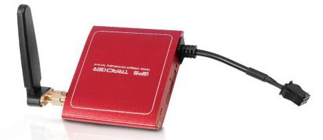

# Supermate - D26-T

El Supermate D26-T es un rastreador GPS compacto y ligero pensado para una amplia variedad de necesidades de seguimiento. Adecuado para uso personal, comercial e industrial, el D26-T prioriza la portabilidad y la instalación discreta, a la vez que ofrece monitoreo continuo de ubicación. Entre sus características descritas por el fabricante se incluyen el rastreo en tiempo real, soporte de geocercas, un botón de emergencia SOS y una construcción pensada para resistir el uso diario y distintas condiciones climáticas.

Como modelo compatible con Plaspy, el D26-T se puede integrar en una plataforma de seguimiento centralizada para combinar las funciones del dispositivo con las herramientas de visibilidad e informes de Plaspy. Esa compatibilidad convierte al D26-T en una opción práctica para equipos que buscan un despliegue sencillo de dispositivos junto con monitoreo a nivel de flota, alertas y datos históricos de ubicación proporcionados por Plaspy.

## Puntos clave

- Factor de forma compacto y ligero para una colocación discreta en vehículos o activos  
- Capacidad de rastreo en tiempo real para visibilidad continua de la ubicación  
- Soporte de geocercas para notificar cuándo los activos ingresan o salen de áreas definidas  
- Botón de emergencia SOS para alertas urgentes y respuesta rápida  
- Instalación amigable que facilita el despliegue incluso a usuarios no técnicos  
- Diseño resistente y soporte para un amplio rango de condiciones de operación

## Cómo funciona con Plaspy

Cuando se utiliza con Plaspy, el Supermate D26-T envía actualizaciones de ubicación y notificaciones de eventos a la plataforma Plaspy, donde administradores y operadores pueden ver, gestionar e informar sobre la actividad del dispositivo. La integración con Plaspy centraliza los datos del dispositivo en una interfaz unificada para supervisión operativa y registros archivados.

- Visualización de ubicación en tiempo real y seguimiento en mapa dentro de Plaspy para monitoreo activo  
- Configuración de geocercas y enrutamiento de alertas para notificar al equipo cuando se crucen límites definidos  
- Reenvío de eventos SOS para que las alertas de emergencia sean visibles para los respondedores designados  
- Agrupamiento por flotas y vistas de estado para supervisión de múltiples vehículos o activos  
- Reproducción histórica y reportes básicos para revisar movimientos e incidentes pasados

## Casos de uso típicos

- Seguimiento de vehículos de flota y supervisión de rutas para flotas pequeñas y medianas  
- Monitoreo de activos portátiles o equipos de alto valor durante transporte o almacenamiento  
- Seguimiento de seguridad personal para trabajadores solitarios o familiares mediante la función SOS  
- Despliegues temporales para logística de eventos o vigilancia de sitios donde la colocación discreta es importante  
- Entornos operativos mixtos que requieren un rastreador compacto pero resistente

## Por qué elegir este rastreador con Plaspy

El Supermate D26-T es una opción práctica para organizaciones que necesitan un rastreador compacto y adaptable junto con una plataforma moderna de seguimiento. Sus funciones descritas cubren necesidades operativas comunes como visibilidad en vivo, alertas por geocerca y un botón de emergencia; al integrarlo con Plaspy, esos eventos del dispositivo se incorporan a un flujo de trabajo centralizado para monitoreo e informes.

Si está evaluando un rastreador pequeño y versátil para añadir a su cuenta de Plaspy, el D26-T merece consideración en casos donde la colocación discreta y la instalación sencilla son prioritarias. Para obtener más información sobre Plaspy y cómo la plataforma puede presentar y gestionar datos de rastreadores compatibles como el D26-T, visite el sitio de Plaspy https://www.plaspy.com. Las especificaciones del producto, la disponibilidad y los detalles del fabricante pueden cambiar con el tiempo, así que verifique las especificaciones actuales en el sitio del fabricante http://www.gps-summit.com/.
