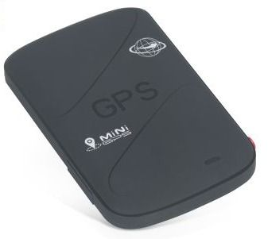

# Supermate - K20

El Supermate K20 es un rastreador GPS compacto y versátil diseñado para cubrir una amplia variedad de necesidades de seguimiento. Ofrece monitoreo continuo de ubicación y puede instalarse de forma discreta en vehículos, equipos o pertenencias personales. El K20 prioriza la portabilidad y el sigilo, a la vez que incorpora funciones como seguimiento en vivo, geocercas y un botón SOS para apoyar casos de seguridad y recuperación.

Como dispositivo compatible con Plaspy, el K20 puede integrarse al entorno de gestión de flotas y activos de Plaspy para proporcionar visibilidad en tiempo real y notificaciones de eventos. Esta compatibilidad convierte al K20 en una opción práctica para organizaciones e individuos que deseen combinar un rastreador de tamaño reducido con las herramientas de monitoreo, reportes y supervisión operativa de Plaspy.

## Características principales

- Diseño liviano y compacto ideal para colocación discreta de activos
- Seguimiento de ubicación en tiempo real para visibilidad continua
- Capacidad de geocercas con alertas al entrar o salir de zonas delimitadas
- Botón SOS integrado para notificaciones de emergencia instantáneas
- Construido para operar en distintas condiciones ambientales
- Optimizado para cobertura amplia en bandas GSM y alta sensibilidad GPS

## Cómo funciona con Plaspy

Al utilizarse con Plaspy, el Supermate K20 envía información de ubicación y eventos a la plataforma de monitoreo de Plaspy para que los equipos puedan ver, analizar y actuar sobre los datos de rastreo. Plaspy añade una capa centralizada para organizar dispositivos, configurar alertas y generar reportes operativos.

- Visualización de ubicación en vivo en los paneles de Plaspy para monitoreo activo
- Eventos de geocerca que generan notificaciones y pueden activar reglas operativas
- Alertas SOS reenviadas a Plaspy para notificar rápidamente a respondedores o supervisores
- Datos históricos de ubicación disponibles para revisión de rutas e investigación de incidentes
- Visibilidad a nivel de flota y agrupamiento para monitorear múltiples dispositivos K20 simultáneamente

## Casos de uso típicos

- Seguimiento de vehículos de flota y supervisión de rutas para flotas pequeñas y medianas
- Protección de activos portátiles como equipos de renta o herramientas
- Monitoreo de seguridad personal para trabajadores solitarios o miembros de la familia
- Recuperación ante robos y verificación de ubicación de artículos de alto valor
- Logística y seguimiento de asignaciones temporales de activos

## Por qué elegir este rastreador con Plaspy

El Supermate K20 combina un perfil físico discreto con las funciones de tiempo real y alertas que importan a los equipos operativos. Para organizaciones que usan Plaspy, el K20 ofrece una manera sencilla de ampliar la visibilidad sobre activos móviles sin añadir volumen ni complejidad. Su resistencia ambiental y sensibilidad ayudan a mantener un rastreo consistente en condiciones variadas, lo que complementa el enfoque de Plaspy en monitoreo y reportes confiables.

Al ser compatible con Plaspy, el K20 se puede incorporar a flujos de trabajo ya establecidos para alertas, revisiones históricas y supervisión de flota manteniendo la administración de dispositivos relativamente simple. Las organizaciones que buscan un rastreador compacto que se integre en una plataforma telemática y operativa más amplia encontrarán en el K20 una opción práctica a considerar.

To learn more about how Plaspy supports devices like the Supermate K20, visit https://www.plaspy.com. Product specifications, availability, and manufacturer details can change over time, so please verify current technical and compliance information on the manufacturer's official site http://www.gps-summit.com/.
