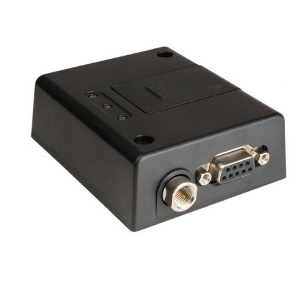

# Telic - LT910-EUbis

El LT910-EUbis es un terminal IoT industrial compacto diseñado para redes LTE europeas y pensado como la columna vertebral de comunicaciones en soluciones de seguimiento y telemetría. Basado en el módulo Telit LE910R1-EU, ofrece conectividad LTE Cat 1bis con retroceso a 2G y está orientado a implementaciones que requieren enlaces celulares fiables, mejor movilidad y mayor capacidad de respuesta frente a algunas opciones de baja potencia de área amplia. Su factor de forma y las interfaces industriales lo hacen adecuado para instalaciones montadas en vehículos o activos donde se necesita conectividad constante.

Este modelo es relevante como dispositivo compatible con Plaspy porque proporciona el transporte celular y las interfaces de telemetría que Plaspy utiliza para ingerir datos de ubicación y estado. En combinación con GNSS o entradas de rastreadores externos e integrado en Plaspy, el LT910-EUbis habilita visibilidad de ubicación en tiempo real, alertas y reportes a nivel de flota. Sus funciones de ahorro de energía y diseño industrial lo convierten en una opción práctica para operadores que necesitan conectividad persistente para seguimiento de flotas y monitoreo remoto de activos dentro de Plaspy.

## Puntos clave

- Compatible con Plaspy para seguimiento en tiempo real, alertas y paneles de gestión de flotas
- Conectividad LTE Cat 1bis con retroceso 2G para amplia cobertura y movilidad en Europa
- Optimizado en costo para despliegues a gran escala en Europa, equilibrando rendimiento y valor
- I/O industrial y capacidad de telemetría para integración con sistemas vehiculares y sensores
- Funciones de ahorro energético que reducen costos operativos en instalaciones con batería
- Factor de forma industrial y compacto, apto para montaje en vehículos o equipos
- Diseñado para soportar actualizaciones continuas de posición o ráfagas periódicas de telemetría

## Cómo funciona con Plaspy

Al integrarse con Plaspy, el LT910-EUbis aporta una capa de transporte celular confiable para que los datos de telemetría y posición sean recolectados, normalizados y mostrados en paneles y reportes. Plaspy ingiere los datos del terminal, asigna los mensajes del dispositivo a los campos de la plataforma y pone la información a disposición para monitoreo, reglas automatizadas y análisis operativo.

- Actualizaciones de ubicación y telemetría en tiempo real cuando hay entradas GNSS o de rastreadores externos
- Monitoreo de flota y visibilidad de estado mediante los paneles y mapas en vivo de Plaspy
- Alertas automatizadas y notificaciones anti robo basadas en umbrales de posición o telemetría
- Informes y reproducción histórica para análisis de rutas y revisión operativa
- Flujos remotos para eventos como inmovilización o alertas cuando se integran entradas del vehículo

## Casos de uso típicos

- Gestión de flotas con telemetría continua o programada de vehículos, ruteo y despacho
- Flujos anti robo y recuperación combinados con acciones de inmovilizador y alertas
- Telemetría industrial para monitoreo de condición de equipos remotos y planificación de mantenimiento
- Seguimiento distribuido de remolques, contenedores y activos de alto valor que requieren cobertura celular europea fiable
- Instalaciones remotas que se benefician de modos de ahorro energético y ráfagas periódicas de telemetría

## Por qué elegir este rastreador con Plaspy

El LT910-EUbis es una opción práctica para organizaciones que usan Plaspy cuando la prioridad es un equilibrio entre ancho de banda, movilidad y costo. Su base LTE Cat 1bis ofrece mayor capacidad de respuesta frente a opciones IoT de menor ancho de banda, lo que lo hace adecuado para escenarios que requieren actualizaciones más frecuentes o flujos interactivos. Las interfaces industriales y las funciones de gestión de energía añaden flexibilidad para integradores que despliegan soluciones montadas en vehículos o activos y que alimentan telemetría hacia Plaspy.

Si busca un terminal de comunicaciones industrial y compacto que se integre con Plaspy para proporcionar conectividad consistente en seguimiento y telemetría, vale la pena considerar el LT910-EUbis. Conozca más sobre Plaspy en el sitio principal https://www.plaspy.com y verifique las especificaciones y disponibilidad actuales en el sitio del fabricante https://www.telic.de ya que los detalles del producto pueden cambiar con el tiempo.
