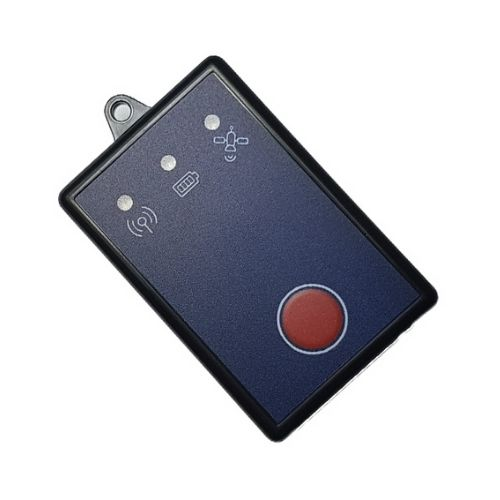

# Telic - Picotrack 4G

El Picotrack 4G es un dispositivo telemático compacto diseñado para despliegues que requieren telemetría celular fiable y operación desatendida a largo plazo. Basado en conectividad LTE Cat M1 para cobertura de área amplia, el Picotrack 4G es ideal para flujos de trabajo de seguimiento en tiempo real, envíos de telemetría periódicos y monitoreo remoto de activos. El producto se ofrece con opciones de carcasa robusta y múltiples alternativas de montaje para instalaciones al aire libre y espacios reducidos.

Como rastreador compatible con Plaspy, el Picotrack 4G puede enviar ubicación y telemetría a Plaspy para monitoreo de flotas, recuperación ante robos y proyectos de activos distribuidos. Su conectividad eficiente en consumo energético y su comportamiento de reporte configurable lo convierten en una opción práctica cuando se necesita un equilibrio entre frecuencia de actualización y larga vida útil de batería. Plaspy utiliza los mensajes del dispositivo para ofrecer visibilidad, alertas e informes históricos en flotas y tipos de activos mixtos.

## Aspectos clave

- Conectividad LTE Cat M1 para cobertura celular de baja potencia en áreas amplias y uso eficiente de datos
- Operación de larga duración configurable, adecuada para semanas o meses según la configuración de reporte
- Opción de carcasa robusta con clasificación IP69K para condiciones exteriores exigentes
- Múltiples opciones de montaje, incluyendo imanes, tornillos o bridas para instalaciones flexibles
- Variante para entornos gubernamentales disponible con la variante de comunicación PAIP UKSP
- Factor de forma compacto que se adapta a instalaciones encubiertas y espacios reducidos

## Cómo funciona con Plaspy

Al vincularse con Plaspy, el Picotrack 4G entrega actualizaciones periódicas de ubicación y telemetría que Plaspy presenta a través de mapas, alertas e informes. Plaspy ingiere los mensajes del dispositivo y los pone a disposición para supervisión operativa, análisis histórico y flujos de trabajo de notificación.

- Actualizaciones de ubicación en tiempo real y seguimiento en vivo visibles en los mapas y paneles de Plaspy
- Intervalos de reporte configurables para equilibrar la frecuencia de actualizaciones con la autonomía del dispositivo
- Alertas y notificaciones en Plaspy basadas en movimiento, eventos de geocerca o comportamiento de reporte
- Rutas históricas e informes exportables para análisis posterior al evento y revisión operativa
- Soporte para la variante PAIP UKSP en despliegues que requieren conformidad de comunicación específica

## Casos de uso típicos

- Gestión de flotas para conocimiento de ubicación, supervisión de rutas y registros programados
- Flujos de trabajo de prevención de robo y recuperación usando montajes compactos y alertas telemáticas
- Telemetría de activos remotos para equipos dejados sin supervisión en entornos severos
- Despliegues gubernamentales y regulados que requieren variantes de protocolo específicas
- Instalaciones temporales o estacionales que necesitan despliegue rápido en campo

## Por qué elegir este rastreador con Plaspy

El Picotrack 4G combina operación práctica de larga duración y una carcasa resistente con conectividad moderna LTE Cat M1, lo que lo hace una buena opción para usuarios de Plaspy que necesitan seguimiento remoto fiable y despliegues de bajo mantenimiento. Su tamaño compacto y las opciones de montaje flexibles simplifican las implementaciones en flotas o activos distribuidos, mientras que la variante PAIP UKSP da soporte a entornos con requisitos de comunicación más estrictos.

Plaspy aporta la visibilidad y las herramientas de gestión en la plataforma para convertir la telemetría del Picotrack 4G en información operativa, alertas y registros históricos. Si su despliegue prioriza operación desatendida, resistencia ambiental y rendimiento celular predecible, vale la pena evaluar el Picotrack 4G como parte de una solución compatible con Plaspy.

To learn more about Plaspy and how Picotrack 4G devices integrate with our platform visit https://www.plaspy.com. Product specifications and availability can change over time, so please verify current technical details and variant options with the manufacturer at https://www.telic.de.
