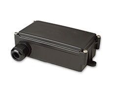

# Telic - SBC3 IO

El Telic SBC3 IO es una unidad telemática robusta diseñada para aplicaciones de localización en exteriores. Con una carcasa resistente al agua y un receptor GPS de alta sensibilidad, el SBC3 IO está pensado para escenarios de rastreo donde los dispositivos quedan expuestos a las inclemencias del tiempo. Sus antenas GSM y GPS integradas facilitan la instalación en ubicaciones que requieren reportes de posición fiables en ámbitos abiertos.

Como dispositivo compatible con Plaspy, el SBC3 IO aporta seguimiento exterior duradero a la plataforma Plaspy para mejorar la visibilidad de flotas y activos. Su batería recargable integrada mantiene la transmisión de posiciones si se pierde la alimentación principal, y las entradas y salidas digitales y analógicas disponibles permiten tareas telemáticas habituales, como registrar contadores operativos o intervalos de servicio. Estas características hacen de la unidad una opción práctica para organizaciones que necesitan un rastreo exterior resistente junto con la monitorización y los informes que ofrece Plaspy.

## Aspectos destacados

- Carcasa resistente al agua y construida para implementaciones en exteriores y entornos exigentes
- Receptor GPS de alta sensibilidad para una mejor adquisición de posición en áreas abiertas
- Antenas GSM y GPS integradas que simplifican la colocación del equipo y reducen la necesidad de cableado externo
- Batería recargable integrada para transmitir datos de posición cuando no hay alimentación externa
- Entradas y salidas digitales y analógicas para señales telemáticas personalizadas y registro de eventos
- Construcción duradera adecuada para el seguimiento a largo plazo de activos y flotas en exteriores

## Cómo funciona con Plaspy

El SBC3 IO se puede integrar en Plaspy para ofrecer visibilidad continua de ubicación y monitorización basada en eventos para activos en exteriores. Una vez conectado, Plaspy puede agregar actualizaciones de posición y eventos generados por las entradas del dispositivo para ofrecer a los operadores una visión operativa unificada.

- Seguimiento de ubicación en tiempo real y visualización en mapas dentro de la plataforma Plaspy
- Monitorización de eventos y entradas usando el IO del dispositivo para detectar cambios operativos clave
- Alertas y notificaciones en Plaspy por pérdida de alimentación, movimiento o condiciones configuradas en las entradas
- Informes históricos de rutas y posiciones para apoyar auditorías y análisis de desempeño
- Supervisión centralizada para activos dispersos en exteriores y flotas mixtas

## Casos de uso típicos

- Vehículos de flota y remolques que operan en condiciones exteriores o entornos rústicos
- Seguimiento de activos y equipos almacenados o utilizados en exteriores en obras o sitios de trabajo
- Unidades remotas que requieren respaldo de batería para mantener el reporte de posición durante interrupciones de energía
- Registro de vida útil o uso donde las señales IO registran horas operativas o eventos
- Monitorización de activos autónomos que necesitan telemática duradera y resistente a la intemperie

## Por qué elegir este rastreador con Plaspy

El SBC3 IO es una opción sensata para organizaciones que necesitan un rastreador exterior robusto con entradas de evento flexibles. Su carcasa resistente y la batería de respaldo disminuyen el riesgo de lagunas en los datos en entornos con acceso limitado a energía o refugio, mientras que la capacidad IO permite flujos de trabajo telemáticos personalizados que Plaspy puede supervisar y reportar.

Combinado con Plaspy, el SBC3 IO ayuda a reunir en una sola plataforma la ubicación, los datos de eventos y la supervisión operativa. Esta combinación resulta valiosa para equipos que buscan extender la visibilidad de flotas y activos a equipos de exterior sin sacrificar continuidad ni opciones básicas de personalización.

Para conocer más sobre Plaspy y cómo puede gestionar dispositivos como el SBC3 IO visite https://www.plaspy.com. Las especificaciones y la disponibilidad del producto pueden cambiar con el tiempo, por lo que le recomendamos verificar los detalles actuales en el sitio del fabricante https://www.telic.de.
