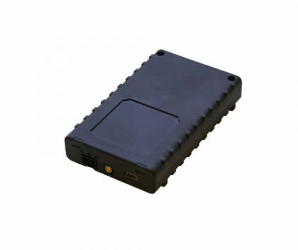

# Teltonika - FM 2100

El Teltonika FM 2100 es un rastreador GPS compacto diseñado para determinar las coordenadas de objetos remotos y transmitir esa información a través de GSM. Soporta GPRS clase 10 y comunicación por SMS, opera en frecuencias GSM de cuatro bandas para una cobertura regional amplia y ofrece control básico de entradas y salidas con dos entradas digitales y dos salidas digitales. El equipo viene en una carcasa resistente e incluye LEDs de estado y salida NMEA para flujos de trabajo relacionados con navegación.

Como modelo compatible con Plaspy, el FM 2100 puede enviar ubicación e información básica de estado a Plaspy para monitoreo en tiempo real y supervisión operativa. Su combinación de reporte de posición confiable, control remoto sencillo de E/S y diseño duradero lo hace práctico para empresas que desean integrar este rastreador en Plaspy para visibilidad de flota, alertas e informes rutinarios.

## Características principales

- Reporte de ubicación en tiempo real adecuado para vehículos y activos móviles
- GPRS clase 10 y comunicación por SMS para datos y mensajería de respaldo
- Compatibilidad GSM de cuatro bandas para amplia cobertura regional
- Dos entradas digitales y dos salidas digitales para control y monitoreo de dispositivos externos
- Salida NMEA disponible para navegación o exportación de posiciones
- Carcasa resistente con indicadores LED para retroalimentación operativa clara

## Cómo funciona con Plaspy

El FM 2100 entrega actualizaciones periódicas de ubicación y el estado básico de entradas y salidas que Plaspy puede ingerir para ofrecer visibilidad unificada de flotas y activos. Al conectarlo a Plaspy, este rastreador permite monitoreo centralizado, procesamiento de eventos e informes históricos junto con otros dispositivos de su flota.

- Seguimiento en vivo en mapa para ver posiciones en tiempo real de activos y vehículos
- Monitoreo de eventos y estados usando cambios en entradas y salidas digitales para activar alertas
- Registros históricos de rutas y movimientos para revisión operativa e informes
- Notificaciones configurables en Plaspy para geocercas, movimiento y eventos personalizados
- Gestión centralizada de dispositivos y visibilidad junto a otros rastreadores compatibles

## Casos de uso típicos

- Seguimiento rutinario de ubicación y movimiento para flotas de vehículos pequeñas y medianas
- Monitoreo de vehículos de renta o activos arrendados donde el control básico de E/S es útil
- Rastreo de activos y equipos que requieren hardware robusto
- Exportación simple de datos de navegación usando la salida NMEA para sistemas posteriores
- Telemetría remota y alertas básicas cuando las actualizaciones por SMS o GPRS son aceptables

## Por qué elegir este rastreador con Plaspy

El FM 2100 es un rastreador directo y económico que equilibra el reporte esencial de ubicación con algunas funciones flexibles de entradas y salidas. Para organizaciones que usan Plaspy, ofrece una vía rentable para añadir dispositivos que proporcionan datos de posición confiables, señalización de eventos básica y estado operativo visible sin requerir periféricos complejos.

Dado que el FM 2100 se centra en el rastreo básico y en capacidades simples de control remoto, encaja bien cuando necesita hardware físico robusto y reportes dependientes de GSM confiables. En conjunto con Plaspy, el dispositivo ayuda a los equipos a centralizar el monitoreo, generar informes rutinarios y actuar sobre eventos impulsados por E/S manteniendo los costos de despliegue y operación modestos.

To learn more about using GPS trackers with Plaspy, visit https://www.plaspy.com. Product specifications and availability can change over time, so please verify current technical details and compatibility on the manufacturer site https://www.teltonika-gps.com/ before finalizing deployments.
