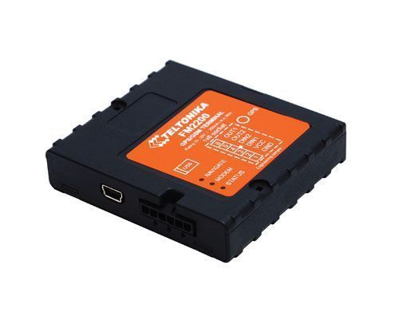

# Teltonika - FM 2200

El Teltonika FM 2200 es un rastreador GPS versátil con conectividad GSM diseñado para determinar coordenadas precisas de objetos remotos y transmitirlas a través de redes móviles. Ofrece seguimiento de ubicación en tiempo real para vehículos y activos, múltiples entradas y salidas digitales para supervisión y control, un puerto USB para salida NMEA y configuración, además de almacenamiento local para posiciones históricas. El FM 2200 también soporta geocercas, envío de datos configurable y actualizaciones de firmware por distintos métodos, lo que lo hace adecuado para una variedad de despliegues de seguimiento.

Como dispositivo compatible con Plaspy, el FM 2200 puede enviar datos de posición y eventos a la plataforma Plaspy para visibilidad centralizada y supervisión de flotas. Su soporte para métodos de transporte estándar y salida NMEA, junto con lógica de geocerca y eventos a bordo, permite que Plaspy muestre ubicaciones en vivo, gestione alertas e incorpore el dispositivo en informes y flujos operativos. Las organizaciones que usan Plaspy pueden aprovechar el FM 2200 para ampliar las capacidades de seguimiento en vehículos y activos remotos.

## Aspectos destacados

- Reporte de ubicación GPS en tiempo real con receptor GNSS de 50 canales para fijaciones de posición confiables
- Comunicación GSM GPRS para transmisión continua de datos a plataformas de rastreo
- Entradas y salidas integradas para monitorear y controlar dispositivos externos de forma remota
- Puerto USB que ofrece salida NMEA y opciones de configuración sencillas
- Geocercas configurables y reglas flexibles para adquisición y envío de datos
- Almacenamiento en el dispositivo de hasta 15,000 registros para recuperación de datos históricos
- Certificaciones CE y E mark que reflejan cumplimiento con estándares comunes de calidad

## Cómo funciona con Plaspy

Cuando está conectado a la red, el FM 2200 transmite datos de posición y eventos que Plaspy ingiere, almacena y visualiza en mapas y paneles de control de la flota. Plaspy utiliza la información entrante para aportar contexto operativo y consolidar la información de vehículos y activos para los equipos responsables de logística y operaciones de campo.

- Seguimiento de ubicación en vivo y visualización en mapa para conciencia operativa en tiempo real
- Gestión de eventos de geocerca y alertas para notificar cuando los objetos rastreados entran o salen de áreas definidas
- Reportes de rutas y posiciones históricas usando los registros almacenados para cumplimiento y revisión
- Monitoreo de entradas y salidas digitales para mostrar el estado del dispositivo y la actividad de dispositivos externos
- Notificaciones centralizadas de eventos y alertas configurables que se ajustan a las necesidades operativas

## Casos de uso típicos

- Rastreo de vehículos de flotas de reparto, servicio y transporte
- Monitoreo de activos remotos cuando se necesita registrar posición y estados básicos de E/S
- Supervisión de vehículos en alquiler o arrendamiento con alertas por geocerca e historial de recorridos
- Seguimiento y control de equipo de campo para operaciones distribuidas
- Verificación de despachos y rutas que requieren datos históricos de trayectos

## Por qué elegir este rastreador con Plaspy

El FM 2200 combina características prácticas de rastreo con transporte de datos flexible y lógica local, lo que lo convierte en una opción pragmática para organizaciones que integran dispositivos en una plataforma de flotas como Plaspy. Su mezcla de reporte de posición, capacidades de E/S, salida NMEA y almacenamiento a bordo soporta tanto la supervisión en vivo como el análisis retrospectivo sin requerir integraciones altamente especializadas.

Emparejado con Plaspy, el FM 2200 forma parte de un entorno centralizado de monitoreo e informes que ayuda a los equipos a mantener visibilidad sobre activos móviles y reaccionar ante eventos con mayor eficiencia. El dispositivo es una buena opción cuando necesita reportes de posición confiables junto con control remoto básico y alertas configurables, y cuando desea consolidar esas fuentes en los paneles e informes de Plaspy.

Para saber más sobre Plaspy y cómo funciona con los dispositivos Teltonika visite https://www.plaspy.com. Las especificaciones del producto y la disponibilidad pueden cambiar con el tiempo, por lo que le recomendamos verificar los detalles técnicos y la información de certificación actualizada con el fabricante en https://www.teltonika-gps.com/.
