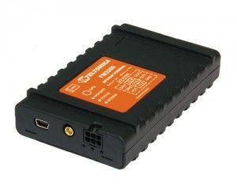

# Teltonika - FM 3200

El Teltonika FM 3200 es un rastreador GPS compacto que ofrece detección de posición en tiempo real y transmisión remota de datos sobre redes GSM. Diseñado para el seguimiento de vehículos y activos, el equipo incorpora un receptor de 50 canales, salida NMEA por USB, múltiples entradas y salidas para monitoreo y control externos, sensor de movimiento interno y almacenamiento local de datos. El FM 3200 está pensado para tareas de rastreo habituales, con opciones de configuración flexibles para disparadores, geocercas e informes de datos.

Como dispositivo compatible con Plaspy, el FM 3200 puede alimentar la plataforma Plaspy con datos de ubicación y eventos para facilitar la supervisión centralizada y la elaboración de informes. Su captura de datos configurable, soporte para actualizaciones por mensajes y la capacidad de almacenar miles de registros lo hacen adecuado para seguimiento continuo y reproducción histórica dentro de Plaspy. Las organizaciones que usan Plaspy pueden aprovechar el FM 3200 para aumentar la visibilidad sobre vehículos y activos remotos, y al mismo tiempo beneficiarse de las funciones de informes y alertas de Plaspy.

## Características principales

- Reporte de ubicación en tiempo real con receptor de 50 canales y amplia compatibilidad NMEA.
- Conectividad GSM con GPRS clase 10 y soporte de SMS para entrega flexible de datos y alertas.
- Varias entradas digitales y salidas colectoras abiertas para monitoreo y control remoto de dispositivos conectados.
- Puerto USB para salida NMEA y configuración local, además de almacenamiento interno para hasta 15,000 registros.
- Disparadores configurables y múltiples áreas de geocerca para generar eventos basados en movimiento, velocidad o entradas externas.
- Sensor de movimiento integrado y batería interna de respaldo para mayor fiabilidad en campo.
- Certificaciones CE y E mark que indican cumplimiento de normas aplicables.

## Cómo funciona con Plaspy

El FM 3200 envía mensajes de ubicación y eventos que Plaspy puede procesar para ofrecer una vista unificada de su flota y activos. Al conectarse a Plaspy, los datos del rastreador pasan a formar parte de un panel centralizado para monitoreo en vivo, historial e informes operativos.

- Actualizaciones en vivo de ubicación y estado que se muestran en los mapas de Plaspy para seguir vehículos y activos en tiempo real.
- Eventos de geocerca y disparadores configurables desde el FM 3200 que generan alertas y notificaciones dentro de Plaspy.
- Registros históricos almacenados en el dispositivo que pueden sincronizarse con Plaspy para reproducción de rutas y análisis.
- Eventos de entradas y salidas digitales reflejados como sucesos discretos en Plaspy para supervisión operativa.
- Actualizaciones por SMS y GPRS que permiten a Plaspy recibir notificaciones críticas incluso con conectividad variable.

## Casos de uso típicos

- Seguimiento de vehículos de flotas de transporte, reparto y servicio que requieren visibilidad constante de ubicación.
- Monitoreo de activos remotos donde la telemetría ocasional y las alertas por geocerca mejoran la seguridad de los activos.
- Historial de rutas y reproducción para revisiones de viaje, análisis de comportamiento del conductor y auditorías operativas.
- Control y supervisión remota de equipos auxiliares mediante entradas y salidas conectadas al rastreador.
- Notificaciones y alertas por movimientos no autorizados o por entrada y salida de áreas definidas.

## Por qué elegir este rastreador con Plaspy

El FM 3200 combina un conjunto de funciones sencillo con opciones de comunicación flexibles y reportes de datos configurables, lo que lo convierte en una opción práctica para organizaciones que necesitan reportes de posición fiables y control básico de E/S. Su capacidad para disparadores, geocercas y almacenamiento local se integra bien con los flujos de trabajo de Plaspy para monitoreo, alertas y análisis histórico sin requerir cambios de hardware especializados.

Plaspy integra esos datos del dispositivo en una vista operativa única, permitiendo que los equipos gestionen la visibilidad, respondan a eventos y generen informes desde la misma plataforma. Si usted requiere un rastreador que soporte las funciones de seguimiento más comunes y que pueda integrarse en una solución centralizada de gestión de flotas, el FM 3200 es una opción a considerar con Plaspy.

Learn more about Plaspy on the main website https://www.plaspy.com. Product specifications, availability, and manufacturer details can change over time, so please verify current technical specifications and certifications on the manufacturer site https://www.teltonika-gps.com/.
