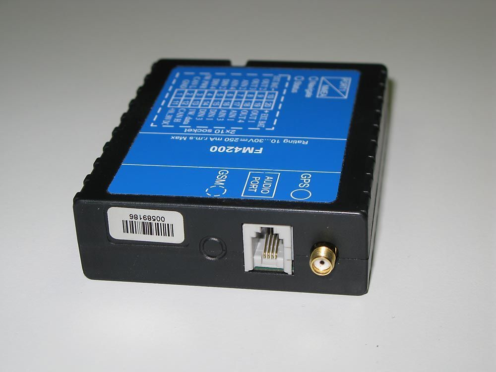

# Teltonika - FM 4200

El Teltonika FM 4200 es un rastreador GPS versátil diseñado para obtener la ubicación de objetos remotos y transmitirla mediante una conexión celular. Combina un receptor GPS de alta sensibilidad con conectividad GSM GPRS y SMS, y ofrece múltiples entradas y salidas para monitoreo y control. Sus interfaces integradas, como 1-Wire, CAN y RS232, amplían su aplicabilidad para sensores de temperatura, lectores iButton, adquisición de datos del vehículo y comunicación con periféricos.

Como dispositivo compatible con Plaspy, el FM 4200 puede alimentar flujos de trabajo de gestión de flotas con datos de posición y eventos para ofrecer visibilidad en tiempo real y análisis históricos. Sus opciones configurables de envío y almacenamiento de datos lo convierten en una elección práctica para operadores que requieren rastreo confiable, reportes de eventos personalizables y supervisión remota dentro de la plataforma Plaspy.

## Características principales

- Posicionamiento GPS con receptor uBlox NEO-5M de 50 canales para adquisición precisa de coordenadas.
- Conectividad GSM GPRS y SMS para transmisión de datos y funciones de mensajería básica.
- Múltiples interfaces físicas, incluidas 1-Wire, CAN y RS232, para integrar sensores y datos del vehículo.
- Entradas digitales y analógicas configurables, además de salidas de colector abierto para monitoreo remoto y control.
- Acelerómetro integrado y batería interna de respaldo para detección de movimiento y breve autonomía ante cortes de energía.
- Almacenamiento local con capacidad para varios miles de registros que garantiza retención de datos entre cargas.
- Opciones flexibles de actualización de firmware y configuración por red o por conexión cableada.

## Cómo funciona con Plaspy

Cuando se integra con Plaspy, el FM 4200 suministra datos de ubicación, eventos y estados de entradas que Plaspy utiliza para mostrar mapas, alertas e informes orientados a operaciones de flota. Las funciones configurables de reporte y geocercas del rastreador facilitan alinear el comportamiento del dispositivo con las reglas de monitoreo y los flujos de trabajo que usted configure en Plaspy.

- Visibilidad de ubicación y estado en tiempo real sobre los mapas de Plaspy para supervisión operativa.
- Reportes de eventos y geocercas que activan alertas y acciones dentro de los flujos de trabajo en Plaspy.
- Retención de datos históricos de viajes y posiciones para informes y análisis de rutas.
- Monitoreo de entradas digitales y analógicas para exponer estados de sensores y la actividad de dispositivos externos.
- Agregación de eventos de los dispositivos para respaldar informes a nivel de flota y métricas de desempeño.
- Opciones de configuración remota y actualización de firmware que ayudan a mantener los dispositivos alineados con los requisitos de datos de Plaspy.

## Casos de uso típicos

- Ubicación y seguimiento de rutas de vehículos de flota para operaciones logísticas y de reparto.
- Adquisición de datos de camiones y supervisión de flotas donde los datos CAN del vehículo son relevantes.
- Monitoreo remoto de activos, incluyendo registro de temperatura o accesos mediante sensores 1-Wire e iButton.
- Vigilancia del comportamiento y movimiento del conductor mediante eventos basados en el acelerómetro.
- Control de equipos y monitoreo de estado a través de entradas y salidas digitales.

## Por qué elegir este rastreador con Plaspy

El FM 4200 es una opción práctica para organizaciones que necesitan un equilibrio entre precisión de posicionamiento, múltiples opciones de interfaz y reportes configurables. Su combinación de rendimiento GPS, diversidad de entradas y salidas, y almacenamiento a bordo lo hace adecuado para flotas mixtas y proyectos de monitoreo de activos que alimentan una plataforma centralizada como Plaspy.

Si desea conocer más sobre cómo Plaspy puede trabajar con el Teltonika FM 4200, visite el sitio de Plaspy en https://www.plaspy.com para explorar funciones y compatibilidad. Las especificaciones del producto, la disponibilidad y los detalles del fabricante pueden cambiar con el tiempo, por lo que le recomendamos verificar la información técnica actual y las especificaciones exactas en el sitio oficial de Teltonika en https://www.teltonika-gps.com/ antes de comprar o desplegar equipos.
