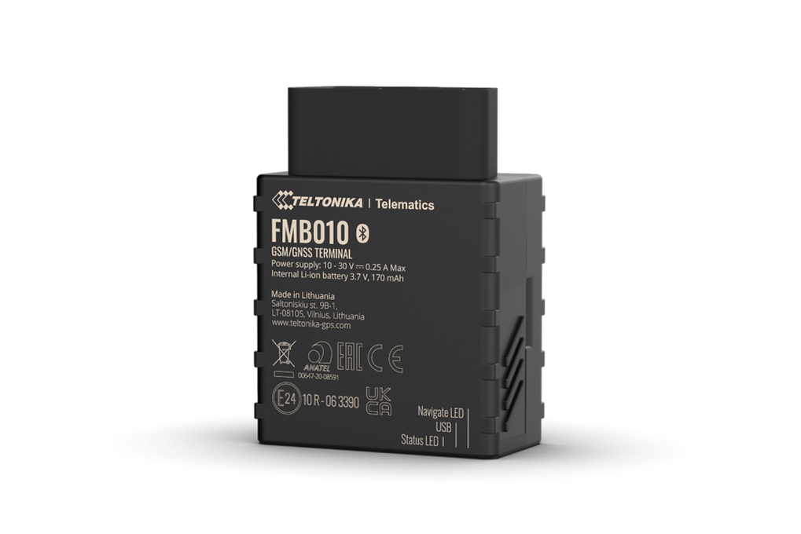

# Teltonika - FMB010

El Teltonika FMB010 es un rastreador GPS compacto, diseñado para conectarse rápidamente al puerto OBD-II y ofrecer un seguimiento vehicular básico y confiable. Integra funciones telemáticas esenciales como reporte continuo de ubicación, batería interna de respaldo para mantener la transmisión ante cortes de energía, soporte Bluetooth Low Energy para balizas y sensores externos, y un acelerómetro integrado con detección de choques configurable. Es una opción práctica para equipos que requieren despliegue ágil y telemetría básica estable.

Como dispositivo compatible con Plaspy, el FMB010 puede transmitir su ubicación y telemetría esencial del vehículo a los paneles de Plaspy para lograr visibilidad operativa inmediata. Esta compatibilidad hace al equipo adecuado para organizaciones que desean añadir rastreo en tiempo real, alertas simples de eventos y telemetría básica de flota a su instancia de Plaspy sin cambios complejos en hardware. Los usuarios de Plaspy pueden aprovechar el FMB010 para mostrar ubicación, lecturas de sensores y alertas de incidentes junto con otros datos de la flota para monitoreo y reportes consolidados.

## Aspectos clave

- Factor de forma OBD-II compacto plug-and-play para despliegue rápido en vehículos y acceso inmediato a telemetría.
- Batería interna de respaldo que mantiene el reporte durante pérdida de alimentación del vehículo, útil para monitoreo antirrobo.
- Soporte Bluetooth Low Energy para ampliar la telemetría con balizas y sensores externos como temperatura o detectores de movimiento.
- Acelerómetro 3 ejes integrado con detección de choques configurable para alertas e identificación de incidentes.
- Métricas básicas de conducción eficiente (eco driving) y telemetría relacionada con el motor para mejorar eficiencia de flota y comportamiento del conductor.
- Adecuado para integración directa en flujos de trabajo de rastreo y paneles operativos existentes.

## Cómo funciona con Plaspy

Al conectarse a Plaspy, el FMB010 entrega ubicación en tiempo real y telemetría vehicular básica para que los operadores monitoreen la flota desde una sola plataforma. Plaspy ingiere los datos del dispositivo para ofrecer seguimiento en vivo, reproducción histórica, notificaciones de eventos y reportes telemáticos sencillos que ayudan a gestionar rutas, incidentes y el estado de los activos.

- Actualizaciones de ubicación en tiempo real y reproducción histórica de recorridos para visibilidad operativa y revisión de incidentes.
- Alertas por detección de choques basadas en eventos del acelerómetro, visibles en Plaspy como notificaciones de prioridad.
- Telemetría derivada del OBD-II y métricas de conducción eficiente disponibles en los reportes de Plaspy para obtener información básica sobre consumo y desempeño del conductor.
- Lecturas de sensores BLE emparejados integradas en Plaspy para monitorear temperatura, humedad, magnetismo o movimiento.
- Reporte continuo desde la batería interna de respaldo que permite escalamiento de eventos y flujos antirrobo durante cortes de energía.

## Casos de uso típicos

- Gestión de flota con seguimiento en tiempo real y reportes básicos de eco driving para apoyar la planificación de rutas y control de costos.
- Monitoreo antirrobo y procesos de recuperación utilizando el reporte continuo del dispositivo y asistencia de balizas BLE para mejorar la precisión de ubicación.
- Registro de eventos por choque y notificación de incidentes para acelerar la respuesta y disponer de datos para seguimiento.
- Monitoreo de activos sensibles a temperatura o condiciones ambientales emparejando sensores BLE para telemetría complementaria durante el transporte.
- Supervisión del comportamiento del conductor y del ciclo de vida del vehículo mediante telemetría OBD-II y métricas de conducción eficiente.

## Por qué elegir este rastreador con Plaspy

El FMB010 es una opción práctica para organizaciones que buscan un rastreador GPS de baja fricción que se integre sin complicaciones con Plaspy. Su diseño OBD-II plug-and-play, junto con el reporte de respaldo y soporte para sensores BLE, brinda al equipo lo esencial para el rastreo diario de flotas, la detección de incidentes y reportes telemáticos sencillos sin un despliegue complejo.

Si desea conocer más sobre cómo Plaspy puede aprovechar dispositivos compatibles como el FMB010 para mejorar la visibilidad y los reportes de su flota, visite https://www.plaspy.com. Las especificaciones del producto, las opciones de paquete y la disponibilidad pueden cambiar con el tiempo; verifique los detalles más recientes en el sitio del fabricante https://www.teltonika-gps.com/ antes de tomar decisiones de compra.
