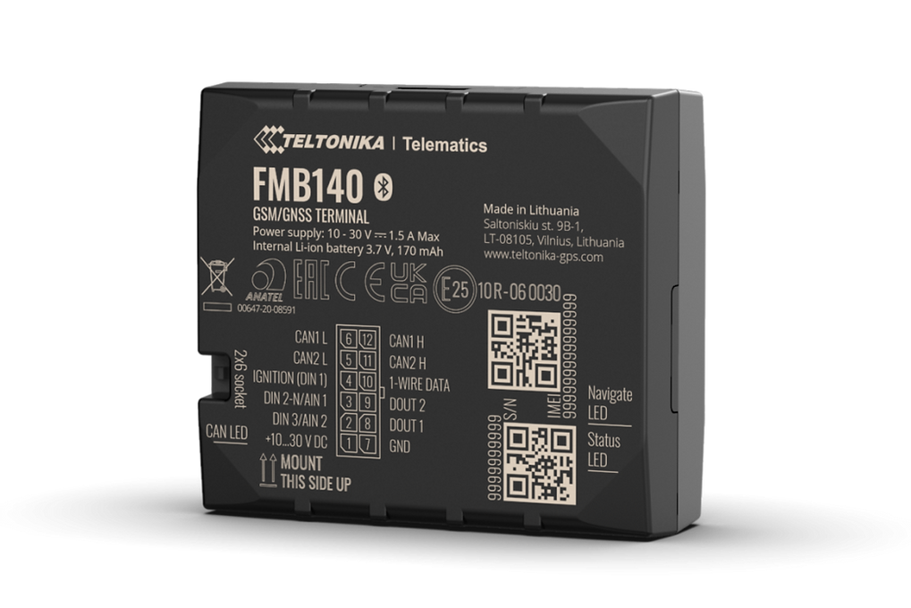

# Teltonika - FMB140

El Teltonika FMB140 es un rastreador GPS compacto diseñado para capturar la ubicación del vehículo y telemetría derivada del bus CAN. Integra un procesador CAN y conectividad Bluetooth Low Energy para leer parámetros del vehículo en autos ligeros, camiones, autobuses y maquinaria especial, y puede enviar esa información a una plataforma telemática para monitoreo y generación de informes en tiempo real. El dispositivo se utiliza comúnmente cuando se requieren telemetría vehicular más detallada e integraciones con accesorios, además del rastreo de posición estándar.

Como dispositivo compatible con Plaspy, el FMB140 puede alimentar señales a nivel CAN, eventos de accesorios y datos de sensores Bluetooth en los paneles y flujos de trabajo de Plaspy. Esta compatibilidad permite a los operadores de flota combinar el seguimiento de ubicación con métricas de conducción ecológica, análisis del comportamiento del conductor y telemetría ambiental dentro de Plaspy. Tenga en cuenta que el FMB140 figura como End of Life, por lo que debe confirmar disponibilidad y detalles de SKU antes de la compra.

## Aspectos destacados

- Rastreador compatible con Plaspy que combina el reporte de posición con telemetría vehicular basada en CAN para obtener información más profunda de la flota.
- Procesador CAN integrado (según SKU) para extraer parámetros útiles en análisis de conducción ecológica y comportamiento del conductor.
- Soporte Bluetooth Low Energy para emparejar balizas y sensores externos y ampliar el monitoreo ambiental y de activos.
- Conectividad GSM 2G para cobertura en redes heredadas en una amplia variedad de mercados.
- Factor de forma compacto con cable de alimentación IO estándar incluido para conexión al sistema eléctrico del vehículo.
- Soporta herramientas de gestión remota para actualizaciones de firmware y configuración a escala.

## Cómo funciona con Plaspy

Al integrarse con Plaspy, el FMB140 transmite ubicación y telemetría derivada del CAN a las vistas de flota, alertas e informes, de modo que usted puede monitorear activos, investigar eventos y medir el rendimiento a lo largo del tiempo. Plaspy puede mapear datos CAN y eventos de accesorios a paneles y flujos de trabajo que facilitan la supervisión operativa y el cumplimiento.

- Actualizaciones de ubicación en tiempo real y reproducción histórica disponibles en Plaspy para análisis de rutas y revisión de incidentes.
- Parámetros del bus CAN y métricas de conducción ecológica rumbo a Plaspy para scoring de conductores, proxies de eficiencia de combustible e informes del estado del vehículo.
- Lecturas de sensores Bluetooth y eventos de accesorios enviados a Plaspy para soportar monitoreo de temperatura, detección de movimiento y alertas de condición de activos.
- Integraciones de accesorios como eventos RFID e iButton incorporados en los flujos de eventos de Plaspy para control de accesos y flujos de trabajo de check-in automatizados.
- Configuración remota y gestión de firmware mediante las herramientas de gestión de Teltonika soportadas, minimizando el mantenimiento en sitio para flotas gestionadas con Plaspy.

## Casos de uso típicos

- Programas de telemática de flotas y conducción ecológica que requieren parámetros a nivel CAN para medir eficiencia y entrenar a los conductores.
- Operaciones de renta y leasing de autos que usan ubicación, datos CAN y eventos RFID o iButton para check-in automático y seguimiento de uso.
- Logística y transporte refrigerado donde sensores Bluetooth ofrecen telemetría ambiental junto al rastreo vehicular.
- Monitoreo de equipos pesados y servicios públicos donde señales CAN y datos de movimiento informan reportes de mantenimiento y utilización.
- Monitoreo de activos y flujos de trabajo antirobo que combinan posicionamiento con eventos de accesorios y telemetría.

## Por qué elegir este rastreador con Plaspy

El FMB140 es una opción práctica para flotas que desean ir más allá del simple rastreo GPS e incorporar telemetría a nivel vehículo y eventos impulsados por accesorios en sus flujos telemáticos. Su combinación de procesamiento CAN a bordo y la extensibilidad mediante Bluetooth Low Energy lo hace ideal para flotas mixtas e instalaciones donde importan las métricas de conducción ecológica, sensores ambientales e integraciones de accesorios. En conjunto con Plaspy, esos flujos de datos se integran en paneles, alertas e informes unificados para la toma de decisiones operativas.

Para obtener más información sobre Plaspy y cómo funciona con dispositivos compatibles como el Teltonika FMB140 visite https://www.plaspy.com. Las especificaciones del producto, la disponibilidad y el soporte del fabricante pueden cambiar con el tiempo, por lo que le recomendamos verificar los detalles actuales y la compatibilidad de SKU en el sitio oficial de Teltonika https://www.teltonika-gps.com/.
