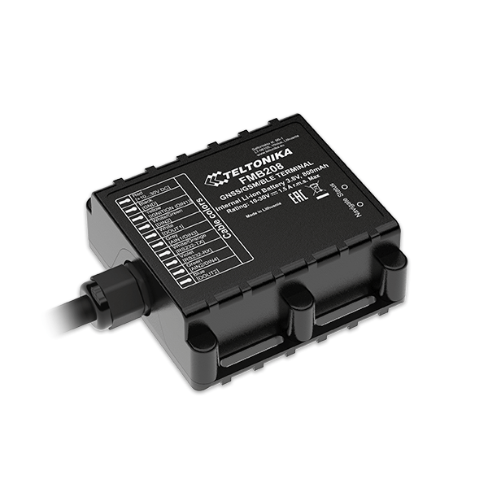

# Teltonika - FMB208

El rastreador GPS Teltonika FMB208 es un dispositivo resistente al agua con giroscopio y soporte IRNSS diseñado específicamente para el mercado de cumplimiento de la India. Este rastreador cumple con los requisitos de la regulación AIS140 y ofrece funciones de alta gama para los proveedores de soluciones telemáticas GPS.

El FMB208 es un rastreador AIS140 certificado por ARAI con IRNSS y GPS, lo que garantiza el cumplimiento de los requisitos de soporte GAGAN. Además, cuenta con funcionalidad de 2 servidores, batería interna, acelerómetro y giroscopio, SIM integrada y clasificación IP67 a prueba de manipulaciones. También ofrece potentes actualizaciones de firmware a través de WEB FOTA.

Teltonika ha agregado funciones avanzadas al FMB208 para brindar aún más valor a los proveedores de servicios de telemática GPS. Estas funciones incluyen soporte para un tercer servidor, funcionalidad BT para actualizaciones de firmware y configuración, conexión de teléfono inteligente y compatibilidad con dongle OBD. Además, el rastreador cuenta con sensores y balizas BLE que amplían las oportunidades comerciales.

En términos de seguridad, el FMB208 ofrece detección de interferencias, detección de desconexión y remolque, así como características de colisión, como eventos de colisión y reconstrucción de colisión.

### Características destacadas:

- Sensores: acelerómetro
- Escenarios: conducción ecológica, detección de exceso de velocidad, detección de interferencias, control de DOUT mediante llamada, contador de combustible GNSS, inmovilizador, detección de ralentí excesivo, detección de desconexión, detección de remolque, detección de colisiones, geovalla automática, geovalla manual, viaje
- Modos de reposo: Sueño GPS, Sueño profundo en línea, Sueño profundo, Sueño ultraprofundo
- Actualización de configuración y firmware: FOTA Web, FOTA, Configurador Teltonika \(USB, Bluetooth\), aplicación móvil FMBT \(Configuración\)
- SMS: Configuración, eventos, control DOUT, depuración
- Comandos GPRS: Configuración, control DOUT, depuración
- Sincronización de tiempo: GPS, NITZ, NTP
- Monitoreo de combustible: LLS \(analógico\), LLS digital \(RS232\), dongle OBDII
- Detección de ignición: Entrada digital 1, acelerómetro, voltaje de alimentación externa, RPM del motor \(dongle OBDII\)
- Modos RS232: Modo de registro, NMEA, LLS, LCD, RFID HID / MF7, Garmin FMI, TCP ASCII / Binary

