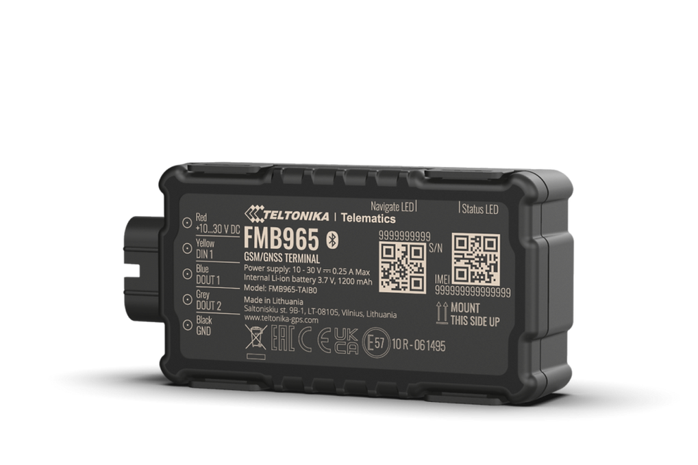

# Teltonika - FMB965

El Teltonika FMB965 es un rastreador GPS 2G compacto y compatible con Plaspy, diseñado para operación autónoma prolongada y uso fiable en exteriores. Pensado para motocicletas, remolques pequeños, embarcaciones de recreo y activos expuestos similares, el FMB965 combina una caja con certificación IP67, una batería interna de respaldo de 1.200 mAh y consumo ultra bajo de energía para ofrecer localización en tiempo real confiable y mayor autonomía en periodos sin conexión.

Al figurar como dispositivo compatible con Plaspy, el FMB965 se integra en flujos de trabajo de monitoreo de flotas y antirrobo soportados por la plataforma. Puede transmitir posiciones GNSS y datos de sensores a Plaspy para mapas en vivo, alertas y reproducción histórica, mientras que el soporte de Bluetooth Low Energy permite emparejar balizas y sensores externos para ampliar la telemetría y el seguimiento del estado del activo.

## Características principales

- Rastreador GPS 2G compatible con Plaspy, ideal para seguimiento en tiempo real de vehículos pequeños y activos expuestos.
- Carcasa resistente con clasificación IP67 para uso fiable en exteriores y en embarcaciones de recreo.
- Batería interna de respaldo de 1.200 mAh para sostener operación autónoma prolongada.
- Consumo de energía ultra bajo y modos de sueño extendidos para maximizar la vida útil de la batería durante inactividad.
- Soporte de Bluetooth Low Energy para balizas y sensores externos que amplían las capacidades de telemetría.
- Preparado para funciones telemáticas estándar como rastreo de ubicación, geocercas y reporte de eventos en los paneles de Plaspy.
- Gestión remota de dispositivos mediante herramientas Teltonika y FOTA WEB para simplificar mantenimiento y despliegues masivos.

## Cómo funciona con Plaspy

Cuando está conectado, el FMB965 envía actualizaciones de posición y lecturas de sensores a Plaspy, de modo que los responsables de flota e integradores pueden monitorear activos en tiempo real y revisar la actividad histórica. Plaspy procesa la ubicación, los reportes de eventos y la telemetría suplementaria para alimentar alertas, reportes y supervisión operativa de una flota o conjunto de elementos rastreados.

- Actualizaciones de ubicación y telemetría en tiempo real para mapas en vivo y reproducción de rutas en Plaspy.
- Alertas por entrada o salida de geocercas y reporte de eventos como movimiento o pérdida de conectividad visibles en los paneles de Plaspy.
- Sensores Bluetooth para temperatura, humedad, magnetismo y movimiento que pueden aportar telemetría adicional a Plaspy para el monitoreo de condiciones.
- Gestión remota de dispositivos vía Teltonika FOTA WEB para coordinar actualizaciones de firmware y configuración masiva antes o durante la integración con Plaspy.
- Los integradores pueden combinar la telemetría del rastreador con señales del vehículo o activo para indicadores de estado adicionales cuando la instalación lo soporte.

## Casos de uso típicos

- Antirrobo y recuperación para motocicletas con montaje discreto y reportes alimentados por batería interna.
- Seguimiento de remolques y activos pequeños donde la protección IP67 y la larga autonomía de batería son prioritarias.
- Monitoreo de embarcaciones de recreo pequeñas como motos de agua y lanchas.
- Monitoreo de carga sensible mediante emparejamiento de balizas BLE de temperatura o humedad para rastrear pequeños envíos.
- Gestión de pequeñas flotas para mensajería independiente, alquiler de motocicletas y vehículos de servicios especializados.

## Por qué elegir este rastreador con Plaspy

El FMB965 es una opción práctica para organizaciones que usan Plaspy cuando la robustez, la larga duración de batería y la posibilidad de ampliar la telemetría con sensores Bluetooth son prioridades. Su factor de forma compacto y diseño resistente al agua lo hacen adecuado para instalaciones expuestas, mientras que la batería interna y el comportamiento de bajo consumo permiten operación autónoma entre cargas o eventos de alimentación externa. Integradores y gestores de flota se benefician de las opciones de gestión remota para agilizar el despliegue y el mantenimiento de firmware en múltiples dispositivos.

Para saber más sobre cómo el FMB965 puede integrarse con Plaspy y explorar las funciones de la plataforma, visite la web principal de Plaspy https://www.plaspy.com. Las especificaciones del producto, la disponibilidad y los detalles del fabricante pueden cambiar con el tiempo, por lo que verifique las especificaciones vigentes y la documentación oficial en la web del fabricante https://www.teltonika-gps.com/.
