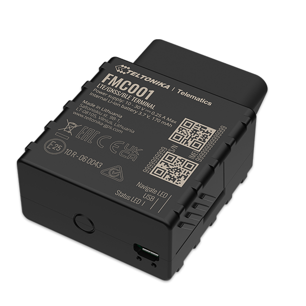

# Teltonika - FMC001

El Teltonika FMC001 es un rastreador GPS para vehículos que combina conectividad OBD II con posicionamiento GNSS y soporte Bluetooth, ofreciendo una solución telemática compacta. Diseñado para aplicaciones vehiculares, el FMC001 lee parámetros OBD II, entrega información detallada del acelerómetro para obtener insights sobre el comportamiento al volante y puede trabajar con sensores y balizas Bluetooth Low Energy para ampliar las capacidades de monitoreo.

Como dispositivo compatible con Plaspy, el FMC001 resulta relevante para flotas y programas vehiculares que requieren visibilidad integrada de ubicación, diagnóstico y eventos de conductor. Plaspy puede recibir los datos del FMC001 para proporcionar seguimiento centralizado, alertas e informes, simplificando la conversión de la telemetría del dispositivo en información operativa sin necesidad de integraciones personalizadas complejas.

## Características principales

- Acceso a datos OBD II combinado con posicionamiento GNSS para seguimiento centrado en el vehículo.
- Salidas detalladas del acelerómetro que facilitan la detección de eventos de conducción y patrones de comportamiento.
- Compatibilidad con sensores Bluetooth Low Energy para ampliar las opciones de monitoreo.
- Múltiples modos de suspensión que permiten gestionar el consumo de energía según las necesidades de despliegue.
- Configuración remota y métodos de actualización de firmware que simplifican la gestión del ciclo de vida del dispositivo.
- Útil para monitoreo de combustible y detección de encendido cuando se empareja con fuentes de datos compatibles.

## Cómo funciona con Plaspy

Plaspy recibe y procesa la telemetría del FMC001 para ofrecer visibilidad en tiempo real e histórica sobre la ubicación del vehículo, eventos de conducción y parámetros seleccionados del vehículo. La plataforma transforma los datos crudos del dispositivo en mapas, alertas e informes que los equipos operativos pueden utilizar para monitorear flotas y mejorar la eficiencia.

- Ubicación en tiempo real e historial de recorridos para supervisión centralizada de la flota
- Detección de eventos y análisis de comportamiento del conductor a partir de lecturas del acelerómetro
- Informes de parámetros del vehículo, incluidos métricas derivadas de OBD II e indicadores relacionados con el combustible
- Integración de entradas de sensores y balizas Bluetooth en los paneles y alertas de Plaspy
- Uso de los modos de suspensión del dispositivo para equilibrar frecuencia de reporte y consumo energético
- Soporte del ciclo de vida del equipo mediante flujos de trabajo de configuración remota y actualizaciones compatibles con el FMC001

## Casos de uso habituales

- Gestión de flotas de vehículos comerciales ligeros y pequeñas flotas de camiones
- Registros de jornada y monitoreo de conducta del conductor para programas de seguridad
- Flotas de alquiler y leasing que requieren visibilidad del uso del vehículo
- Programas de seguros basados en uso y telemática que necesitan datos de eventos de conducción
- Rastreo individual de vehículos para empresas con flotas mixtas

## Por qué elegir este rastreador con Plaspy

El FMC001 es una opción adecuada para organizaciones que buscan telemetría centrada en el vehículo junto con información del comportamiento de conducción en un solo equipo. Su combinación de acceso a datos OBD II, eventos del acelerómetro y soporte para sensores Bluetooth lo hace flexible para múltiples programas vehiculares sin necesidad de añadir hardware adicional. Al integrarlo con Plaspy, esas capacidades del dispositivo quedan accesibles mediante mapas, alertas e informes consolidados que ayudan a los equipos operativos a responder más rápido y analizar tendencias a lo largo del tiempo.

Para quienes evalúan opciones de rastreadores, el FMC001 es práctico cuando necesita diagnóstico del vehículo y monitoreo de comportamiento junto al seguimiento de ubicación. Plaspy proporciona la capa de plataforma para recopilar, visualizar y actuar sobre los datos del FMC001, de modo que las flotas y los programas vehiculares puedan mejorar la utilización, la seguridad y la generación de informes.

Para saber más sobre cómo Plaspy puede trabajar con el Teltonika FMC001 visite https://www.plaspy.com. Product specifications and availability can change over time, so please verify current device details and technical documentation on the manufacturer site https://www.teltonika-gps.com/.
