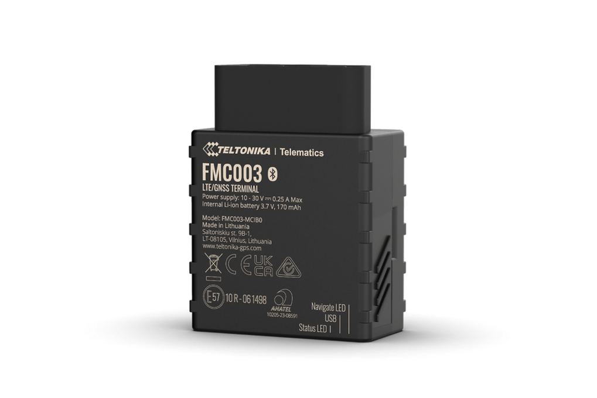

# Teltonika - FMC003

El Teltonika FMC003 es un rastreador OBD II plug and play diseñado para la gestión de flotas, operaciones logísticas y programas de movilidad eléctrica. Su factor de forma OBD II y la lectura de parámetros OEM entregan telemetría proveniente del vehículo, como odómetro, nivel de combustible y métricas de baterías eléctricas, mientras que la conectividad celular permite actualizaciones continuas de posición y estado en flotas mixtas.

Como dispositivo compatible con Plaspy, el FMC003 suministra telemetría de alta fidelidad a la plataforma Plaspy, de modo que los operadores pueden combinar datos precisos del vehículo con información de ubicación y eventos. Esto hace que el FMC003 sea ideal para despliegues rápidos donde la instalación ágil, la reportación consistente y la monitorización integrada de vehículos eléctricos son prioritarias para los equipos de flota y operaciones.

## Características principales

- Instalación plug and play mediante OBD II para desplegarse rápidamente en vehículos de pasajeros y comerciales ligeros
- Conectividad LTE Cat 1 4G con retroceso a 2G para amplia cobertura celular y continuidad en la telemetría
- Lecturas a nivel OEM del odómetro y nivel de combustible directamente desde la ECU del vehículo para reportes confiables
- Soporte explícito para vehículos eléctricos con métricas de batería y consumo para flotas de e-movilidad
- Compatible con accesorios Teltonika como cables de extensión y adaptador OBD II a FMS para montaje flexible
- Gestión remota de dispositivos mediante herramientas Teltonika para simplificar actualizaciones y configuración a gran escala
- SKUs regionales y variantes de frecuencia disponibles para cumplir con requisitos de redes locales

## Cómo funciona con Plaspy

Al conectarse al vehículo, el FMC003 aporta ubicación continua y telemetría proveniente del OBD que Plaspy ingiere para poblar dashboards, reportes y alertas. Plaspy muestra los datos del dispositivo junto al mapeo y flujo de eventos para que los responsables de flota obtengan visibilidad consolidada para seguimiento, mantenimiento y toma de decisiones operativas.

- Seguimiento en tiempo real y telemetría visibles en los dashboards de Plaspy para monitoreo en vivo de la flota
- Datos de odómetro y combustible integrados en reportes Plaspy para respaldar la planificación de mantenimiento y el análisis de consumo
- Métricas de batería y consumo de vehículos eléctricos disponibles en Plaspy para monitoreo de autonomía e insights de carga
- Diagnóstico remoto y actualizaciones de configuración coordinadas con las herramientas de gestión Teltonika y reflejadas en los flujos de trabajo de Plaspy
- Alertas y manejo de eventos por exceso de velocidad, geocercas y otros disparadores operativos para facilitar una respuesta rápida

## Casos de uso típicos

- Gestión de flotas y supervisión de rutas para flotas mixtas que incluyen vehículos de combustión interna y eléctricos
- Operaciones de logística y reparto que requieren despliegues rápidos y telemetría vehicular consistente
- Operación de flotas EV que monitorean consumo de batería, autonomía y eventos de carga
- Programas de control de combustible que dependen del nivel y consumo OEM para gestionar costos
- Programación de mantenimiento preventivo basada en datos precisos de odómetro y entradas diagnósticas

## Por qué elegir este rastreador con Plaspy

El FMC003 es una opción práctica para organizaciones que necesitan instalación rápida junto con telemetría vehicular de calidad OEM. Su diseño OBD II reduce la complejidad de la puesta en marcha a la vez que ofrece fidelidad de datos que mejora los reportes y flujos operativos en Plaspy. Combinado con las herramientas de gestión de Teltonika y las opciones de SKU regionales, el FMC003 soporta despliegues escalables en flotas con diversidad territorial.

To learn more about Plaspy and how compatible devices like the FMC003 fit into a broader fleet management strategy visit https://www.plaspy.com. Product specifications and availability can change over time, so verify current details with the manufacturer at https://www.teltonika-gps.com/ before purchase or large scale rollout.
