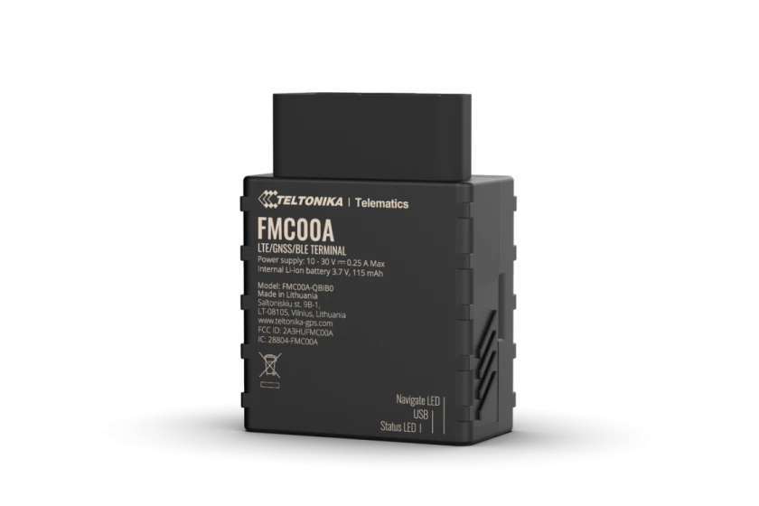

# Teltonika - FMC00A

El Teltonika FMC00A es un rastreador compacto Plug & Play con conector OBD II diseñado para vehículos en América del Norte. Ofrece conectividad celular 4G LTE Cat 1 con respaldo a 3G y está pensado para proporcionar posicionamiento continuo mediante múltiples sistemas GNSS. El equipo puede leer parámetros OEM del vehículo, como odómetro y nivel de combustible, e incluye detección de eventos como tiempo de marcha en ralentí excesivo, alertas por remolque, indicación de choque y detección de desconexión.

Al ser compatible con Plaspy, el FMC00A puede enviar la ubicación y la telemática del vehículo a la plataforma para supervisión centralizada de la flota. Esa compatibilidad lo convierte en una opción práctica para organizaciones que buscan instalación rápida, datos vehiculares más completos desde el OBD II y visibilidad de viajes y alertas dentro del entorno de Plaspy.

## Aspectos principales

- Factor de forma OBD II Plug & Play para despliegues rápidos en vehículos compatibles
- Conectividad 4G LTE Cat 1 con respaldo a 3G para mantener cobertura en Norteamérica
- Capacidad para leer parámetros OEM desde OBD, incluyendo odómetro y nivel de combustible, para mayor visibilidad operativa
- Soporte multi GNSS que mejora la precisión de posicionamiento en distintas regiones
- Detección de eventos integrada, como ralentí excesivo, remolque, desconexión, choque y alertas por interferencia
- Soporta configuración remota y actualizaciones de firmware mediante las herramientas del fabricante
- Diseño compacto y robusto con clasificación IP41 y amplio rango de temperatura operacional

## Cómo funciona con Plaspy

Al integrarse con Plaspy, el FMC00A envía ubicación y los datos vehiculares compatibles a la plataforma, donde usted puede visualizarlos, analizarlos y tomar acciones. Plaspy consume la telemática para ofrecer seguimiento en vivo, reportes históricos y alertas configurables que ayudan a los equipos operativos a gestionar la flota con mayor eficiencia.

- Ubicación del vehículo en tiempo real y visibilidad de viajes en el panel de Plaspy
- Monitoreo del odómetro y datos relacionados con combustible para apoyar la planificación de mantenimiento y los reportes de uso
- Configuración de alertas por geocerca y notificaciones de eventos como remolque, desconexión y ralentí excesivo
- Reproducción histórica de viajes y reportes para analizar rutas, tiempo en ralentí y patrones operativos
- Centralización de alertas y estado de la flota para apoyar despacho y supervisión operativa

## Casos de uso típicos

- Operadores de flotas que requieren despliegue rápido con conectores OBD y supervisión centralizada para vehículos en Norteamérica
- Empresas de alquiler y leasing que rastrean kilometraje y datos de combustible para facturación y mantenimiento
- Flotas pequeñas y medianas que buscan información sobre comportamiento del conductor para iniciativas de conducción eficiente
- Negocios de servicio y entrega que necesitan ubicación en vivo confiable y historial de viajes para el despacho
- Protección de activos usando detección de desconexión y alertas de remolque para identificar posibles robos o manipulaciones

## Por qué elegir este rastreador con Plaspy

El FMC00A es una opción práctica para organizaciones que desean un dispositivo telemático a nivel vehicular fácil de desplegar y capaz de ofrecer lecturas OEM desde la interfaz OBD II. Su conectividad celular y posicionamiento multi GNSS lo hacen adecuado para el seguimiento rutinario de flotas, mientras que la detección de eventos a bordo añade una capa de seguridad operativa y prevención de pérdidas.

Combinado con Plaspy, el FMC00A convierte los datos en bruto del vehículo en información accionable mediante paneles centralizados, alertas y reportes. Si prioriza la instalación rápida, la visibilidad del odómetro y combustible, y un dispositivo compatible con flotas en Norteamérica, vale la pena evaluar el FMC00A junto con Plaspy.

Obtenga más información sobre Plaspy en nuestro sitio web principal https://www.plaspy.com. Las especificaciones del producto, la disponibilidad y los detalles del fabricante pueden cambiar con el tiempo, por lo que le recomendamos verificar la información técnica actual con la documentación oficial de Teltonika en https://www.teltonika-gps.com/ antes de tomar decisiones de despliegue.
