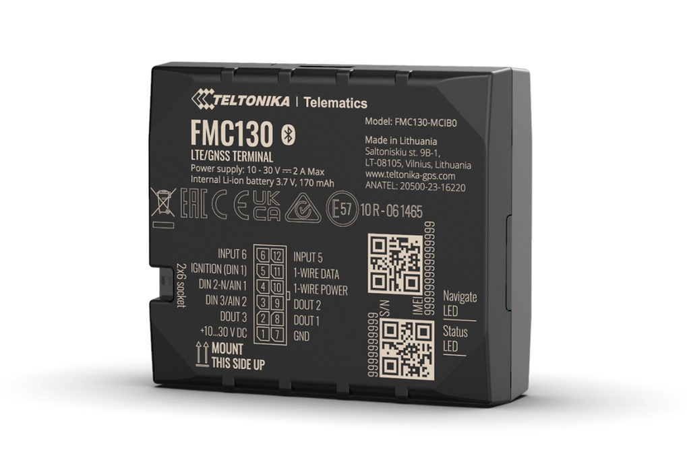

# Teltonika - FMC130

El Teltonika FMC130 es un rastreador GPS compatible con Plaspy diseñado para la gestión moderna de flotas. Integra conectividad celular con batería interna de respaldo y un diseño orientado a la telemetría para mantener la visibilidad de vehículos y activos durante el funcionamiento habitual y en interrupciones temporales de energía. Está pensado para operadores de flotas que requieren ubicación precisa más telemetría avanzada como monitoreo de combustible y sensores ambientales.

Como dispositivo compatible con Plaspy, el FMC130 envía posiciones y telemetría a Plaspy para monitoreo en vivo, generación de informes y control operativo. Sus entradas cableadas, entrada de pulso dedicada para combustible, compatibilidad con adaptadores CAN y soporte para sensores externos Bluetooth lo convierten en una opción práctica para flotas que buscan visibilidad centralizada, acciones remotas y gestión de dispositivos a través de la plataforma Plaspy.

## Características principales

- Rastreador compatible con Plaspy con conectividad 4G LTE Cat 1 y conmutación a 2G para amplia cobertura
- Batería interna de respaldo para mantener el rastreo y las alertas durante cortes de energía
- Entrada de pulso dedicada para lectura precisa de medidores de flujo de combustible y apoyo al monitoreo de combustible
- Compatibilidad con adaptadores CAN para leer parámetros del bus del vehículo y enriquecer la telemetría
- Soporte Bluetooth Low Energy para sensores y balizas externas que permiten monitorear condiciones de carga
- Inmovilizador remoto y bloqueo de motor para respuesta rápida ante intentos de robo
- Gestión remota de firmware y configuración para simplificar las actualizaciones de la flota

## Cómo funciona con Plaspy

Al instalarse en un vehículo o activo, el FMC130 transmite ubicación y telemetría a Plaspy, donde los datos se normalizan y presentan para monitoreo, alertas e informes. Plaspy ofrece una interfaz centralizada para ver posiciones en tiempo real, reproducir historial y ejecutar acciones remotas basadas en eventos del rastreador.

- Actualizaciones de posición y telemetría en vivo disponibles en Plaspy para seguimiento en tiempo real y reproducción histórica
- Señales del vehículo e entradas cableadas reportadas a Plaspy para que los responsables puedan crear alertas y filtros basados en eventos
- Datos de combustible por pulso desde la entrada de impulso enviados a Plaspy para análisis de consumo y detección de pérdidas
- Control remoto del inmovilizador y otras salidas que se pueden activar desde la consola Plaspy para respuesta ante robos
- Lecturas de sensores Bluetooth reenviadas a Plaspy para monitorear temperatura, humedad y estado de la carga

## Casos de uso típicos

- Gestión de flotas y despacho con seguimiento en tiempo real y supervisión operativa
- Monitoreo de combustible y prevención de pérdidas usando datos de flujo por pulso
- Respuesta ante robos con inmovilizador remoto y alertas por movimiento no autorizado
- Cadena de frío y monitoreo de carga refrigerada mediante sensores Bluetooth de temperatura y humedad
- Telemetría de vehículos pesados y maquinaria especial mediante integración con adaptador CAN

## Por qué elegir este rastreador con Plaspy

El FMC130 ofrece un equilibrio entre conectividad, entradas de telemetría y soporte de accesorios que se integra bien con los flujos de trabajo de Plaspy para operadores de flotas. Su diseño permite visibilidad continua incluso durante interrupciones de energía y proporciona canales de datos que ayudan a evaluar el consumo de combustible, el estado del vehículo y el entorno de la carga. Estas capacidades lo hacen apto para organizaciones que necesitan tanto rastreo de ubicación como telemetría avanzada sin complejidad excesiva.

Emparejado con Plaspy, el FMC130 forma parte de una solución telemática centralizada donde los responsables pueden monitorear flotas, recibir alertas basadas en eventos y aplicar controles remotos cuando sea necesario. Para especificaciones detalladas y el conjunto de funciones más reciente consulte la documentación del fabricante y considere Plaspy como la plataforma para recolectar, visualizar y actuar sobre la telemetría que proporciona el FMC130.

Learn more about Plaspy on the main website https://www.plaspy.com. Product specifications and availability can change over time, so verify current details on the manufacturer website https://www.teltonika-gps.com/.
