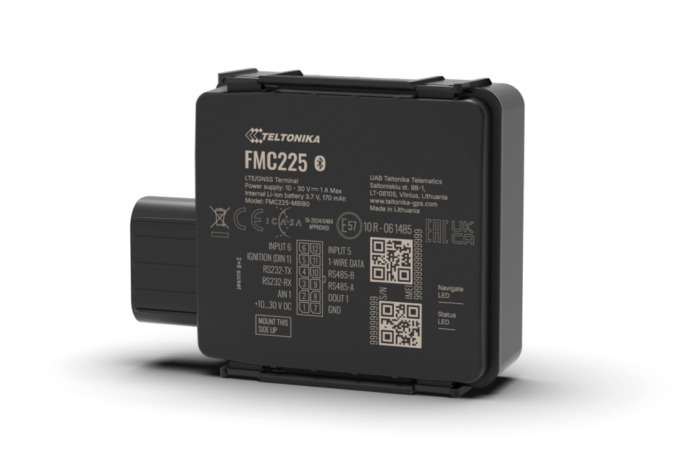

# Teltonika - FMC225

El FMC225 es un rastreador GPS robusto de Teltonika diseñado para la gestión profesional de flotas en entornos exigentes. Pensado para montaje externo y uso pesado, ofrece conectividad celular con opciones de respaldo y capacidad Dual SIM para mantener los vehículos conectados y reportando posición y telemetría en tiempo real. Está orientado a aplicaciones en agricultura, construcción, minería y otras industrias que requieren hardware duradero y visibilidad continua de activos.

Como dispositivo compatible con Plaspy, el FMC225 se integra con la plataforma para llevar ubicación, telemetría y eventos a los paneles y flujos de trabajo de informes. Su carcasa con grado IP67, la telemetría serial y las entradas por impulso para combustible lo convierten en una opción práctica para flotas que necesitan seguimiento fiable, monitoreo de combustible y controles antirobo, mientras se mantiene la gestión remota de dispositivos en despliegues a gran escala.

## Aspectos principales

- Rastreador compatible con Plaspy que proporciona seguimiento en tiempo real y telemetría para operaciones profesionales.
- Carcasa resistente IP67 adecuada para montaje exterior y protección frente a polvo y humedad.
- Conectividad celular con opciones de respaldo y soporte Dual SIM para maximizar la disponibilidad y mantener la conexión entre regiones.
- Interfaces seriales y entrada por impulso para combustible que permiten telemetría extendida e integración precisa del monitoreo de combustible.
- Entradas y salidas digitales y analógicas para control de periféricos y reporte de eventos en flujos de trabajo antirobo.
- Variantes regionales y opciones de kits para ajustarse a requisitos de despliegue y frecuencias locales.

## Cómo funciona con Plaspy

Cuando usted integra el FMC225 con Plaspy, el dispositivo envía posiciones GNSS y telemetría vehicular a través de redes celulares para que los operadores puedan ver ubicación en vivo, eventos y datos de sensores desde los paneles de Plaspy. Plaspy procesa telemetría serial, lecturas por impulso de combustible y eventos de E/S digitales para activar alertas, generar informes y automatizar flujos operativos.

- Actualizaciones de ubicación en tiempo real y reproducción de rutas para monitoreo en vivo y revisión histórica.
- Monitoreo de combustible mediante entrada por impulsos y medidores seriales para alimentar informes de consumo y costos en Plaspy.
- Integración de telemetría serial para sensores externos y adaptadores de terceros que amplían el diagnóstico visible en Plaspy.
- Entradas y salidas digitales y analógicas que permiten reportar eventos de puertas, alarmas e ignición y facilitan el control remoto de periféricos.
- Coordinación de la gestión remota de dispositivos y actualizaciones de firmware junto con las herramientas del fabricante para simplificar los despliegues.

## Casos de uso típicos

- Flujos de trabajo antirobo e inmovilización para vehículos de flota y equipos de alto valor.
- Seguimiento de maquinaria agrícola y de obra en sitios remotos o condiciones severas.
- Monitoreo preciso de combustible y generación de informes de consumo para control de costos y auditorías.
- Operaciones telemáticas avanzadas que requieren diagnósticos extendidos e integración con sensores de terceros.
- Despliegues regionales de flotas que se benefician de la redundancia Dual SIM y las variantes locales.

## Por qué elegir este rastreador con Plaspy

El FMC225 es una opción práctica para organizaciones que necesitan un rastreador resistente y probado en campo junto con una plataforma de gestión de flotas como Plaspy. Su combinación de carcasa robusta, redundancia de conectividad y soporte para telemetría externa e entradas de combustible lo hace especialmente adecuado para flotas que operan en entornos desafiantes donde la visibilidad continua y las decisiones basadas en datos son esenciales.

Los usuarios de Plaspy se benefician al incorporar los datos del FMC225 en paneles centralizados, alertas y herramientas de informe para proteger activos, planificar mantenimiento y optimizar la eficiencia operativa. Para obtener más información sobre cómo Plaspy puede integrarse con dispositivos como el FMC225 visite https://www.plaspy.com. Las especificaciones del producto, disponibilidad y detalles del fabricante pueden cambiar con el tiempo, por lo que le recomendamos verificar las especificaciones y opciones regionales actuales en el sitio del fabricante https://www.teltonika-gps.com/.
