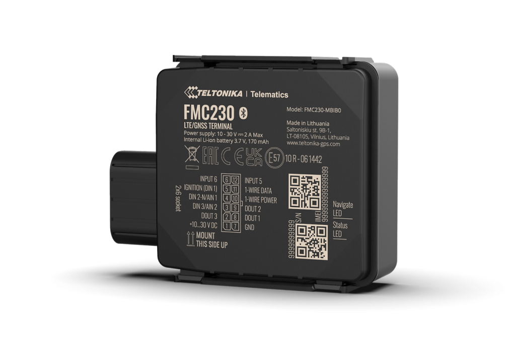

# Teltonika - FMC230

El Teltonika FMC230 es un rastreador GPS resistente diseñado para uso en vehículos y activos de trabajo pesado. Su carcasa con certificación IP67 y su diseño mecánico robusto están pensados para entornos exigentes como la construcción, la minería y la agricultura. El FMC230 ofrece seguimiento continuo mediante conectividad LTE Cat 1 con retroceso automático a 2G y además admite sensores Bluetooth Low Energy (BLE) para ampliar la monitorización ambiental y de movimiento.

Como dispositivo compatible con Plaspy, el FMC230 puede transmitir datos de ubicación y sensores a la plataforma Plaspy para soportar la supervisión de flotas, la protección de activos y flujos de telemetría. Plaspy puede ingerir las actualizaciones de posición en tiempo real del rastreador, lecturas de sensores BLE y eventos de entradas y salidas para que los operadores obtengan visibilidad, alertas configurables e informes históricos que faciliten la gestión operativa y la respuesta ante incidentes.

## Características principales

- Carcasa con certificación IP67 para funcionamiento fiable en condiciones exteriores húmedas y polvorientas
- Conectividad 4G LTE Cat 1 con retroceso automático a 2G para seguimiento continuo
- Soporte de Bluetooth Low Energy para sensores de temperatura, humedad, magnetismo y movimiento
- Opciones flexibles de entradas y salidas y múltiples variantes de cableado para adaptarse a distintas instalaciones
- Cierre rápido tipo clic de dos fases para montaje seguro y rápido sin herramientas adicionales
- Variantes regionales de conectividad celular y soporte FOTA para simplificar despliegues y actualizaciones remotas

## Cómo funciona con Plaspy

Al conectarse a Plaspy, el FMC230 transmite posición y telemetría soportada al panel de Plaspy, donde los datos se procesan para monitorización y alertas. Plaspy organiza la información entrante en vistas en vivo y registros históricos, y permite reglas configurables que convierten eventos crudos en información operativa útil.

- Actualizaciones de posición en tiempo real para visibilidad continua de vehículos y activos
- Reporte de eventos desde entradas y salidas digitales para registrar estados de encendido, puertas y alarmas
- Datos de sensores BLE reenviados a Plaspy para monitoreo de temperatura, humedad y movimiento
- Alertas de geocercas y notificaciones personalizadas basadas en posición y disparadores de eventos
- Informes históricos y registros de actividad para apoyar el análisis de flotas y el cumplimiento

## Casos de uso típicos

- Gestión de flotas para vehículos de construcción, minería y agricultura que operan en condiciones severas
- Monitoreo antirrobo y flujos de inmovilización cuando se integra con salidas y respuestas configuradas
- Seguimiento de cadena de frío y cargas sensibles a la temperatura mediante sensores BLE de temperatura y humedad
- Integración de telemetría y monitoreo de combustible a través de sensores externos y canales de E/S
- Rastreo de activos como remolques, maquinaria de planta y otros equipos de alto valor

## Por qué elegir este rastreador con Plaspy

El FMC230 combina un factor de forma resistente con conectividad flexible y soporte para sensores, lo que lo convierte en una opción sólida para organizaciones que requieren seguimiento confiable en entornos demandantes. Su diseño mecánico y las opciones de cableado reducen el tiempo de instalación, mientras que las SKU regionales y la capacidad FOTA facilitan la gestión de despliegues masivos a lo largo del tiempo.

Si está evaluando soluciones de rastreo para flotas pesadas o activos distribuidos, el FMC230 junto con Plaspy ofrece un equilibrio práctico entre durabilidad, conectividad y extensibilidad de telemetría. Para más información sobre Plaspy y cómo funciona con dispositivos como el FMC230 visite https://www.plaspy.com. Las especificaciones y la disponibilidad del producto pueden cambiar con el tiempo, por lo que le recomendamos verificar los detalles técnicos actuales y las variantes regionales en el sitio del fabricante https://www.teltonika-gps.com/
