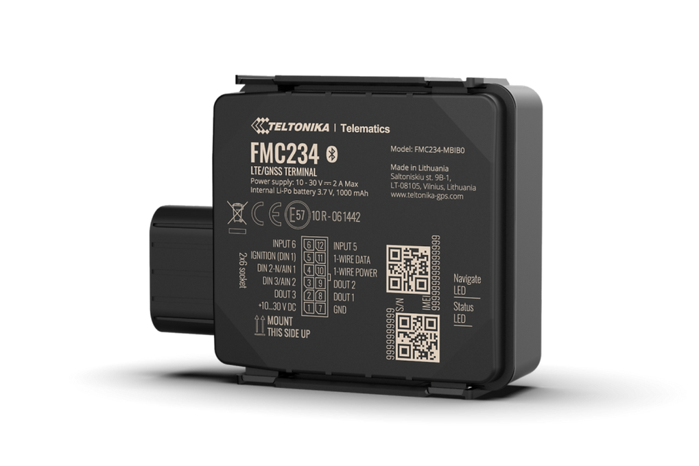

# Teltonika - FMC234

El Teltonika FMC234 es un rastreador GPS robusto diseñado para la gestión de flotas y la protección de activos en entornos exigentes. Con conectividad celular y una carcasa con clasificación IP67, el FMC234 ofrece reporte continuo de ubicación, autonomía extendida en espera y una construcción durable adecuada para vehículos y equipos de alto valor. Su diseño prioriza el seguimiento fiable, el sellado sencillo de la carcasa y la capacidad de permanecer operativo cuando se pierde la alimentación externa.

Como dispositivo compatible con Plaspy, el FMC234 puede transmitir ubicación y telemetría a Plaspy para monitoreo en vivo, generación de alertas e informes históricos. Esta compatibilidad hace del FMC234 una opción práctica para operadores que buscan una plataforma de hardware resistente combinada con la visibilidad y las herramientas de gestión de Plaspy para recuperación antirrobo, seguimiento remoto de activos y operaciones basadas en telemetría.

## Aspectos principales

- Compatible con Plaspy para seguimiento en tiempo real e integración con gestión de flotas
- Carcasa resistente con clasificación IP67 y mecanismo de cierre de dos fases tipo click para condiciones húmedas y polvorientas
- Conectividad celular con configuraciones regionales y opciones de respaldo para maximizar cobertura
- Batería interna de alta capacidad que ofrece operación autónoma durante varios días si se pierde la alimentación externa
- Soporta telemetría del vehículo mediante adaptadores compatibles y amplía capacidades con accesorios Teltonika
- Opciones de gestión remota de dispositivos para despliegues de flota escalables
- Disponible en variantes regionales y embalajes flexibles para adaptarse a necesidades de adquisición

## Cómo funciona con Plaspy

Al integrarse con Plaspy, el FMC234 proporciona posición y telemetría continuas que Plaspy transforma en mapas, alertas e informes para los operadores de flota. Plaspy utiliza los datos del dispositivo para facilitar la supervisión operativa, la respuesta a incidentes y el análisis histórico sin que usted tenga que gestionar detalles de bajo nivel del dispositivo.

- Actualizaciones de ubicación en tiempo real y reproducción de rutas en Plaspy para monitoreo en vivo y revisión posterior de viajes
- Telemetría desde el bus del vehículo o adaptadores compatibles para enriquecer los paneles de Plaspy con eventos de encendido y motor
- Datos ambientales y de proximidad desde accesorios Teltonika compatibles que pueden alimentar alertas en Plaspy por temperatura o condiciones de seguridad
- Alertas y reglas configurables en Plaspy, como geocerca, detección de movimiento y pérdida de alimentación, para apoyar flujos de trabajo de recuperación antirrobo y cumplimiento
- Configuración remota y gestión de firmware como parte de la supervisión centralizada del ciclo de vida del dispositivo al usarse junto con despliegues de Plaspy

## Casos de uso típicos

- Gestión de flotas y protección antirrobo donde la amplia autonomía de respaldo facilita la recuperación
- Monitoreo de cadena de frío y carga sensible cuando se combina con sensores ambientales y alertas de Plaspy
- Seguimiento de equipos en construcción, minería y agricultura en condiciones exteriores adversas
- Telemetría y monitoreo operacional integrando datos del bus del vehículo en los informes de Plaspy
- Protección remota de activos y despliegues a gran escala respaldados por gestión remota y opciones de compra en volumen

## Por qué elegir este rastreador con Plaspy

El FMC234 es una opción sólida para organizaciones que requieren un rastreador duradero con capacidad de espera extendida y opciones de conectividad flexibles. Su carcasa resistente al agua y el sellado práctico reducen el riesgo de exposición en entornos difíciles, mientras que la batería de respaldo interna permite el seguimiento continuo durante cortes de energía. En conjunto con Plaspy, el FMC234 forma parte de una solución completa de monitoreo que ofrece visibilidad de ubicación, alertas automatizadas e informes históricos para gestores de flota y activos.

Si desea conocer más sobre cómo Plaspy puede integrarse con el Teltonika FMC234, visite https://www.plaspy.com para explorar las funciones de la plataforma y las opciones de contacto. Las especificaciones y la disponibilidad de productos pueden cambiar con el tiempo, por lo que por favor verifique los detalles actuales y las variantes regionales en el sitio del fabricante https://www.teltonika-gps.com/ antes de la adquisición.
