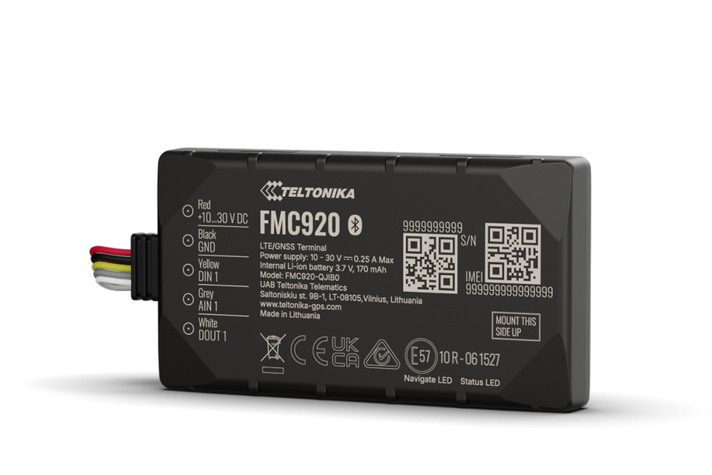

# Teltonika - FMC920

El Teltonika FMC920 es un rastreador GPS 4G LTE Cat 1 compacto, diseñado para ofrecer seguimiento fiable de vehículos y control de flotas en entornos con espacio limitado. Su delgada carcasa de 12 mm permite instalaciones discretas en vehículos y activos, y sus funciones integradas —como compatibilidad con Bluetooth LE, batería de respaldo y bloqueo remoto del motor— lo convierten en una opción práctica para operadores de flotas y proyectos anti-robo.

Como dispositivo compatible con Plaspy, el FMC920 se integra en los flujos de trabajo de seguimiento en tiempo real y gestión de flotas de Plaspy, proporcionando visibilidad consolidada de ubicaciones, alertas e informes. La posibilidad de emparejar sensores inalámbricos amplía la telemetría básica de localización con datos ambientales y de condición, lo que enriquece la información disponible para los gestores de flota en Plaspy.

## Características principales

- Compatible con Plaspy para seguimiento en tiempo real consolidado, alertas y generación de informes.
- Perfil delgado de 12 mm que facilita montajes ocultos en vehículos y activos de alto valor.
- Conectividad 4G LTE Cat 1 con variantes regionales disponibles para despliegues diversos.
- Soporte Bluetooth LE para emparejar balizas y sensores ambientales inalámbricos.
- Batería de respaldo que permite reportes durante cortes breves de alimentación y escenarios básicos anti-robo.
- Capacidad de bloqueo remoto del motor para apoyar flujos de trabajo de inmovilización y respuesta ante robos.
- Múltiples variantes de hardware y regionales; algunos modelos pueden haber alcanzado EOL, verifique disponibilidad.

## Cómo funciona con Plaspy

Al estar conectado, el FMC920 transmite la posición GNSS y la telemetría disponible a través de redes celulares hacia Plaspy, donde los datos se visualizan en mapas, paneles y reportes. Plaspy procesa la información del dispositivo para habilitar geocercas, análisis de rutas históricas y notificaciones automáticas, permitiendo que usted supervise la flota y responda a eventos de forma eficiente.

- Actualizaciones de ubicación en tiempo real y seguimiento en vivo en mapas y paneles de Plaspy.
- Control de bloqueo remoto del motor integrado en los flujos de trabajo de Plaspy para respuesta rápida ante hurtos.
- Datos de sensores Bluetooth (temperatura, humedad, imán, movimiento, nivel de líquido) mostrados junto a la ubicación para monitoreo combinado de condición y posición.
- Alertas y reportes configurables por incumplimiento de geocercas, umbrales de sensores e indicios de manipulación cuando el dispositivo lo soporta.
- Reporte continuado durante cortes de energía cortos soportado por la batería de respaldo del dispositivo.

## Casos de uso típicos

- Anti-robo y inmovilización de flotas con bloqueo remoto y alertas en tiempo real a través de Plaspy.
- Seguimiento oculto de vehículos y activos para empresas de renta, servicios y flotas de alto valor.
- Monitoreo de carga sensible a temperatura utilizando sensores Bluetooth con contexto de ubicación.
- Detección de puertas, imanes y manipulación para contenedores y control de accesos.
- Telemetría general para visibilidad de rutas, reproducción histórica y supervisión operativa.

## Por qué elegir este rastreador con Plaspy

Combinar el Teltonika FMC920 con Plaspy ofrece una solución de rastreo compacta y discreta que va más allá de la localización básica al incorporar soporte para sensores ambientales y funciones anti-robo. Su perfil delgado y el ecosistema de sensores Bluetooth lo hacen ideal para flotas mixtas y ubicaciones con espacio restringido, mientras que la batería de respaldo y las funciones de inmovilizador respaldan flujos críticos de mitigación de robos cuando se integran con las alertas y controles de Plaspy.

Para conocer más sobre cómo el FMC920 puede encajar en su estrategia de gestión de flotas, visite https://www.plaspy.com. Las especificaciones del producto, la disponibilidad y los detalles del fabricante pueden cambiar con el tiempo, por lo que le recomendamos verificar las variantes de dispositivo, firmware y la información de soporte actual en el sitio oficial de Teltonika https://www.teltonika-gps.com/ antes de realizar la adquisición.
