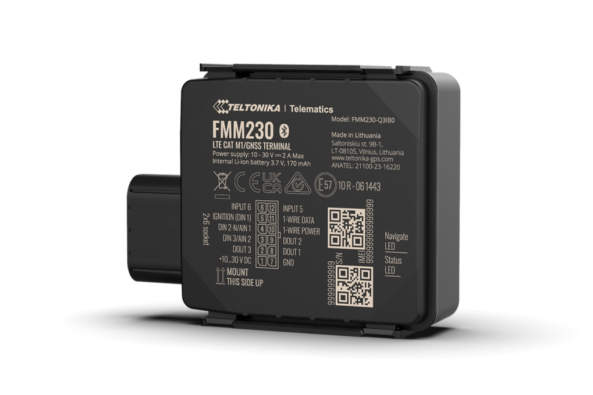

# Teltonika - FMM230

El Teltonika FMM230 es un rastreador GPS compacto y resistente, diseñado para el monitoreo confiable de activos y flotas en entornos exigentes. Con carcasa IP67, la unidad está preparada para soportar polvo y agua mientras brinda reporte continuo de ubicación y telemetría. Su diseño celular soporta conectividad moderna de baja potencia de área amplia junto con retroceso a redes legacy para una cobertura amplia, y se integra con sensores del vehículo y accesorios para ampliar las capacidades de supervisión.

Como dispositivo compatible con Plaspy, el FMM230 puede transmitir datos de ubicación y condición directamente a Plaspy para visibilidad en tiempo real, alertas e informes históricos. Su compatibilidad con sensores BLE, las opciones flexibles de entradas y salidas y la operación con batería de respaldo lo convierten en una opción práctica para implementaciones que requieren monitoreo de condiciones, detección de cortes de energía y supervisión centralizada de flotas dentro de la plataforma Plaspy.

## Características principales

- Compatible con Plaspy para una integración sencilla en paneles y flujos de alertas de Plaspy
- Conectividad celular multinetwork que incluye LTE Cat M1 y NB‑IoT con retroceso a 2G para mayor cobertura
- Carcasa resistente IP67 adecuada para instalaciones al aire libre e industriales
- Soporte BLE para emparejar con beacons y sensores Teltonika EYE y monitorear temperatura, humedad y movimiento
- Funcionamiento con batería de respaldo para preservar el rastreo durante interrupciones de energía
- Entradas y salidas flexibles y compatibilidad con accesorios para telemetría de vehículos y activos
- Opciones de montaje sin herramientas para simplificar la instalación y reducir trabajo de campo

## Cómo funciona con Plaspy

Al conectarse a Plaspy, el FMM230 transmite datos de ubicación y sensores para que los gerentes de flota y operadores puedan monitorear activos en tiempo real y revisar la actividad histórica. Plaspy recibe las entradas del dispositivo y las presenta en paneles, geocercas e informes que apoyan la toma de decisiones operativas y la gestión de excepciones.

- Actualizaciones de ubicación y telemetría en tiempo real disponibles en Plaspy para seguimiento en vivo
- Lecturas de sensores BLE integradas en los paneles de Plaspy para visibilidad del estado de la carga
- Estados de entradas y salidas del vehículo presentados en Plaspy para reflejar encendido o eventos de sensores según la configuración
- Eventos de pérdida de energía y de batería de respaldo enviados a Plaspy para alertas y flujos de trabajo antirobo
- Gestión remota de dispositivos y capacidad de actualización de firmware que facilitan el mantenimiento centralizado y las operaciones a escala de flota

## Casos de uso típicos

- Gestión de flotas y seguimiento de rutas para autobuses, camionetas y vehículos comerciales
- Transporte frigorífico donde sensores BLE supervisan condiciones de la carga y generan alertas en Plaspy
- Operaciones logísticas y de última milla que requieren rastreadores compactos y cobertura celular fiable
- Seguimiento de obras y equipos en entornos exigentes aprovechando la protección IP67 y la energía de respaldo
- Monitoreo de vehículos utility y todoterreno donde la E/S flexible y la conectividad resistente son importantes

## Por qué elegir este rastreador con Plaspy

El FMM230 ofrece una combinación equilibrada de diseño robusto, alcance celular ampliado y soporte para sensores periféricos, alineada con despliegues telemáticos basados en Plaspy. Su factor de forma y opciones de montaje reducen el tiempo de instalación, mientras que la integración de sensores BLE y la E/S flexible lo hacen adecuado para escenarios de monitoreo por condiciones que alimentan directamente las alertas e informes en Plaspy.

Si está evaluando rastreadores para una implementación con Plaspy, el FMM230 es una opción a considerar cuando la protección ambiental, la extensibilidad de sensores y la comunicación persistente son prioridades. Conozca más sobre Plaspy en el sitio principal https://www.plaspy.com. Las especificaciones y la disponibilidad de productos pueden cambiar con el tiempo; por favor verifique los detalles actuales y las opciones de accesorios en el sitio del fabricante https://www.teltonika-gps.com/ antes de tomar decisiones de compra.
