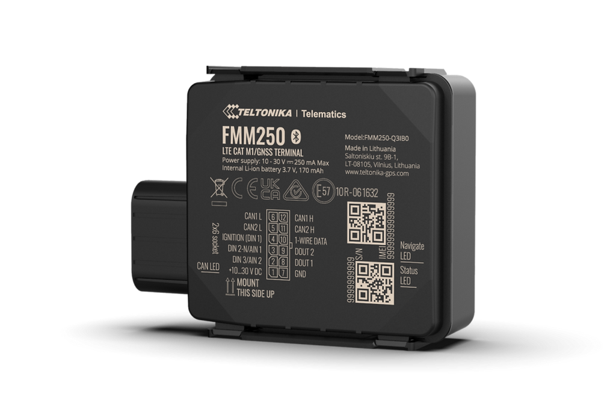

# Teltonika - FMM250

El Teltonika FMM250 es un rastreador GPS para vehículos resistente y con clasificación IP67, diseñado para la adquisición de datos CAN de alta fidelidad y conectividad celular confiable. Pensado para gestión de flotas y entornos móviles exigentes, el FMM250 es compatible con Plaspy: ofrece telemetría detallada y parámetros del bus del vehículo a Plaspy para seguimiento en tiempo real, mantenimiento predictivo y diagnósticos avanzados.

El FMM250 combina comunicaciones LTE Cat M1 y NB‑IoT \(NB2\) con respaldo a 2G donde sea aplicable, un chipset de procesamiento de datos CAN integrado capaz de leer e informar más de 100 parámetros del bus CAN, y un embalaje robusto para montaje en vehículos en condiciones de polvo o humedad. Es una opción ideal para organizaciones que buscan rastreadores GPS compatibles con Plaspy que integren telemetría detallada del vehículo en tableros de flota, flujos de trabajo anti-robo y sistemas de mantenimiento.

## Aspectos clave

- Compatible con Plaspy: transmite telemetría CAN y celular a Plaspy para seguimiento en tiempo real e informes.
- Captura avanzada de datos CAN: lee y reporta más de 100 parámetros del bus CAN de vehículos ligeros, VE, camiones, autobuses y maquinaria especial.
- Conectividad celular de baja potencia y amplio alcance: LTE Cat M1 y NB‑IoT \(NB2\) con respaldo a 2G \(según variante\) para una cobertura amplia y eficiencia.
- Formato robusto IP67: diseño resistente al agua y al polvo para operación fiable en entornos duros sobre el vehículo.
- Telemetría lista para flotas: admite mantenimiento predictivo, análisis del comportamiento del conductor y diagnósticos remotos mediante conjuntos de datos CAN detallados.
- Ecosistema de accesorios: compatible con adaptadores CAN de Teltonika, lectores RFID y sensores Bluetooth para ampliar la funcionalidad.
- Múltiples opciones de SKU: paquetes estándar y extendidos de parámetros CAN y configuraciones RF regionales \(seleccione SKU por mercado\).

## Cómo funciona con Plaspy

El FMM250 envía telemetría derivada de CAN y actualizaciones de ubicación celular a puntos finales del backend a través de LTE Cat M1, NB‑IoT o 2G. Cuando se integra como un rastreador compatible con Plaspy, esos flujos de telemetría —incluyendo la ubicación del vehículo, parámetros CAN y valores de diagnóstico— se asignan a Plaspy para monitoreo en tiempo real, alertas e informes históricos. Plaspy aprovecha los datos detallados del FMM250 para entregar insights accionables para la gestión de flotas, reduciendo el tiempo de inactividad y mejorando la eficiencia operativa.

- Actualizaciones de ubicación y telemetría en tiempo real entregadas a través de LTE Cat M1 / NB‑IoT con respaldo a 2G \(según variante\).
- Transmisión de parámetros del bus CAN: más de 100 parámetros disponibles para motor, batería, estados de VE, sensores y más.
- Estado de encendido, puertas y alarmas: compatible cuando se expongan en el CAN del vehículo o entradas de accesorio y mapeado en Plaspy.
- Monitoreo de combustible y telemetría: disponible cuando el vehículo exponga datos de combustible en el bus CAN; Plaspy integra esos parámetros para análisis de combustible.
- Flujos de trabajo anti-robo e inmovilizador: pueden implementarse mediante accesorios compatibles o salidas del vehículo y coordinados a través de Plaspy \(sujeto a la instalación eléctrica del vehículo y características del SKU\).
- Sensores y beacons Bluetooth: amplían la telemetría con sensores BLE mediante accesorios Teltonika para temperatura, monitoreo de carga o eventos de proximidad.

## Resumen técnico

| Modelo | FMM250 |
| --- | --- |
| Fabricante | Teltonika \(se hace referencia a embalaje con marca Teltonika\) |
| Conectividad | LTE Cat M1, NB‑IoT \(NB2\); respaldo a 2G donde aplique \(según variante\) |
| Bandas | La compatibilidad de bandas varía según SKU y región; seleccione la configuración RF regional adecuada al realizar el pedido |
| Energía & Batería | Alimentado por el vehículo; el paquete estándar incluye cables de alimentación. No se especifican detalles de batería interna en la descripción proporcionada. |
| Interfaces | Chip de procesamiento de datos CAN integrado y interfaces CAN para captura directa del bus del vehículo. Incluye cables de entrada de alimentación; compatible con adaptadores CAN de Teltonika, lectores RFID y ecosistema de accesorios. No se especifican pines digitales de E/S, de encendido o de inmovilizador en la descripción. |
| GNSS | GNSS/ubicación: detalles no especificados en la descripción proporcionada; el dispositivo proporciona la posición del vehículo mediante telemetría celular y datos obtenidos del CAN cuando se usa con Plaspy. |
| Bluetooth | Soporta sensores BLE a través del ecosistema de accesorios Bluetooth de Teltonika \(sensores BLE y beacons compatibles mediante accesorios\). |
| Gestión Remota | Soporta herramientas de gestión remota de Teltonika para actualizaciones de firmware y configuración; disponibles SKUs opcionales y capacidades de configuración remota. |
| Forma | Rastreador de vehículo robusto, con clasificación IP67, apto para montaje en vehículos en entornos polvorientos y húmedos; diseño compacto para instalaciones de flota y activos. |
| Embalaje & SKUs | Los pedidos estándar suelen incluir varias unidades \(paquete estándar: 5 unidades\), cables de alimentación y embalaje con marca Teltonika. Códigos de producto de ejemplo: FMM2502RXW01 \(parámetros estándar\), FMM2502RJ101 \(parámetros extendidos\); otros SKUs regionales disponibles. |

## Casos de uso

- Flujos anti-robo de flota y inmovilización — coordina señales CAN y controles de accesorios a través de Plaspy para garantizar la seguridad de vehículos de alto valor.
- Mantenimiento predictivo y diagnósticos remotos — envía más de 100 parámetros CAN a Plaspy para monitorear la salud del motor, el estado de la batería y los sistemas de VE, y programar el servicio de forma proactiva.
- Monitoreo del comportamiento del conductor y cumplimiento — captura eventos de velocidad, frenado y aceleración derivados del CAN para favorecer una conducción más segura y optimizar las operaciones.
- Monitoreo de combustible y programas de eficiencia — ingiere parámetros CAN relacionados con el combustible \(donde estén disponibles\) en Plaspy para el seguimiento del consumo y control de costos.
- Monitoreo de activos en entornos adversos — diseño IP67 para construcción, minería, agricultura o maquinaria especial donde la resistencia al polvo y al agua es esencial.

## Por qué elegir este rastreador con Plaspy

Elegir el Teltonika FMM250 como rastreador GPS compatible con Plaspy ofrece una combinación práctica de hardware robusto y telemetría detallada del vehículo. Su procesamiento CAN dedicado permite reportes detallados de parámetros del vehículo y de VE que van más allá de la simple localización GPS, alimentando a Plaspy con los datos necesarios para una gestión de flotas eficaz, análisis de telemetría y mantenimiento proactivo. Las opciones de conectividad LTE Cat M1 y NB‑IoT \(con respaldo 2G según corresponda\) proporcionan comunicaciones fiables y rentables a través de redes celulares modernas, mientras que el ecosistema de accesorios facilita una integración escalable de sensores BLE, RFID y adaptadores CAN.

Para operadores que requieren telemetría robusta y compatible con Plaspy para flotas, vehículos pesados y maquinaria especial, el FMM250 ofrece un equilibrio entre durabilidad, profundidad de datos y flexibilidad de SKU regional. Seleccione la variante adecuada para su mercado objetivo y combine el dispositivo con Plaspy para desbloquear seguimiento en tiempo real, diagnósticos del vehículo, flujos de anti-robo y conocimientos sobre consumo de combustible y comportamiento del conductor.

