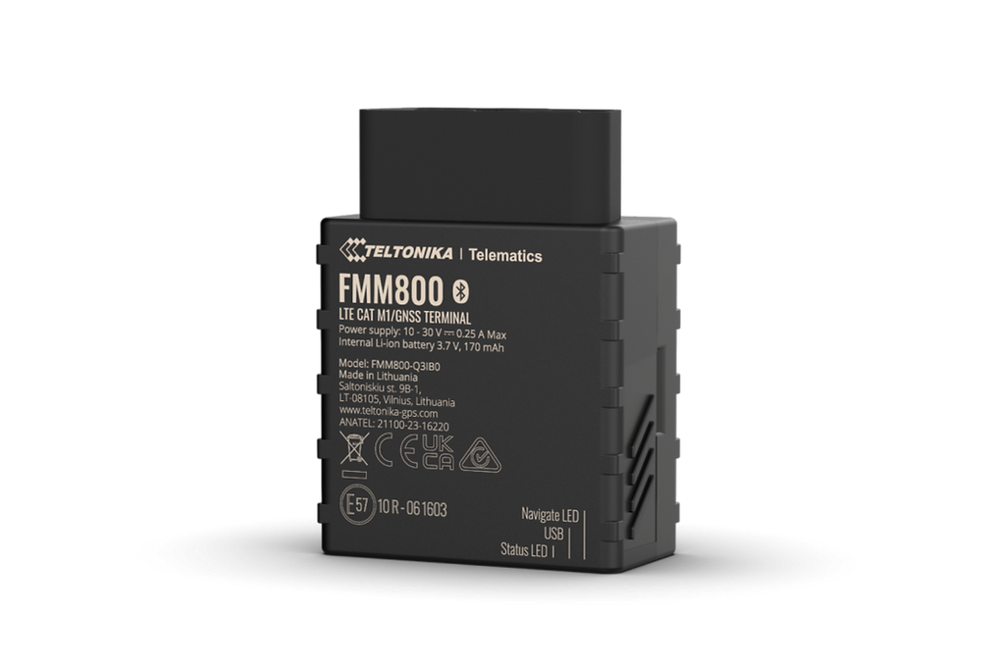

# Teltonika - FMM800

El Teltonika FMM800 es un rastreador GPS OBD II plug and play diseñado para una instalación rápida y un monitoreo vehicular fiable. Pensado para gestión de flotas, car sharing, alquiler de vehículos y operaciones logísticas, el dispositivo transmite ubicación y datos del vehículo a través del puerto OBD II, por lo que su equipo puede comenzar a rastrear y recopilar telemetría sin instalaciones complejas.

Como dispositivo compatible con Plaspy, el FMM800 puede enviar ubicación, eventos del acelerómetro, datos vehiculares obtenidos por OBD y lecturas de sensores Bluetooth a Plaspy para paneles centralizados, alertas e informes históricos. Esta compatibilidad convierte al FMM800 en una opción práctica para organizaciones que requieren despliegue rápido y visibilidad integrada mediante Plaspy para monitoreo, reglas y análisis.

## Aspectos clave

- Instalación plug and play por OBD II para despliegues rápidos en flotas de vehículos.
- Compatible con Plaspy para seguimiento centralizado, alertas e informes.
- Conectividad celular multimodo incluyendo LTE Cat M1 y NB-IoT con fallback quad band 2G para amplia cobertura.
- Acelerómetro de 3 ejes integrado para detección de impactos y eventos de conducción brusca.
- Soporte Bluetooth Low Energy para emparejar sensores externos y beacons.
- Gestión remota de firmware y configuración mediante las herramientas de Teltonika.

## Cómo funciona con Plaspy

Una vez conectado y configurado, el FMM800 envía posición y telemetría del vehículo a Plaspy, brindando a los gestores de flota visibilidad en tiempo real y contexto histórico. Plaspy ingiere actualizaciones de posición, disparadores de eventos y datos de sensores para alimentar monitoreo, alertas e informes, mientras que las herramientas de Teltonika se encargan del aprovisionamiento y las actualizaciones de firmware.

- Actualizaciones de ubicación en tiempo real en Plaspy para seguimiento en mapa y reproducción de rutas.
- Eventos del acelerómetro, como impactos o conducción agresiva, disponibles como disparadores de alertas.
- Datos vehiculares derivados del OBD II que permiten monitoreo de combustible, estado del encendido y análisis de conducta del conductor dentro de Plaspy.
- Lecturas de sensores Bluetooth para temperatura, humedad, magnetismo o movimiento que pueden reenviarse a Plaspy a través del dispositivo.
- La gestión remota con aprovisionamiento Teltonika ayuda a mantener el hardware actualizado e interoperable con Plaspy.
- Telemetría y alertas que apoyan flujos de trabajo contra robo y movimientos no autorizados.

## Casos de uso típicos

- Gestión de flotas con seguimiento en vivo, monitoreo de comportamiento del conductor y análisis de rutas.
- Operaciones de car sharing y alquiler que requieren instalación rápida y registros de uso para facturación y seguridad.
- Servicios de logística y entrega que necesitan actualizaciones continuas de ubicación y alertas basadas en eventos.
- Monitoreo del ambiente del vehículo para unidades estacionales o de lujo utilizando sensores BLE externos.
- Seguridad de activos y detección antirobo combinada con monitoreo de encendido y movimiento.

## Por qué elegir este rastreador con Plaspy

El FMM800 ofrece una vía de baja fricción hacia la telemática vehicular para organizaciones que buscan despliegues rápidos y flujos de datos integrados. Su factor de forma plug and play OBD II reduce el tiempo de instalación, mientras que la detección de movimiento a bordo y el soporte de sensores expanden el tipo de alertas y telemetría que Plaspy puede procesar para obtener información operativa.

Si usted está evaluando rastreadores para una implementación con Plaspy, el FMM800 es una opción práctica cuando necesita datos OBD II del vehículo, soporte para sensores BLE y gestión remota del dispositivo en una unidad compacta. Para más detalles sobre Plaspy y cómo este modelo puede integrarse en su flujo de trabajo visite https://www.plaspy.com. Las especificaciones del producto y disponibilidad pueden cambiar con el tiempo, por favor verifique los detalles técnicos y la información de compra actuales en el sitio del fabricante https://www.teltonika-gps.com/.
