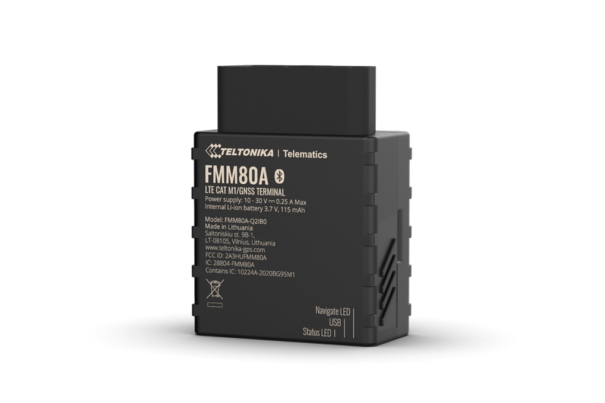

# Teltonika - FMM80A

El Teltonika FMM80A es un rastreador GPS OBD II de tipo plug-and-play pensado para despliegues rápidos y telemática confiable. Diseñado para flotas, alquileres y operaciones de entrega, el dispositivo ofrece monitorización de posición en tiempo real y telemetría del vehículo con un esfuerzo mínimo de instalación al conectarse directamente al puerto OBD II. Este modelo está optimizado para el mercado de Norteamérica e incluye conectividad celular, soporte Bluetooth Low Energy para sensores y balizas externas, y un acelerómetro configurable para detección de incidentes y captura de trazas.

Como dispositivo compatible con Plaspy desde su configuración inicial, el FMM80A puede transmitir ubicación y telemetría a la plataforma Plaspy para habilitar mapas en vivo, alertas e informes históricos sin necesidad de desarrollo personalizado. Su factor de forma plug-and-play y la integración con la administración remota de dispositivos lo convierten en una opción práctica para operadores que buscan implementaciones rápidas y supervisión centralizada dentro de flotas gestionadas por Plaspy.

## Características principales

- Conexión OBD II plug-and-play para instalación rápida y telemetría inmediata en vehículos compatibles
- Informe de ubicación GPS en tiempo real para admitir seguimiento en vivo y supervisión de rutas
- Conectividad celular LTE Cat M1 y NB-IoT con retroceso a 2G para amplia cobertura en Norteamérica y telemetría eficiente
- Soporte Bluetooth Low Energy (BLE) para ampliar la telemetría con sensores y balizas externas y monitorización de condiciones
- Acelerómetro configurable de 3 ejes para detección de colisiones y captura de trazas posteriores al evento
- Integración con las herramientas de administración remota de Teltonika para configuración centralizada y actualizaciones
- Formato y variantes optimizadas para despliegues en Norteamérica y distribución escalable

## Cómo funciona con Plaspy

Una vez conectado, el FMM80A transmite ubicación y telemetría del vehículo a Plaspy para que los administradores de flota puedan monitorear activos en tiempo real, recibir alertas críticas y analizar viajes históricos. Las entradas de sensores BLE y los eventos del acelerómetro enriquecen los flujos de datos del vehículo que Plaspy puede usar en paneles, notificaciones e informes.

- Actualizaciones en tiempo real de ubicación GPS y telemetría enviadas a Plaspy para seguimiento en vivo y supervisión de rutas
- Eventos de detección de choques y trazas del acelerómetro disponibles en la plataforma para revisión de incidentes
- Datos de sensores BLE de balizas emparejadas integrados en Plaspy para monitorización de condiciones y alertas
- Parámetros del vehículo proporcionados a través de la conexión OBD II incorporados en Plaspy cuando esos datos están disponibles
- Administración remota de dispositivos habilitada por las herramientas de gestión de Teltonika para soportar despliegues a escala con Plaspy

## Casos de uso típicos

- Gestión de flotas urbanas y regionales que requieren seguimiento en vivo e informes operativos
- Alquiler y carsharing donde la instalación OBD II rápida y el monitoreo de uso agilizan la rotación de vehículos
- Operaciones de entrega y logística que necesitan ubicación en tiempo real y datos de sensores opcionales para proteger envíos
- Flujos de trabajo de antirobo y recuperación que usan actualizaciones de ubicación inmediatas y alertas de movimiento
- Transporte sensible a condiciones cuando se emparejan sensores BLE para monitorizar temperatura o humedad

## Por qué elegir este rastreador con Plaspy

El FMM80A combina un modelo de instalación de baja complejidad con opciones de telemetría ampliadas, por lo que resulta adecuado para organizaciones que necesitan despliegues rápidos y supervisión escalable mediante Plaspy. Su diseño plug-and-play OBD II reduce el tiempo y la complejidad de la instalación, mientras que la conectividad celular y el BLE amplían los tipos de datos operativos que pueden alimentar los paneles y alertas de Plaspy. Las capacidades de gestión remota simplifican además la administración de flotas en despliegues de mayor tamaño.

Si usted necesita un rastreador compatible con Plaspy que equilibre despliegue rápido, flexibilidad de sensores y detección de incidentes, el FMM80A es un candidato sólido para evaluar. Learn more about Plaspy on the main website https://www.plaspy.com and verify current product specifications, availability, and manufacturer details on the official Teltonika site https://www.teltonika-gps.com/ since product features and packaging can change over time.
