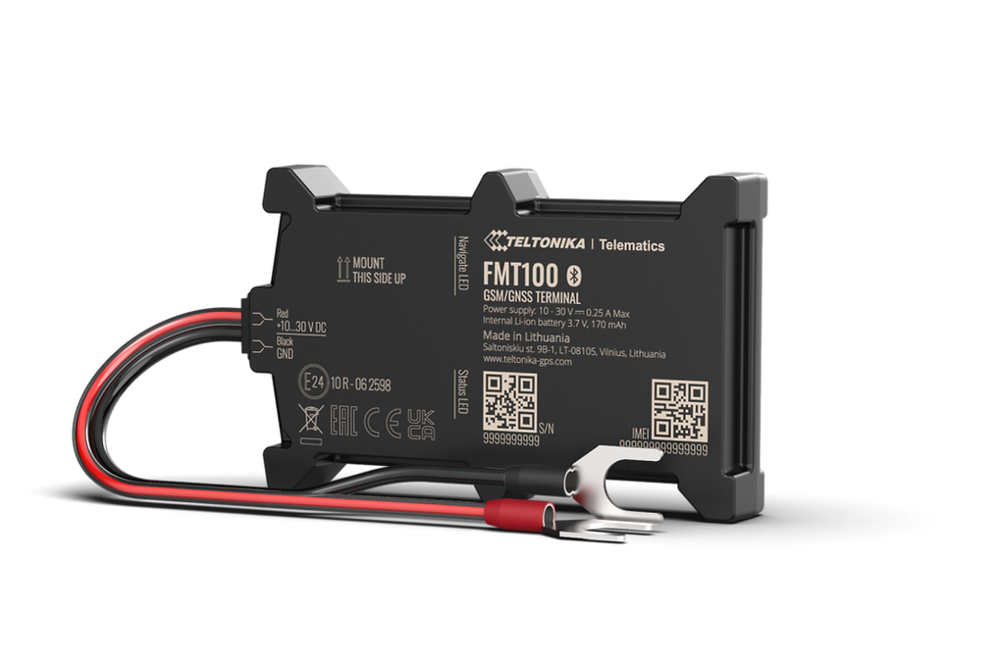

# Teltonika - FMT100

El FMT100 es un rastreador GPS compacto y compatible con Plaspy, diseñado para instalaciones rápidas y fiables montadas en baterías en vehículos y activos móviles. Alberga su electrónica en una carcasa robusta con certificación IP65, pensado para rollouts de flotas, uso estacional y despliegues ágiles donde la facilidad de montaje y la telemetría confiable son prioritarias. El equipo incluye un acelerómetro integrado de 3 ejes y soporte para Bluetooth LE, lo que le permite captar eventos de movimiento y enlazarse con sensores externos para una mayor visibilidad del activo.

Como dispositivo integrado con Plaspy, el FMT100 entrega actualizaciones de ubicación, eventos del acelerómetro y lecturas de sensores Bluetooth al entorno de monitoreo e informes de Plaspy. Esta compatibilidad lo hace idóneo para operaciones que requieren instalación veloz, visibilidad centralizada y alertas basadas en eventos en flotas mixtas. El uso con Plaspy permite convertir los mensajes del FMT100 en seguimiento en tiempo real, trazas de incidentes y notificaciones automáticas sin necesidad de configuraciones complejas.

## Características principales

- Factor de forma compacto montado en batería, pensado para despliegues rápidos en vehículos y activos.
- Carcasa resistente con clasificación IP65 para operación fiable en campo y condiciones climáticas variadas.
- Acelerómetro de 3 ejes integrado para captura de eventos conscientes de choques y detección de movimiento.
- Emparejamiento Bluetooth LE para extender la telemetría con sensores externos de temperatura, humedad, movimiento o magnéticos.
- Conectividad 2G cuatribanda para amplio alcance en redes heredadas, adecuada para reportes básicos de posición y eventos.
- Opciones de paquetes múltiples por parte del fabricante con accesorios para mayor flexibilidad de instalación.

## Cómo funciona con Plaspy

Al integrarse con Plaspy, el FMT100 transmite actualizaciones de posición, eventos del acelerómetro y datos de sensores Bluetooth emparejados a los paneles y herramientas de informes de Plaspy para supervisión operativa y revisión histórica. Plaspy puede ingerir los mensajes orientados a eventos del dispositivo para generar alertas, construir trazas de incidentes y alimentar flujos de trabajo de la flota.

- Actualizaciones en tiempo real de ubicación y movimiento mostradas en los mapas de Plaspy con reproducción histórica de rutas.
- Eventos por acelerómetro relacionados con choques enviados a Plaspy para revisión de incidentes y emisión de alertas.
- Lecturas de sensores Bluetooth LE transmitidas a Plaspy para monitorear condiciones ambientales o el estado del activo.
- Flujos de trabajo y notificaciones basados en eventos configurables en Plaspy según los mensajes del dispositivo y geocercas.
- Funciones opcionales dependientes de I/O, como control remoto o monitoreo de ignición, dependen del paquete seleccionado y del cableado del vehículo; verifique las capacidades necesarias antes del despliegue.

## Casos de uso típicos

- Despliegues a gran escala en flotas de alquiler y estacionales que requieren instalación rápida montada en batería y seguimiento centralizado.
- Flotas de logística y entrega que necesitan unidades económicas para reporte básico de ubicación y alertas por eventos.
- Detección de choques y análisis de incidentes mediante trazas basadas en acelerómetro y notificaciones automáticas.
- Monitoreo ambiental de activos emparejando sensores BLE de temperatura o humedad para carga sensible.
- Despliegues a corto plazo y programas piloto donde la instalación simple y el reporte predecible reducen el tiempo de puesta en marcha.

## Por qué elegir este rastreador con Plaspy

El FMT100 ofrece una combinación práctica de robustez, rapidez de instalación y flexibilidad de sensores que encaja con muchos casos de uso de Plaspy. Su diseño montado en batería y las opciones de paquetes y accesorios reducen tiempos logísticos e instalación, ayudando a que los dispositivos empiecen a reportar en Plaspy con rapidez. El soporte para sensores Bluetooth LE y el acelerómetro integrado proporcionan telemetría más rica que la de un rastreador básico, manteniendo costos de hardware y despliegue moderados.

Para conocer más sobre cómo Plaspy puede integrar el FMT100 en su programa de rastreo visite https://www.plaspy.com. Las especificaciones del producto, la disponibilidad y las recomendaciones del fabricante pueden cambiar con el tiempo, por lo que le recomendamos verificar los detalles actuales en las páginas del fabricante en https://www.teltonika-gps.com/ antes de finalizar la compra o el despliegue.
