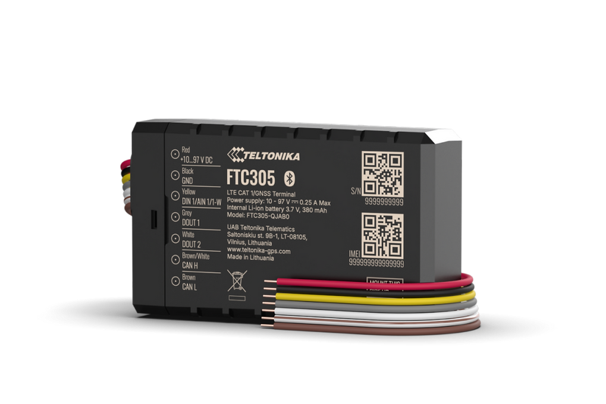

# Teltonika - FTC305

El Teltonika FTC305 es un rastreador GPS de grado vehicular, compacto y pensado para movilidad eléctrica y telemática de flotas. Combina posicionamiento GNSS con capacidad de telemetría vehicular, protección robusta IP67 y un amplio rango de alimentación para adaptarse a plataformas de transporte eléctrico como e-bikes, montacargas, vehículos de traslado y maquinaria utility. El equipo se ofrece en variantes con carcasa sellada y sin carcasa, y admite antena externa y batería de respaldo opcional para despliegues más resistentes.

Como dispositivo compatible con Plaspy desde fábrica, el FTC305 puede enviar ubicación y telemetría del vehículo a Plaspy para mapas en tiempo real, alertas e informes. Esto lo convierte en una opción práctica cuando necesita visibilidad continua de la posición y datos vehiculares más completos dentro de una plataforma de gestión de flotas, ayudando a los equipos de operaciones a supervisar activos, activar respuestas y analizar patrones de uso.

## Aspectos clave

- Diseñado para movilidad eléctrica y telemática de flotas con un formato compacto y grado vehicular.
- Compatibilidad con Plaspy para ingestión directa de posición GNSS y telemetría del vehículo.
- Carcasa robusta IP67, con variante de fábrica sin carcasa para integraciones embebidas.
- Amplio rango de alimentación para adaptarse a diversas plataformas de transporte eléctrico.
- Soporte de telemetría vía bus CAN para mostrar métricas derivadas del vehículo junto a la ubicación.
- Antena externa y batería de respaldo opcionales para mejorar la resiliencia del sistema.
- Perfiles de radio variados incluyendo 4G LTE Cat 1 con respaldo 2G para mayor cobertura.

## Cómo funciona con Plaspy

Al conectarse a Plaspy, el FTC305 transmite fijaciones de posición y telemetría vehicular para que los gestores de flota obtengan visibilidad en mapas, alertas y datos históricos. Plaspy ingiere la información del dispositivo para alimentar flujos de monitoreo, geovallas y análisis que apoyan decisiones operativas y respuestas ante robos.

- Las actualizaciones de ubicación en tiempo real aparecen en los mapas de Plaspy, facilitando el monitoreo de rutas y las alertas de geovallas.
- Los datos del bus CAN pueden mostrarse en los paneles de Plaspy para supervisar el estado del vehículo y métricas operativas clave.
- Las opciones de batería de respaldo y antena externa ayudan a mantener la conectividad y permiten que Plaspy siga recibiendo trazas de posición durante interrupciones cortas de energía.
- El seguimiento histórico y los informes en Plaspy permiten revisar rutas, patrones de uso y líneas de tiempo de eventos para análisis.
- Las opciones de embalaje y variantes simplifican la integración tanto en vehículos de flota estándar como en plataformas embebidas de movilidad eléctrica.

## Casos de uso típicos

- Gestión de flotas de vehículos eléctricos y flotas industriales ligeras que requieren ubicación y telemetría combinadas.
- Monitoreo antirrobo y flujos de respuesta rápida que usan reportes de posición en tiempo real y registros de respaldo de energía.
- Seguimiento de manejo de materiales y vehículos de almacén, como montacargas y carros de traslado, para medir utilización y rutas.
- Instalaciones discretas embebidas dentro de estructuras vehiculares usando variantes sin carcasa y antena externa.
- Análisis basados en telemetría que combinan posición y señales del vehículo para planificar mantenimiento y operaciones.

## Por qué elegir este rastreador con Plaspy

El FTC305 es ideal cuando el factor de forma compacto, la protección duradera y la telemetría a nivel vehicular son prioridades. Su soporte para datos del bus CAN y las opciones flexibles de alimentación y antena lo hacen práctico para flotas de transporte eléctrico que necesitan más que un simple rastreo de ubicación. En conjunto con Plaspy, el FTC305 aporta supervisión operativa en vivo y conjuntos de datos más ricos para paneles e informes históricos.

Aprenda más sobre Plaspy en el sitio web principal https://www.plaspy.com. Las especificaciones del producto, disponibilidad y datos del fabricante pueden cambiar con el tiempo, así que por favor verifique las especificaciones y la información de soporte actuales en el sitio del fabricante https://www.teltonika-gps.com/.
